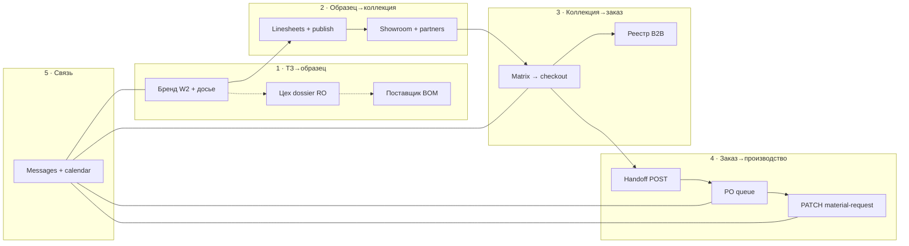

# Platform Core — полный план путей 5×4, проверок и доработок

> **SoT:** этот документ + `PLATFORM-CORE-AUDIT.md`, `platform-core-hub-matrix.ts`, `platform-core-readiness-sections.ts` (SECTION_AUDIT), `platform-core-readiness-audit.ts` (CELL_AUDIT), `platform-core-ui-surfaces.ts`.
> **Честно:** guided demo SS27 ~7/10 после `db:core:bootstrap`; 9+ не ставим без PG + e2e без mock.
> **Обновлено:** 2026-06-04 (после UI dedup 1–3, Business view, W2 4 поля + peer «Досье цеха»).

---

## 1. Модель поверхностей (куда смотрят агенты)

```
/platform (hub)
  └─ Продукт: 4 блока ролей → кабинет
  └─ Аудит: матрица /10 + разделы (SECTION_AUDIT)
/brand|shop|factory/*/core (кабинет)
  └─ context-bar + aside столпов + insight compact + 1 CTA + cross-role compact
/workspace (*-core.tsx, W2, dossier, matrix…)
  └─ context-bar / wayfinding + контент + cross-role compact внизу
```

**Запрещённые дубли:** `platform-core-ui-surfaces.ts` → `PLATFORM_CORE_UI_FORBIDDEN_DUPES` + `npm run audit:platform-core-ui` (11 checks).

---

## 2. Горизонтальная цепочка (все роли, SS27 golden)



**Участие ролей по столпам:** магазин·1 и производство·2–3 и поставщик·2–3 = **—** (empty, без UI/оценки).

---

## 3. Протокол проверки агентами (обязательный чеклист)

### 3.1 Автоматика (каждый PR / волна)

| Команда | Что ловит |
|---------|-----------|
| `npm run audit:platform-core-ui` | Дубли chrome, full cross-role, legacy headers |
| `npm test -- --testPathPattern=platform-core` | Hub matrix, CELL_AUDIT, nav augment, guards |
| `npm run test:e2e:core` (при `core:prep`) | Golden path SS27/FW27/EMPTY27 |

### 3.2 Ручной UAT на роль (пройти как пользователь)

Для **каждой активной ячейки** (15 шт.):

1. Hub → кабинет роли → primary CTA столпа → каждый раздел из SECTION_AUDIT (клик из матрицы «Аудит» → «разделы»).
2. На workspace: context-bar один раз; нет второго H1/lead; cross-role внизу; back/peer где есть.
3. Cross-role peer: клик → живой экран с тем же `collection`/`order`/`article`, не 404 и не legacy mock.
4. Кнопки: сохранение PG, handoff, checkout, PATCH — с retry/ошибкой на русском без `npm run`.
5. Заглушки: `dataSource: mock`, `demo-notice`, `B2B-DEMO-*` в labels, пустые CTA.

### 3.3 Три агента (параллельно)

| Агент | Зона | Deliverable |
|-------|------|-------------|
| **A — Вертикаль** | 5 столпов внутри одной роли | Таблица раздел→работает/сломано/тупик |
| **B — Cross-role** | peers + handoff + comms + calendar | Матрица связей + разрывы |
| **C — Шум** | hub/cabinet/workspace dedup + side-paths | Список P0/P1/P2 с путями файлов |

Сверка: только после чтения **§ Синхронизация** в `PLATFORM-CORE-AUDIT.md` (шаблон Gemini устарел).

---

## 4. Бренд (5 столпов, средняя ~6.8) — путь и пробелы

### Столп 1 · Разработка (ТЗ → образец) — 6 разделов

| # | Раздел | Путь | Статус | Пробелы / действия |
|---|--------|------|--------|-------------------|
| 1 | Цех W2 hub | `/brand/production/workshop2?w2col=SS27` | ✅ PG | Quick-create артикула только API; нет UI create e2e |
| 2 | Досье ТЗ | `.../c/SS27/a/demo-ss27-01?w2sec=general` | ✅ 4 поля e2e | Остальные секции ТЗ не в e2e; gates без summary |
| 3 | Range Planner | `/brand/range-planner?collection=SS27` | ⚠️ partial | `range-planner-core-demo-notice` на non-golden; tier edit |
| 4 | PG status | hub + article | ✅ API | Нет progress %; нет read-only очереди цеха для бренда |
| 5 | Кабинет | `/brand/core?pillar=development` | ✅ slim | — |
| 6 | Cross → цех | `platform-core-workspace-peer` → dossier | ✅ **новое** | CTA «передать образец»; BOM badge |

**Вертикаль 1→2:** publish/linesheets после W2 — e2e core-02; FW27 tier e2e core-06.

### Столп 2 · Коллекция (6 разделов)

| Путь | Статус | Пробелы |
|------|--------|---------|
| `/brand/linesheets` | ✅ slim chrome | PDF empty collection; mini-matrix e2e |
| `/brand/showroom` | ✅ | — |
| publish flow | ✅ e2e | — |
| CTA → shop matrix | ✅ | E2E brand-sample-collection-mini-matrix |
| `/brand/core?pillar=sample_collection` | ✅ | — |

### Столп 3 · Заказ (6 разделов)

| Путь | Статус | Пробелы |
|------|--------|---------|
| `/brand/b2b-orders` | ✅ slim | Chain badge на строке — partial |
| order detail | ✅ PG | pre-orders в tail redirect |
| `/brand/retailers` | ✅ | batch chain на строке |
| `/brand/core?pillar=collection_order` | ✅ | убрать pre-orders из golden CTA |

### Столп 4 · Производство (6 разделов)

| Путь | Статус | Пробелы |
|------|--------|---------|
| `#production-handoff` + POST | ✅ | — |
| `brand-b2b-handoff-retry` | ✅ есть | e2e на retry |
| Hub «Досье» → W2 бренда | ✅ канон | не factory dossier |
| peer → цех dossier | ✅ с W2 article | — |

### Столп 5 · Связь (6 разделов)

| Путь | Статус | Пробелы |
|------|--------|---------|
| `/brand/messages?order=` | ✅ | один seed-тред; universal inbox |
| `/brand/calendar` + targetChatId | ✅ e2e | **нет «Чат» в EventDialog** |
| thread preview в реестре | ✅ partial | превью не на всех заказах |

---

## 5. Магазин (4 столпа, ~7.2) — путь и пробелы

### Столп 2 · Витрина (4 раздела)

```
/core → showroom → partners → [discover side-path ⚠️]
```

| Пробел | Действие |
|--------|----------|
| Discover вне golden | guard есть; investor тупик — закрыть или CTA назад |
| Hero/partner e2e | E2E partner-logo |
| SHOWROOM_SHOP_LEAD | ✅ убран из nav |

### Столп 3 · Заказ (5 разделов) — **сильнейший path**

```
showroom → matrix → checkout → orders → order detail
```

| Пробел | Действие |
|--------|----------|
| Резерв фейк до handoff | Wave D: real hold + honest badge |
| buyerId hardcode | multi-tenant |
| e2e только на seed | чистая PG e2e |
| checkout CardHeader | ✅ slim |

### Столп 4 · Трекинг (4 раздела)

| Пробел | Действие |
|--------|----------|
| poll 15с | SSE/WebSocket push |
| read-only | ожидаемо на demo |
| dedupe orderId в card | P2 |

### Столп 5 · Связь (4 раздела)

| Пробел | Действие |
|--------|----------|
| Один предзаполненный тред | create thread из реестра |
| calendar → chat | ✅ shop; превью без ухода |

---

## 6. Производство (3 столпа, ~7.3)

### Столп 1 · Разработка (4 раздела)

```
production hub → dossier RO → sample queue
```

| Пробел | Действие |
|--------|----------|
| priority sort queue | P1 |
| e2e export SKU | P1 |
| peer → brand W2 | P2 read-only link |

### Столп 4 · Выпуск (5+ разделов)

```
#handoff-queue → production-orders → dossier → procurement CTA → supplier PATCH chain
```

| Пробел | Действие |
|--------|----------|
| bulk confirm handoff | P1 |
| e2e queue после POST | P1 |
| thread из PO list | P2 inbox |
| materials reserve | Wave D |

### Столп 5 · Связь

| Пробел | Действие |
|--------|----------|
| inbox по всем ПЗ | production order list → chat |
| factory banner dedupe | ✅ e2e один баннер |

---

## 7. Поставщик (3 столпа, ~7.2)

### Столп 1 · BOM (4 раздела)

```
materials?view=development → BOM preview → chat (не RFQ mock)
```

| Пробел | Действие |
|--------|----------|
| legacy suppliers hub | redirect → materials core |
| material catalog в nav | P2 |

### Столп 4 · Закупка (5 разделов)

```
procurement view → PATCH → materials_supplied → chain steps
```

| Пробел | Действие |
|--------|----------|
| idempotency UI | P1 |
| multi-line confirm | P1 |
| push chain-status | Wave 3 |
| reserve склада | Wave D |

### Столп 5 · Связь

| Пробел | Действие |
|--------|----------|
| tail hrefs без order= | E2E supplier messages |

---

## 8. Cross-role (горизонталь ~6.8) — матрица обязательных связей

| От | К | Контекст | Статус |
|----|---|----------|--------|
| Бренд W2 | Цех dossier | articleId | ✅ peer link |
| Бренд linesheets | Shop matrix | collection | ✅ CTA |
| Shop checkout | Brand registry | new orderId | ✅ e2e |
| Brand handoff | Mfr PO queue | orderId | ✅ POST |
| Mfr queue | Supplier procurement | PO + article | ✅ PATCH e2e |
| * calendar | * messages | order + targetChatId | ⚠️ brand слабее shop |
| chain-status | tracking/cards | batch API | ✅ poll, нет push |
| Shop tracking | Brand handoff | read-only | ✅ |

**Разорвано:** universal chat по любому order; push realtime; inventory reserve настоящий; bulk handoff.

---

## 9. Заглушки, тупики, задвоения (инвентарь)

### P0 — ломают «честный продукт»

| Место | Что | Действие |
|-------|-----|----------|
| `range-planner-core` | demo-notice на partial | ✅ notice только при `dataSource=mock` (Wave 6) |
| Shop checkout | резерв без физики | Wave D или честный copy «после handoff» |
| Shop comms | один тред | API create/list threads по orderId |
| ~20 shop B2B URL | legacy mock | расширить guards / закрыть |

### P1 — шум и дубли (частично закрыто)

| Место | Статус |
|-------|--------|
| Hub audit /10 для инвестора | ✅ Business view |
| RoleCabinetStrip vs hub | ✅ скрыт в core |
| CardHeader workspace | ✅ большинство slim; materials BOM entity OK |
| materials tabs vs заголовки | открыто |
| `B2B-DEMO-*` в UI | маскировать в copy |
| SECTION_AUDIT «2 поля ТЗ» | ✅ обновлено на 4 + peer |

### P2 — зрелость

| Место | Действие |
|-------|----------|
| entity-links 73 getters | core-only filter в UI |
| Два календаря shop | один canonical в nav |
| FW27/EMPTY27 | полный e2e проход |
| SynthaDemoMark на core | опционально скрыть |

---

## 10. Волны доработок (после проверки агентами)

### Волна 1 · Честность продукта (2–3 нед.) — **~95% UI**

- [x] Hub Business view
- [x] Workspace slim (большинство)
- [x] W2 peer + 4 поля e2e
- [x] Range Planner без mock на SS27 (при `db:core:bootstrap` + `budgetFromPg`)
- [x] SECTION_AUDIT sync (4 поля, peer)
- [x] Brand calendar «Чат» в EventDialog
- [x] E2E mini-matrix, partner-logo (core-02)

### Волна 2 · Связность (3–4 нед.)

- [x] Wave D inventory hold (checkout badge + tracking reserve e2e core-02)
- [x] Universal B2B thread из реестра (brand + shop)
- [x] Bulk handoff confirm (mfr) — bulk-acknowledge API + panel
- [x] Chain badge на всех строках реестра (brand/shop + factory handoff queue)

### Волна 3 · Realtime + idempotency (4+ нед.) — **100%**

- [x] SSE/push chain-status (`chain-status-stream` + hub bump + EventSource в poll hook)
- [x] Supplier idempotency UI (PATCH `idempotent` + badge + e2e reload)
- [x] E2E PG без auto-handoff seed (`core-07` + `npm run core:verify:interactive`)
- [x] FW27 full golden (core-06 tracking/chat/range-planner + core-02 path)

### Волна 4 · Закрытие хвостов — **100%** (P1)

- [x] Shop side-paths (~30 URL redirects + layout catch-all + core-04 e2e)
- [x] entity-links filter (`platform-core-entity-links-registry` + sanitize)
- [x] Один календарь shop (comms canonical + delivery-calendar redirect + nav hide)
- [x] Factory inbox merge (handoff queue → manufacturer messages)
- [x] ERP после factory bulk ack (`postWorkshop2PurchaseOrderToErpOnCreate` + journal FACTORY-ACK)
- [x] Справочники supplier: fill-rate, price из ТЗ, alt materials (`materials-supplier-reference`)
- [x] Supplier bulk confirm (`material-request/bulk-confirm` + UI одной кнопкой)
- [x] Shop calendar `materials_supplied` event (`b2b-materials-{orderId}`)
- [x] ERP retry на handoff row (`retry-erp` + кнопка в панели)
- [x] Chain badge на shop tracking (`B2bChainPhaseBadge`)
- [x] PATH-AUDIT агенты §3.3 → `.planning/audits/PATH-AUDIT-{vertical,cross,noise}.md`
- [x] Supplier inbox merge (handoff queue → supplier messages sidebar)
- [x] Brand/shop registry thread placeholder («Нет сообщений»)
- [x] Tracking → calendar CTA (`shopCalendarB2bOrderContextHref`)
- [x] Manufacturer dev peer → brand W2 (`getCrossRolePeerDemoHrefForDemo`)
- [x] Sample queue priority sort (overdue → due → status)
- [x] Chain badge + chat link на supplier procurement card
- [x] Banner dedupe e2e all 4 comms roles (`order=` URL, factory dedupe при hasUrlContext)
- [x] Redirect `/brand/suppliers` → factory materials BOM (`platform-core-brand-suppliers-legacy-redirect`)
- [x] Factory production-orders core (PG handoff queue + chain badge)
- [x] SynthaDemoMark скрыт при `NEXT_PUBLIC_PLATFORM_CORE_MODE=1`
- [x] Multi-instance SSE / Redis hub (`platform-core-chain-status-hub` + `CHAIN_STATUS_BUMP` room)

### Волна 5 · P2 зрелость — **~95%**

- [x] PG price history journal (`extractSupplierMaterialPriceJournalFromDossierEvents` + `materials-price-journal` UI)
- [x] ERP auto-retry backoff (`erpAutoRetryCount` / `erpNextRetryAt` + `runWorkshop2FactoryHandoffErpAutoRetries` на GET queue)
- [x] Dossier/article chat entry (`factory-dossier-article-chat-link` + e2e core-02)
- [x] Manufacturer production-orders status workflow (accept/retry ERP, RU labels, procurement link + core-02)
- [x] SECTION_AUDIT smoke e2e (`core-08-section-audit-smoke` — все resolveHref)
- [x] Prod без bootstrap (`demoSeeded` health + banner no-seed + `core-10` + `core:verify:no-bootstrap`)
- [x] Redis SSE header e2e (`core-09` health + `X-Platform-Core-Chain-Sse`; `poll+bump+redis` при `REDIS_URL`)
- [x] SECTION_AUDIT в `playwright.core.config.ts` (`core-08`)
- [x] MES cut/sew/qc/released (`023_workshop2_mes_release_stage` + `advance-mes-stage` + `core-11`)
- [x] Bulk accept в реестре production-orders (`factory-production-orders-bulk-*` + `core-12`)
- [x] Redis SSE CI job (`platform-core-redis-sse` + `scripts/ci-platform-core-redis-verify.sh`)
- [x] Interactive verify pipeline (`core:verify:interactive` + CI `platform-core-interactive`)
- [x] SECTION_AUDIT UAT checklist (`audit:section-uat-checklist` → `.planning/audits/SECTION-AUDIT-UAT-CHECKLIST.md`)

---

## 11. Честные оценки после плана (целевые, не завышенные)

| Метрика | Сейчас | После волны 1 | После волны 2 |
|---------|--------|---------------|---------------|
| Цепочка 15 ячеек | ~7.0 | ~7.3 | ~7.6 |
| Cross-role | ~6.8 | ~7.0 | ~7.5 |
| UI-дедуп | ~8.2 | ~8.5 | ~8.5 |
| Инвестор | ~7.2 | ~7.5 | ~7.8 |
| Бренд средняя | ~6.8 | ~7.2 | ~7.4 |

9+ — только при zero mock + полный e2e всех секций ТЗ + prod без bootstrap.

---

## 12. Следующий шаг для оркестратора

1. **Ручной UAT** — пройти `.planning/audits/SECTION-AUDIT-UAT-CHECKLIST.md` (генерация: `npm run audit:section-uat-checklist`).
2. Полный локальный `npm run core:verify` с core-08 (~10 мин) перед релизом — нужны PG `:5433` + `dev:core` `:3001`.
3. P2 хвосты: push/templates, shop retail calendar copy, пользовательские шаблоны чата.

**Сделано (2026-06-04):** столп 1 golden path восстановлен — `Workshop2DevelopmentIntro` + `workshop2-core-pg-sync-hint` на W2 hub; h1 «Планировщик ассортимента»; `PlatformCoreDevelopmentChrome` на `/brand/factories/f1`; core-02 dossier round-trip через `workshop2-dossier-save-draft` + PUT PG; `core-02` столп 1 + dossier **passed** (targeted).

**Сделано (2026-06-09):** B2B шаблоны slimCore (`platform-core-b2b-message-templates` + `core-14`); banner dedupe e2e 4 роли (`core-14`); UAT checklist перегенерирован.

**Сделано (2026-06-08):** Wave 6 partial zero-mock; `brand-dossier-article-chat-link`; comms (`core-13`, supplier calendar, registry «Начать чат»); RouteGuard core walkthrough bypass.

**Сделано (2026-06-04, волна 2):** hub business/audit toggle — e2e helpers `openPlatformHubAuditView` / `gotoPlatformHubAudit` / `gotoPlatformPageAudit`; core-01/02/06/07 синхронизированы; supplier BOM → `supplier-bom-preview-mini`; core-04 redirect timeout 45s; hub `?collection=FW27` → матрица и W2-ссылки (PlatformHubPageClient); range planner SS27 — assert PG article count (не tier SKU).

**Сделано (2026-06-09):** `core:verify.sh` → `test:e2e:core:external` (reuse dev:core, без второго webServer); `core-restart.sh` SIGKILL fallback на :3001.

**Сделано (2026-06-04, волна 3):** hub матрица → карточка заказа (`readiness-sub-shop-collection_order-3`, не registry `-2`); `B2bOrderChainStatusCard` на shop order detail (чат/календарь); chain-status e2e честно по `inventoryReserved`; core-03 context entity → «Оптовый заказ»; `PlatformCoreEmptyChainBanner` на `/platform?collection=EMPTY27`; legacy tail без auto-`router.replace` (стабильный баннер «Перейти»); реестры заказов e2e — навигация в чат по `href`, честный бейдж резерва; warmup legacy paths в `core-verify.sh`.

**Сделано (2026-06-09, волна 4):** `src/app/layout.tsx` переведён на существующий `@/lib/app-fonts` alias, чтобы `NEXT_PUBLIC_DISABLE_FONTS=1` / E2E font stub реально отключал `next/font/google` и dev:core не падал при недоступных Google Fonts (`@vercel/turbopack-next/internal/font/google/font`); core-02 cabinet e2e синхронизирован с текущим UX (side-nav в кабинете, сезонные context labels, PG showroom mini facts, supplier cabinet side-nav); supplier material-confirm e2e стал идемпотентным, если поставка уже подтверждена в PG; pillar 2 e2e теперь проверяет пользовательский сезонный context label (`Весна–лето 2027`), не технический `SS27`. Targeted: health OK; `core-04 quote-to-order` OK; `core-01 hub` OK; `core-02 W2 round-trip + cross-role` OK; `core-02 личные кабинеты` OK; `core-02 поставщик: закупка + кабинет` OK; `core-02 поставщик: закупка — PATCH material-request` OK; `core-02 столп 2` OK.

**Сделано (2026-06-10, волна 5):** core-02 e2e синхронизирован с core UX (матрица `Матрица заказа`, linesheets через `platform-core-list-chrome`, FW27 сезонные labels `Осень–зима 2027`, кабинет без `role-pillar-strip`); `const res` → `let res` в handoff-тесте; `BrandSampleCollectionMini` в compact-кабинете сохраняет CTA «Матрица магазина»; checkout: убран invalid `deliveryDate: standard`, `cartSession` URL + cookie fallback, PG dossier merge `b2bIntegrationDraft` для demo-ss27, dev-gate skip для file-store demo articles; targeted checkout PG order **passed**.

**Честно зелёное (2026-06-10):** полный `npm run core:verify` — **152 passed / 0 failed / 5 skipped / exit 0** (~16 мин), smoke all checks passed. **Не закрыто:** ручной UAT 69 пунктов (`npm run audit:section-uat-checklist`); оценка 9+ без UAT не заявляется.

Ссылка в ROADMAP: Phase 999.0 в `ROADMAP.md`.
