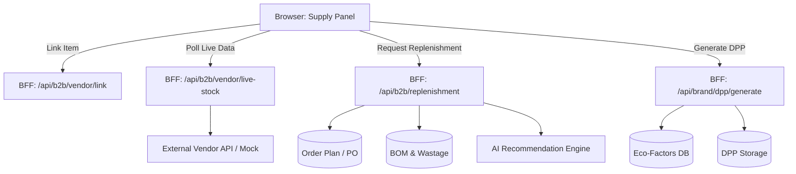

# Phase 2: Supply & Purchasing - Research

**Researched:** 2026-05-15
**Domain:** Supply Chain Integration, B2B Vendor Connect, AI Auto-Replenishment, Sustainability (DPP)
**Confidence:** HIGH

## Summary

This phase integrates external supply chain data into the Workshop 2.0 article workspace. It introduces live vendor connections for BOM items (Live Stock, Lead Time), AI-driven raw material replenishment based on production orders (PO), and the calculation of the Digital Product Passport (DPP) and Eco-footprint based on the BOM composition. 

**Primary recommendation:** Extend the existing `Workshop2ArticleSupplyPanel` to support linking BOM lines to vendor catalog items via a new BFF endpoint, use `@tanstack/react-query` for live polling, and implement a backend service for DPP calculation using a mock eco-factors database.

## Architectural Responsibility Map

| Capability | Primary Tier | Secondary Tier | Rationale |
|------------|-------------|----------------|-----------|
| **B2B Vendor Connect** | API / Backend | Browser / Client | BFF handles vendor API integrations and caching; client uses React Query for live polling of badges. |
| **AI Auto-Replenishment** | API / Backend | Browser / Client | Backend calculates requirements (BOM qty * PO qty * (1 + wastage)) and applies AI rules; client displays actionable suggestions. |
| **DPP & Eco-footprint** | API / Backend | Database / Storage | Backend calculates metrics using an eco-factors dictionary; DB stores the generated DPP payload for public access. |

## Standard Stack

### Core
| Library | Version | Purpose | Why Standard |
|---------|---------|---------|--------------|
| `@tanstack/react-query` | ^5.90.21 | Live data polling | Standard in the project for client-side data fetching and caching. |
| `lucide-react` | ^0.469.0 | UI Icons | Project standard for iconography. |

### Alternatives Considered
| Instead of | Could Use | Tradeoff |
|------------|-----------|----------|
| Next.js API Routes (BFF) | Direct Client-to-Vendor API | Direct client calls expose API keys and CORS issues. BFF is safer and allows caching. |

## Architecture Patterns

### System Architecture Diagram



### Recommended Project Structure
```
_ai-share/synth-1-full/src/
├── app/api/b2b/vendor/               # Vendor Connect endpoints
├── app/api/brand/workshop2/dpp/      # DPP generation endpoints
├── lib/b2b/vendor-connect.ts         # Vendor API integration logic
├── lib/platform/dpp-calculator.ts    # Eco-footprint calculation logic
└── components/brand/production/      # UI updates (Supply Panel, Replenishment Panel)
```

### Pattern 1: Live Stock Polling
**What:** Polling live stock and lead time for linked vendor items.
**When to use:** When a BOM line is linked to a vendor catalog item.
**Example:**
```typescript
import { useQuery } from '@tanstack/react-query';

export function useLiveVendorItem(vendorItemId?: string) {
  return useQuery({
    queryKey: ['vendor-item', vendorItemId],
    queryFn: async () => {
      const res = await fetch(`/api/b2b/vendor/item/${vendorItemId}`);
      if (!res.ok) throw new Error('Failed to fetch');
      return res.json();
    },
    enabled: !!vendorItemId,
    refetchInterval: 60000, // Poll every minute
  });
}
```

### Anti-Patterns to Avoid
- **Direct Vendor API calls from Client:** Exposes API keys and violates the BFF pattern. Always route through Next.js API.
- **Hardcoding Eco-factors in UI:** Eco-factors should be managed on the backend to ensure consistency across the platform and allow easy updates.

## Don't Hand-Roll

| Problem | Don't Build | Use Instead | Why |
|---------|-------------|-------------|-----|
| Live Data Polling | Custom `setInterval` with `useEffect` | `@tanstack/react-query` | Built-in caching, deduplication, and lifecycle management. |

## Runtime State Inventory

| Category | Items Found | Action Required |
|----------|-------------|------------------|
| Stored data | `Workshop2DossierPhase1` (BOM lines) | Add `vendorItemId` to `Workshop2BomLine` schema. |
| Live service config | None | — |
| OS-registered state | None | — |
| Secrets/env vars | Vendor API Keys | Add `VENDOR_API_KEY` to `.env` (or use mocks for now). |
| Build artifacts | None | — |

## Common Pitfalls

### Pitfall 1: Stale Live Stock Data
**What goes wrong:** Users see outdated stock levels and place orders that cannot be fulfilled.
**Why it happens:** Caching live stock data for too long or failing to invalidate the cache after an order is placed.
**How to avoid:** Use a short `refetchInterval` in React Query and invalidate the query cache immediately after placing an order or reserving stock.

### Pitfall 2: Ignoring Wastage in Replenishment
**What goes wrong:** Replenishment suggestions fall short of actual production needs.
**Why it happens:** Calculating requirements purely as `BOM qty * PO qty` without factoring in manufacturing wastage.
**How to avoid:** Always apply the `wastageAllowance` (e.g., `total = qty * PO * (1 + wastageAllowance)`).

## Code Examples

### DPP Calculation Logic
```typescript
export function calculateEcoFootprint(bomLines: Workshop2BomLine[], ecoFactors: Record<string, EcoFactor>) {
  let totalCarbon = 0;
  let totalWater = 0;
  
  for (const line of bomLines) {
    const factor = ecoFactors[line.materialId] || DEFAULT_ECO_FACTOR;
    totalCarbon += (line.qty || 0) * factor.carbonPerUnit;
    totalWater += (line.qty || 0) * factor.waterPerUnit;
  }
  
  return { carbonFootprint: totalCarbon, waterUsage: totalWater };
}
```

## State of the Art

| Old Approach | Current Approach | When Changed | Impact |
|--------------|------------------|--------------|--------|
| Fake random DPP metrics | Calculated DPP based on BOM and Eco-factors | Phase 2 | Real sustainability tracking and compliance. |
| Manual raw material ordering | AI Auto-Replenishment | Phase 2 | Reduced stockouts and optimized inventory levels. |

## Assumptions Log

| # | Claim | Section | Risk if Wrong |
|---|-------|---------|---------------|
| A1 | Vendor APIs will be mocked initially | Architecture | If real APIs are required immediately, integration effort increases significantly. |
| A2 | Eco-factors database will be a static dictionary for now | DPP & Eco-footprint | If a dynamic external service is required, additional API integration is needed. |

## Open Questions

1. **Vendor API Standardization**
   - What we know: Different vendors have different API structures.
   - What's unclear: Do we need a unified adapter layer for multiple vendors?
   - Recommendation: Start with a single unified mock API interface (`/api/b2b/vendor/item`) that internalizes the adapter logic.

## Environment Availability

| Dependency | Required By | Available | Version | Fallback |
|------------|------------|-----------|---------|----------|
| Vendor APIs | Live Stock / Lead Time | ✗ | — | Use internal mock data (`MOCK_RFQ_LIST` style). |
| Eco-factors DB | DPP Calculation | ✗ | — | Use static dictionary in codebase. |

**Missing dependencies with fallback:**
- Vendor APIs (Fallback: Mock data)
- Eco-factors DB (Fallback: Static dictionary)

## Security Domain

### Applicable ASVS Categories

| ASVS Category | Applies | Standard Control |
|---------------|---------|-----------------|
| V2 Authentication | yes | Next.js API Route protection (session validation) |
| V3 Session Management | yes | Existing session management |
| V4 Access Control | yes | RBAC for Supply Panel actions |
| V5 Input Validation | yes | Zod validation for BOM lines and Replenishment requests |
| V6 Cryptography | no | — |

### Known Threat Patterns for Next.js BFF

| Pattern | STRIDE | Standard Mitigation |
|---------|--------|---------------------|
| IDOR on Vendor Linking | Elevation of Privilege | Verify user has access to the dossier/article before linking. |
| SSRF via Vendor API | Spoofing | Hardcode allowed vendor API base URLs; do not accept arbitrary URLs from the client. |

## Sources

### Primary (HIGH confidence)
- Codebase grep: `workshop2-article-workspace-supply-panel.tsx`
- Codebase grep: `Workshop2SustainabilityPanel.tsx`
- Codebase grep: `src/lib/types/production.ts` (wastageAllowance)

## Metadata

**Confidence breakdown:**
- Standard stack: HIGH - Based on existing project dependencies (`@tanstack/react-query`).
- Architecture: HIGH - Aligns with the existing BFF and client component patterns.
- Pitfalls: HIGH - Standard supply chain integration challenges.

**Research date:** 2026-05-15
**Valid until:** 2026-06-15
