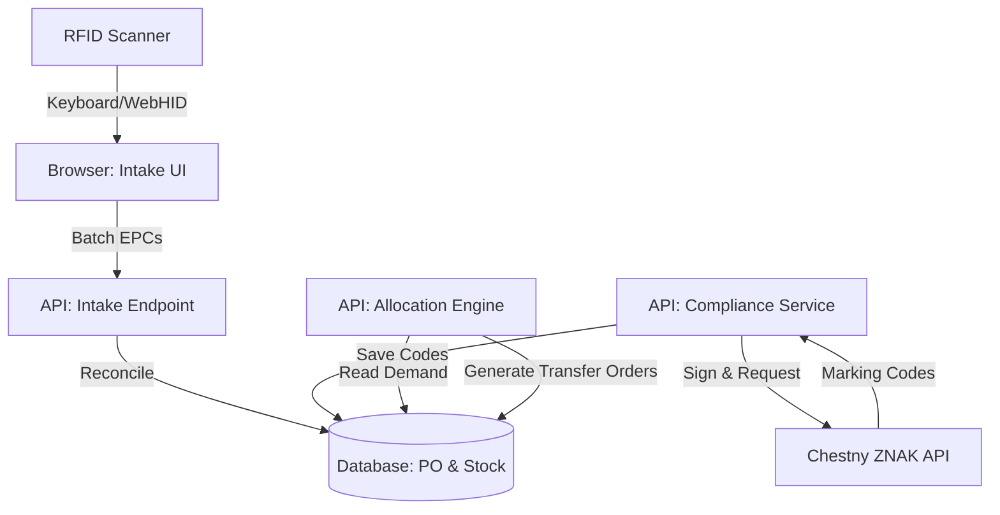

# Phase 7: Умная Приёмка (Stock / Intake) - Research

**Researched:** 2026-05-15
**Domain:** Supply Chain, Inventory Management, Compliance
**Confidence:** MEDIUM

## Summary

Phase 7 (Умная Приёмка) модернизирует процесс поступления товаров и сэмплов на склад. Основные фокусы: автоматизация распределения товара по каналам продаж (Smart Allocation), интеграция с государственными системами прослеживаемости (Честный ЗНАК, ТН ВЭД) и ускорение физической приемки с помощью RFID. Архитектура должна обеспечивать высокую скорость обработки на клиенте (для RFID) и надежную асинхронную работу с внешними API (для комплаенса).

**Primary recommendation:** Реализовать RFID через WebHID/Keyboard Wedge для максимальной совместимости, комплаенс-интеграции вынести в асинхронные фоновые задачи (очереди), а Smart Allocation построить на основе стратегий (Strategy Pattern) с транзакционным применением.

## Architectural Responsibility Map

| Capability | Primary Tier | Secondary Tier | Rationale |
|------------|-------------|----------------|-----------|
| Smart Allocation | API / Backend | Database | Сложная бизнес-логика распределения, требующая транзакционной целостности при резервировании стока. |
| Compliance Sync | API / Backend | Background Workers | Взаимодействие с Честным ЗНАКом требует криптографии (ГОСТ) и асинхронного поллинга статусов. |
| RFID Auto-Intake | Browser / Client | API / Backend | Клиент должен быстро агрегировать сотни сканирований в секунду, бэкенд выполняет сверку с PO (Purchase Order). |
| TN VED Resolution | API / Backend | — | Определение кода ТН ВЭД на основе состава (Composition) и категории артикула. |

## Standard Stack

### Core
| Library | Version | Purpose | Why Standard |
|---------|---------|---------|--------------|
| WebHID API / Keyboard Events | Native | RFID Hardware Integration | Не требует установки драйверов на стороне клиента, работает в современных браузерах. |
| BullMQ / DB-based Queue | Latest | Background Jobs | Надежная обработка запросов к Честному ЗНАКу с поддержкой ретраев. |
| Zod | Latest | Data Validation | Строгая типизация контрактов с внешними API и RFID-сканерами. |

### Supporting
| Library | Version | Purpose | When to Use |
|---------|---------|---------|-------------|
| CryptoPro Node.js wrapper | — | GOST Cryptography | Для подписи запросов к API Честного ЗНАКа (если не используется сторонний SaaS-провайдер). |

### Alternatives Considered
| Instead of | Could Use | Tradeoff |
|------------|-----------|----------|
| WebHID | Local WebSocket Agent | Local Agent требует установки ПО на каждый складской ПК, но дает больше контроля над железом. |
| Direct API Integration | SaaS Integrator (e.g., Контур) | SaaS проще в интеграции (нет проблем с криптопровайдерами), но добавляет операционные косты. |

## Architecture Patterns

### System Architecture Diagram



### Recommended Project Structure
```
src/
├── lib/b2b/intake/          # Логика приемки и сверки с PO
├── lib/b2b/allocation/      # Алгоритмы Smart Allocation
├── lib/compliance/          # Интеграция с Честным ЗНАКом и ТН ВЭД
└── components/brand/production/intake/ # UI компоненты приемки и RFID
```

### Pattern 1: Smart Allocation Strategy
**What:** Использование паттерна Strategy для различных алгоритмов распределения.
**When to use:** При поступлении партии, когда нужно решить, сколько единиц отправить в розницу, e-com или отгрузить по B2B-предзаказам.
**Example:**
```typescript
interface AllocationStrategy {
  allocate(intake: IntakeBatch, demand: DemandProfile): AllocationPlan;
}

class B2BPriorityStrategy implements AllocationStrategy {
  allocate(intake, demand) {
    // Сначала закрываем B2B backorders, остаток делим между retail и e-com
  }
}
```

### Anti-Patterns to Avoid
- **Синхронный запрос к Честному ЗНАКу:** API гос. систем могут отвечать медленно или быть недоступны. Ожидание ответа в HTTP-запросе пользователя приведет к таймаутам. Используйте асинхронные очереди.
- **Поштучная отправка RFID-меток на бэкенд:** RFID-рамка может считывать сотни меток в секунду. Отправка каждой метки отдельным HTTP-запросом положит бэкенд. Необходимо агрегировать метки на клиенте (debounce/throttle) и отправлять батчами.

## Don't Hand-Roll

| Problem | Don't Build | Use Instead | Why |
|---------|-------------|-------------|-----|
| ГОСТ Криптография | Свою реализацию алгоритмов | CryptoPro / SaaS-интеграторы | Требует сертификации ФСБ, крайне сложно реализовать и поддерживать. |
| Очереди задач | `setTimeout` или in-memory массивы | BullMQ / Postgres-based queues | In-memory очереди теряют данные при рестарте пода (Vercel/Docker). |

## Common Pitfalls

### Pitfall 1: RFID Over-scanning
**What goes wrong:** При приемке коробки сканер считывает метки из соседних коробок, находящихся рядом.
**Why it happens:** Радиоволны RFID проникают сквозь картон и могут отражаться от поверхностей.
**How to avoid:** Использовать экранированные туннели для приемки, настраивать мощность антенны (Tx Power) и фильтровать метки по RSSI (уровню сигнала) на уровне железа или клиента.

### Pitfall 2: Рассинхронизация остатков при аллокации
**What goes wrong:** Две параллельные приемки пытаются аллоцировать один и тот же дефицитный товар.
**Why it happens:** Race conditions в базе данных.
**How to avoid:** Использовать транзакции с уровнем изоляции Serializable или пессимистичные блокировки (`SELECT ... FOR UPDATE`) при записи складских движений.

## Code Examples

### RFID Batch Processing (Client-side)
```typescript
// Агрегация сканирований перед отправкой
const useRfidScanner = (onBatchScan: (epcs: string[]) => void) => {
  const [buffer, setBuffer] = useState<Set<string>>(new Set());
  
  useEffect(() => {
    const timer = setTimeout(() => {
      if (buffer.size > 0) {
        onBatchScan(Array.from(buffer));
        setBuffer(new Set());
      }
    }, 500); // Отправляем батч каждые 500мс
    return () => clearTimeout(timer);
  }, [buffer, onBatchScan]);

  const handleScan = (epc: string) => {
    setBuffer(prev => new Set(prev).add(epc));
  };
  
  return { handleScan };
};
```

## Environment Availability

| Dependency | Required By | Available | Version | Fallback |
|------------|------------|-----------|---------|----------|
| Честный ЗНАК API | Compliance Sync | ✗ | — | Ручной экспорт/импорт CSV |
| RFID Scanner | Auto-Intake | ✗ | — | Ручной ввод штрихкодов / сканер ШК |
| Background Queue | Compliance Sync | ✓ | — | — |

**Missing dependencies with fallback:**
- Честный ЗНАК API: Требует получения тестовых сертификатов и доступов к песочнице (Sandbox). На этапе разработки использовать моки (Mock API).
- RFID Scanner: Для разработки UI сделать программный эмулятор (генератор случайных EPC кодов по нажатию кнопки).

## Validation Architecture

### Test Framework
| Property | Value |
|----------|-------|
| Framework | Jest + Playwright |
| Config file | `jest.config.ts`, `playwright.config.ts` |
| Quick run command | `npm run verify` |
| Full suite command | `npm run verify:all` |

### Phase Requirements → Test Map
| Req ID | Behavior | Test Type | Automated Command | File Exists? |
|--------|----------|-----------|-------------------|-------------|
| REQ-7.1 | Smart Allocation распределяет сток по правилам | unit | `jest src/lib/b2b/allocation` | ❌ Wave 0 |
| REQ-7.2 | Compliance Sync генерирует валидные ТН ВЭД | unit | `jest src/lib/compliance` | ❌ Wave 0 |
| REQ-7.3 | RFID Intake корректно матчит EPC с PO | integration | `jest src/lib/b2b/intake` | ❌ Wave 0 |

### Wave 0 Gaps
- [ ] `src/lib/b2b/allocation/allocation-engine.test.ts` — covers REQ-7.1
- [ ] `src/lib/compliance/tnved-resolver.test.ts` — covers REQ-7.2
- [ ] `src/lib/b2b/intake/rfid-reconciliation.test.ts` — covers REQ-7.3

## Security Domain

### Applicable ASVS Categories

| ASVS Category | Applies | Standard Control |
|---------------|---------|-----------------|
| V2 Authentication | yes | NextAuth / Session |
| V3 Session Management | yes | Secure Cookies |
| V4 Access Control | yes | RBAC (Только роль Warehouse Manager может делать приемку) |
| V5 Input Validation | yes | Zod (Валидация EPC кодов и ответов от ЧЗ) |
| V6 Cryptography | yes | CryptoPro (для подписи запросов к ЧЗ) |

### Known Threat Patterns for Next.js / API

| Pattern | STRIDE | Standard Mitigation |
|---------|--------|---------------------|
| Подделка RFID меток | Spoofing | Сверка EPC с криптохвостом (если поддерживается) и валидация по базе ожидаемых кодов из PO. |
| Неавторизованная приемка | Elevation of Privilege | Строгая проверка ролей на уровне API (`requireRole('warehouse_manager')`). |

## Sources

### Primary (HIGH confidence)
- Архитектурные паттерны складских систем (WMS).
- Документация ЦРПТ (Честный ЗНАК) по API интеграции.

### Secondary (MEDIUM confidence)
- Best practices работы с RFID в веб-браузерах (Keyboard emulation vs WebHID).

## Metadata

**Confidence breakdown:**
- Standard stack: MEDIUM - Выбор между WebHID и Keyboard emulation зависит от конкретного оборудования заказчика.
- Architecture: HIGH - Паттерны асинхронной обработки и стратегий аллокации стандартны для ERP/WMS.
- Pitfalls: HIGH - Проблемы с over-scanning типичны для всех RFID внедрений.

**Research date:** 2026-05-15
**Valid until:** 2026-08-15
