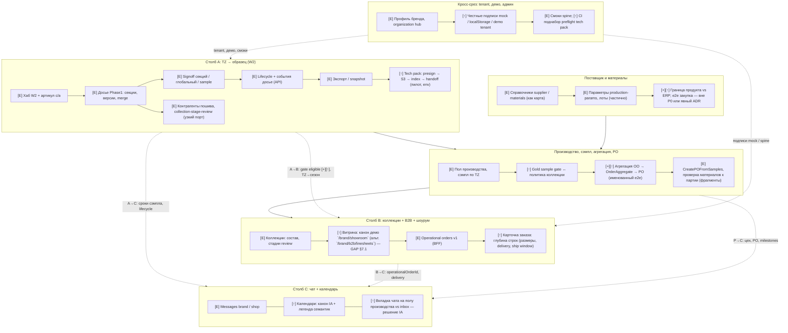
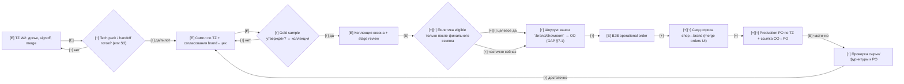
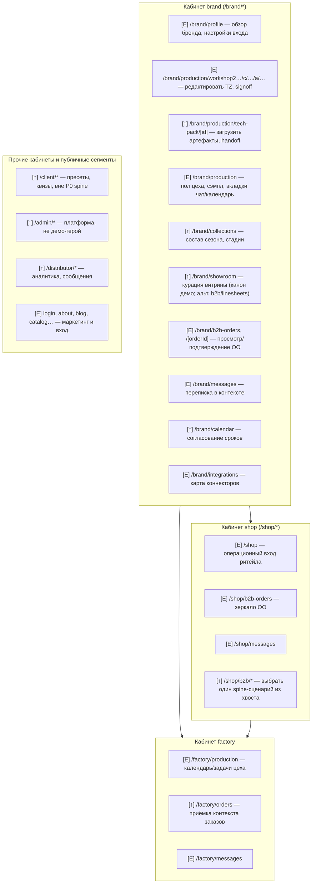

# Финальные диаграммы и карта страниц (RU)

**Дата:** 2026-05-11 · **Канон приложения:** `_ai-share/synth-1-full` (`Next.js`, `src/app`) · **Источники (только канон research):** `FOCUS_ONE_PAGER.md` (матрица уровней L0–L4), `GAP_ANALYSIS_USER_FLOW_COLLECTION_B2B_CHAT_CALENDAR.md` (**§0** карта разделов; **§7** — DTO/URL/приёмка; **§7.6** — очередь ADR; **§9.1** — обновление §2/§5; **§11** — PATCH Mermaid), `PLAN_RESTRUCTURE_THREE_PILLARS.md` (**§0** связи + мини-схема артефактов; **§3–3.2**; **§7.7–7.8**; **§8** + **§8.4** реестр флагов; **§9**), этот файл (**§0.1** — карта диагр↔PATCH↔таблицы). **Runbook презентации (во full):** `docs/INVESTOR_DEMO_RUNBOOK.md`. **Межстолбцовые рёбра:** **Приложение G** + `GAP` §7.0. Дополнительно по коду: `AGENTS.md`, `e2e/README.md`, `docs/UNIFIED_ECOSYSTEM_VERIFICATION.md` во full. **Архив:** `.planning/research/_archive/` **не** входит в канон четырёх research-файлов — в этот документ **не** импортируется и **не** ссылается.

**Назначение:** одна точка входа для питча и дорожной карты: что **обязаны** довести, что **уже есть**, что **добавить**, что **улучшить**; карта **страниц** по кабинетам и **типовые действия**. Язык — **русский**; аббревиатуры латиницей: B2B, W2, TZ, PO, API, UI, S3, BFF, IA, ERP, SKU, RFQ, CMS, PO, DTO, CI, ADR, P0.

**Факт по коду:** файлов `**/page.tsx` под `src/app` — **552**; файлов `**/page.mdx` — **0**.

### 0. Уровни артефакта и куда смотреть при правке

| Уровень                 | Артефакт в `FINAL`                    | Связь с другими канонами                                    | Когда обновлять                   |
| ----------------------- | ------------------------------------- | ----------------------------------------------------------- | --------------------------------- |
| **Статус узла**         | Легенда [Е]/[+]/[↑], диаграммы 1–2    | Правда о внедрении — **`GAP` §2**, контракты — **`GAP` §7** | После PR, меняющего UX/API        |
| **Страницы / IA**       | Таблицы brand/shop, диаграмма 3       | **`PLAN` §4**, `ROUTES`, `UNIFIED_ECOSYSTEM_VERIFICATION`   | Смена маршрута или tid            |
| **Must / backlog**      | § «Что обязаны», backlog визуализации | **`PLAN` §6–7**, **`GAP` §5**                               | Планирование квартала / ADR       |
| **Фазы работ**          | **Приложение F** (узел → фаза)        | **`PLAN` §3**, **`GAP` §7.6**                               | Закрытие фазы или ADR             |
| **Межстолбцовые рёбра** | **Приложение G** (A↔B↔C, supply)      | **`FOCUS`** таблица рёбер; **`GAP` §7.0**                   | Новый поток данных между столбами |
| **Карта чтения схем**   | **§0.1** (таблица ниже)               | **`GAP` §11** PATCH; **Приложение D/F**                     | Путаница «скелет vs LR vs PATCH vs страницы» |
| **Лайв-сценарий**       | Ссылки на URL в текстах диаграмм      | **`PLAN` §7.7**, **`docs/INVESTOR_DEMO_RUNBOOK.md`**        | Любой сдвиг демо-порядка          |

**Кросс-ссылка на стратегию:** три столба и non-goals — только в **`FOCUS`**; этот файл **не** дублирует one-pager, а **визуализирует** и **привязывает к страницам**.

### 0.1 Карта чтения: большие схемы ↔ PATCH ↔ таблицы

Один экран не заменяет остальные: **уровни абстракции** разведены так, чтобы не путать «скелет продукта», «сквозной контракт», «детальный gate/sequence» и «каталог URL». Содержимое **`.planning/research/_archive/`** в таблицу ниже и в остальной канон **не** включается.

| Что нужно понять                                                                                     | Где смотреть                                    | Комментарий                                                                                      |
| ---------------------------------------------------------------------------------------------------- | ----------------------------------------------- | ------------------------------------------------------------------------------------------------ |
| Столбы A/B/C, supply, prodexec, кросс-срез; статусы узлов; **пунктир между subgraph** (с подписями)  | **Диаграмма 1** ниже + **Приложение G**         | Скелет; пунктир = **информационные / продуктовые** связи, не обязательно один BFF-вызов          |
| Сквозной LR TZ→…→PO; **ELIG / AGG / PO**; подписи на **каждом** ребре потока                         | **Диаграмма 2**                                 | Истина по «как течёт заказ» для питча                                                            |
| Gate по сэмплу **детально**, **sequence** Shop→BFF→Brand→AGG→PO, **IA** чат vs пол цеха vs календарь | **`GAP` §11** (PATCH-A, PATCH-B, PATCH-C)       | Дубли по смыслу диаграмме 2 / §4 `GAP`, но **другая детализация** (условия, участники, сущности) |
| Реальные пути `page.tsx`, глаголы на экране, агрегаты «+ N страниц»                                  | **Диаграмма 3** + таблицы brand / shop / прочие | Не смешивать со **data flow** — см. подпись к диагр. 3                                           |
| Меню и layout по кабинетам (файлы навигации)                                                         | **Приложение D**                                | Не несёт gate/agg — только **оболочка IA**                                                       |
| Узел схемы 1–2 → фаза `PLAN` §3 → статус                                                             | **Приложение F**                                | Для спринт-планирования без перечитывания Mermaid                                                |

**Правило синхронизации:** изменили **узел или статус** на диаграммах 1–2 → **Приложение F** (и при необходимости **G**); изменили **gate / OO→PO / comms** на уровне контракта → **`GAP` §7, §11** и диаграмму 2; изменили **маршрут** → диаграмма 3 + таблицы + **`PLAN` §4, §7.7** + runbook.

---

## Легенда статуса (узлы и рёбра)

| Префикс | Значение                                                                  | Как читать на схемах              |
| ------- | ------------------------------------------------------------------------- | --------------------------------- |
| **[Е]** | Уже есть в продуктовом контуре (UI/API/смоки в разной степени зрелости)   | стабильный опорный узел или ребро |
| **[+]** | Нужно **добавить** (контракт, экран, поток, тест) до «рабочего» нарратива | пробел из GAP / чеклиста          |
| **[↑]** | Нужно **улучшить** внутри ядра (IA, честность демо, глубина DTO, подписи) | не новый модуль, а доводка        |

**Дополнительно (по зрелости данных, без отдельного цвета в Mermaid):** в текстах планирования встречаются ● реальный путь / ◐ демо-seed / ○ env-gated — здесь это **не дублируем** на каждом узле, но учитываем в таблице «статус» там, где критично (W2, tech pack).

**Сводка по сегментам** (первый сегмент пути после `src/app/`, по `find …/page.tsx`):

| Сегмент                                                     | Страниц (`page.tsx`) | Комментарий                         |
| ----------------------------------------------------------- | -------------------- | ----------------------------------- |
| `brand`                                                     | **257**              | Ядро трёх столбов + широкий хвост   |
| `shop`                                                      | **110**              | в т.ч. **83** под `shop/b2b/`*      |
| `client`                                                    | **46**               | вне P0 spine                        |
| `factory`                                                   | **35**               | handoff/comms частично              |
| `admin`                                                     | **28**               | вне демо-фокуса                     |
| `distributor`                                               | **17**               | вне узкого spine                    |
| Прочие корневые сегменты (`about`, `blog`, `login`, `u`, …) | **остальные**        | публичные и вспомогательные витрины |

---

## Диаграмма 1 — целевой контур: три столба + сквозные слои

Подпись: три **столба фокуса** из `FOCUS_ONE_PAGER.md` + **поставщик/материалы**, **производство/агрегация/PO**, **кросс-срез** (tenant, демо, админ). Префиксы **[Е] / [+] / [↑]** прямо в подписи узла. **Столб C:** линии **C1—C2—C3** внутри subgraph — цепочка UX (inbox → календарь → пол цеха); связи столба C с A, B и производством — только **пунктир с подписями** (см. **Приложение G**).

---

## Диаграмма 2 — полный сквозной процесс (TZ → … → PO)

Подпись: целевой **LR** поток; на рёбрах — что **уже течёт**, что **достроить**, что **улучшить**. Узлы с префиксами.

**Смысл веток:** пунктир в диаграмме 1 — **подписанные** рёбра (см. также **Приложение G**); на диаграмме 2 — **явные рёбра** с маркировкой `[Е]/[+]/[↑]` на каждом шаге. Главный **продуктовый разрыв** — **[+]** на **ELIG → AGG → PO** (согласовано с **`GAP` §2, §5, §7.3**).

---

## Диаграмма 3 — карта страниц по кабинетам (сжатая)

Подпись: не все **552** URL — **крупные `subgraph`** по ролям; внутри — **типовая страница** и **одно действие** (глагол). Детальные пути — в таблице ниже.

**Стрелки brandCab → shopCab → factoryCab:** типичный **порядок просмотра в демо** (кто за кем рассказывает), **не** интеграционный data pipeline и не единственный сетевой поток данных между кабинетами.

---

## Таблица: brand — spine и крупные разделы

**Политика таблицы:** строки **spine** и **ключевые домены** — по отдельности; остальные страницы того же префикса — **агрегатом** «+ N страниц» (N из структуры каталога, см. счётчики по первому подкаталогу: `merch` 41, `b2b` 20, `academy` 18, …).

| Раздел               | Путь                                                                               | Назначение                                                      | Типовые действия                                   | Статус |
| -------------------- | ---------------------------------------------------------------------------------- | --------------------------------------------------------------- | -------------------------------------------------- | ------ |
| Дом бренда           | `/brand/profile`                                                                   | Профиль и «дом» после редиректа с `/brand`                      | Просмотреть сводку, перейти в разделы              | [Е]    |
| W2 хаб               | `/brand/production/workshop2`                                                      | Список артикулов/коллекций для TZ                               | Открыть демо-коллекцию, выбрать артикул            | [Е]    |
| W2 артикул           | `/brand/production/workshop2/c/[collectionId]/a/[articleId]`                       | Редактор досье Phase1                                           | Редактировать секции, merge, lifecycle, signoff    | [Е]    |
| Tech pack            | `/brand/production/tech-pack/[id]`                                                 | Пилот артефактов и handoff                                      | Загрузить файл, presign, индекс, complete          | [↑]    |
| Производство бренда  | `/brand/production`, `/brand/production/gold-sample`                               | Пол цеха, сэмпл, gold gate                                      | Согласовать образец, открыть вкладки чат/календарь | [Е][↑] |
| Коллекции            | `/brand/collections`                                                               | Сезон как контейнер                                             | Добавить артикул в сезон, стадии review            | [Е][↑] |
| Шоурум (канон демо)  | `**/brand/showroom`** (+ подстраницы `…/ai-search`, …)                             | Витрина и курация; **v1 чеклист** — `PLAN` §7.7–7.8, `GAP` §7.1 | Настроить витрину, перейти к B2B                   | [Е][↑] |
| Linesheets и др.     | `/brand/linesheets`, `**/brand/b2b/linesheets`** (альт. канон опта) и смежные      | Подборки под опт                                                | Собрать лист, поделиться                           | [Е][↑] |
| B2B заказы           | `/brand/b2b-orders`, `/brand/b2b-orders/[orderId]`                                 | Operational orders v1                                           | Фильтр списка, открыть карточку, сверить строки    | [Е][↑] |
| Сообщения            | `/brand/messages`                                                                  | Inbox бренда                                                    | Ответить, перейти по контексту заказа/проекта      | [Е][↑] |
| Календарь            | `/brand/calendar`                                                                  | Сроки и встречи                                                 | Создать событие, согласовать окно                  | [↑]    |
| Интеграции           | `/brand/integrations`                                                              | Каталог коннекторов                                             | Просмотреть статус, перейти в карточку             | [Е]    |
| Архив интеграций     | `/brand/integrations/archive/`* (JOOR, NuORDER, …)                                 | Карта legacy B2B                                                | Демо-обзор коннектора                              | [Е][↑] |
| Merch                | `/brand/merch/`*                                                                   | **41** страница: прогноз, цены, медиа-галерея, …                | Аналитика спроса, настройка видимости              | [Е][↑] |
| Academy              | `/brand/academy/`*                                                                 | **18** страниц: курсы, клиенты, материалы                       | Учебный контент, тренинги                          | [Е]    |
| B2B расширения       | `/brand/b2b/`*                                                                     | **20** страниц: отгрузки, приватные инвайты, …                  | Операции вокруг опта                               | [Е][↑] |
| Маркетинг            | `/brand/marketing/`*                                                               | **9** страниц: кампании, content factory                        | Планирование кампаний                              | [Е]    |
| Аналитика            | `/brand/analytics/`*                                                               | **8** страниц: sell-through, platform-sales                     | Отчёты, фильтры                                    | [Е][↑] |
| Финансы              | `/brand/finance/`*                                                                 | **7** страниц                                                   | Платежи, embedded                                  | [Е][↑] |
| Retailers / продукты | `/brand/retailers/`*, `/brand/products/`*                                          | Управление сетью и каталогом бренда                             | CRUD сущностей                                     | [Е][↑] |
| Прочие brand-ветки   | `planning`, `ai-design`, `circular-hub`, `logistics`, `kickstarter`, `auctions`, … | Широкий exploration                                             | Демо-фичи вне трёх столбов                         | [Е][↑] |

---

## Таблица: shop — spine и хвост `/shop/b2b/*`

| Раздел              | Путь                                                                                                           | Назначение                         | Типовые действия                        | Статус |
| ------------------- | -------------------------------------------------------------------------------------------------------------- | ---------------------------------- | --------------------------------------- | ------ |
| Корень shop         | `/shop`                                                                                                        | Вход в операционный контур ритейла | Выбрать раздел B2B или склад            | [Е]    |
| B2B заказы          | `/shop/b2b-orders`, `/shop/b2b-orders/[orderId]`                                                               | Зеркало operational orders         | Разместить/уточнить заказ, строки       | [Е][↑] |
| Сообщения           | `/shop/messages`                                                                                               | Переговоры с брендом               | Ответить, приложить контекст            | [Е][↑] |
| Календарь           | `/shop/calendar`                                                                                               | Сроки shop                         | Согласовать delivery                    | [↑]    |
| Настройки           | `/shop/settings`                                                                                               | Конфигурация кабинета              | Параметры магазина                      | [Е]    |
| Заказы (розница)    | `/shop/orders/*`                                                                                               | Розничные заказы                   | Просмотр статуса                        | [Е]    |
| Склад / реклама     | `/shop/inventory/*`, `local-inventory-ads`                                                                     | Остатки, ESL, архив                | Коррекция остатков                      | [Е][↑] |
| Staff / stylist     | `/shop/staff`, `stylist-tablet`                                                                                | Персонал и инструменты             | Рабочие сценарии магазина               | [Е][↑] |
| Хвост B2B           | `/shop/b2b/*` (**83** страницы): `checkout`, `quick-order`, `lookbooks`, `calendar`, `analytics`, `finance`, … | Широкая матрица опта               | **Выделить один** URL-сценарий для демо | [Е][↑] |
| Клиентинг / карьера | `/shop/clienteling`, `/shop/career`                                                                            | CRM и HR витрины                   | Не spine без решения                    | [Е][↑] |

---

## Сводная таблица: остальные сегменты (не детализируем каждую страницу)

| Сегмент         | ~Страниц       | Назначение (в одну строку)                              | Типовые действия                  | Статус |
| --------------- | -------------- | ------------------------------------------------------- | --------------------------------- | ------ |
| `client`        | 46             | Потребительский UX, пресеты шитья, квизы                | Редактировать пресет, пройти квиз | [Е][↑] |
| `factory`       | 35             | Кабинет цеха: производство, заказы, документы           | План смен, переписка              | [Е][↑] |
| `admin`         | 28             | Платформенное администрирование                         | Модерация, биллинг, качество      | [Е][↑] |
| `distributor`   | 17             | Дистрибьютор: аналитика, сообщения                      | Отчёт по сети                     | [Е][↑] |
| `u`             | 5              | Пользовательский кабинет (wardrobe, payments, …)        | Личные данные                     | [Е]    |
| `academy`       | 4              | Публичная академия                                      | Обучение                          | [Е]    |
| Публичные корни | ~20+ одиночных | `about`, `blog`, `catalog`, `login`, `store-locator`, … | Маркетинг, вход, SEO              | [Е]    |

---

## Что **обязаны** довести (must) — конденсат (см. также `GAP` §5–§7 и `PLAN` §7–§8)

1. **Короткий список URL демо** на столбец A/B/C + union смоков: **канон витрины** `/brand/showroom` (альт. `/brand/b2b/linesheets`); матрица URL×столбец×команда — `PLAN` **§7.8**; контракты OO/DTO и OO→PO — `GAP` **§7**; **исполняемый сценарий презентации** — `docs/INVESTOR_DEMO_RUNBOOK.md` во full (два независимых прогона ≤25 мин — `PLAN` Фаза 3).
2. **Политика коллекции** = после финального сэмпла (gold + W2 sample/global) — единый контракт в API+UI.
3. **Сквозная связь** B2B operational order → агрегация → PO с ADR источника правды.
4. **IA чата:** два уровня или конвергенция — зафиксировать текстом.
5. **Канонический календарь** на квартал — одна продуктовая строка + легенда семантик.
6. **W2 персистентность** prod-пути (вне «тихого» localStorage в целевом окружении).
7. **Tech pack:** env + `w2:techpack:preflight` в демо-чеклисте / CI.
8. **Merge orders / свод спроса** в UI бренда.
9. **CI поднабор** — согласованный набор смоков и API e2e.
10. **Инвесторский слой «как в бою»** — явные экраны/смоки под **eligible-коллекцию**, **OO→AGG→PO** и **persist W2** (см. свод пробелов в **`FOCUS`** после non-goals и **`GAP` §2**); до закрытия — позиция узлов **ELIG / AGG / PO** на диаграмме 2 остаётся **[+][↑]**.

---

## Краткий backlog **визуализации** (что дорисовать позже)

### Визуализация: уже закрыто в каноне (не дублировать вне PR)

**Как вести список ниже:** когда пункт таблицы «Остаётся» (#1–7) реализован в каноне — **перенести одну строку** в этот блок с **датой** и при желании **ссылкой на PR**; в таблице оставить пометку «→ см. „уже закрыто“, дата» или удалить строку, если дубль не нужен.

- **§0.1** — таблица «большие схемы ↔ **`GAP` §11** PATCH ↔ таблицы страниц ↔ D/F/G».
- **Диаграмма 1** — подписи на ключевых пунктирах A→B, A→C, B→C, P→C, cross→A/B (согласовано с **`FOCUS`** и **Приложение G**).
- **Диаграмма 2** — сквозной LR и узлы ELIG/AGG/PO (опора для must п.2–3, 8–10).
- **`GAP` §11** — PATCH-A (gate), PATCH-B (sequence OO→AGG→PO), PATCH-C (сущности comms).
- **Диаграмма 3** — явная подпись: стрелки между кабинетами = **демо-порядок**, не data flow.

Частично закрыто: **sequence + gate + IA чата/календаря** вынесены в **`GAP_ANALYSIS…` §11** (PATCH Mermaid). Остаётся:

| #   | Артефакт                                                           | Зачем                                               |
| --- | ------------------------------------------------------------------ | --------------------------------------------------- |
| 1   | Доп. **sequenceDiagram** (handoff TZ→цех, уведомления→чат)         | Контракты между модулями                            |
| 2   | Таблица **«узел схемы → доменное имя → экран/API → статус»**       | Единый глоссарий                                    |
| 3   | **Ветки исключений** (merge-конфликт, presign fail, отмена строки) | Честность процесса                                  |
| 4   | **RBAC** на рёбрах (кто меняет lifecycle, read-only ритейл)        | Черновик матрицы — `PLAN` **§8.2**; код — `rbac.ts` |
| 5   | **SLA / метрики** (signoff ≤ N дней, время OO→PO)                  | Связь с cron W2 metrics                             |
| 6   | **Интеграционный приложок** пунктиром (внешние каналы)             | Целостность IA без раздувания spine                 |
| 7   | **Mini-flow** tenant bootstrap → демо → смоки                      | Кросс-срез платформы                                |

---

## Связь диаграмм с приоритетами

- **Карта уровней и чтения** — **§0** и **§0.1** выше (что открыть первым: скелет vs LR vs PATCH vs таблицы).  
- **Диаграмма 1** = структурный «скелет» трёх столбов + поставщик + производство + кросс-срез с **маркировкой** `[Е]/[+]/[↑]` и **подписями пунктира**.  
- **Диаграмма 2** = сквозной LR-поток с **продуктовыми разрывами** (ELIG, AGG, PO).  
- **Диаграмма 3** + **таблицы** = привязка к **реальным** `page.tsx` (всего **552**), без перечисления каждого файла; стрелки между кабинетами — **демо-порядок**, не data flow (см. подпись к диагр. 3).  
- **Must и backlog** = согласованы с `GAP` (чеклист capability, §7 контракты, §9.1 синхронизация, PATCH §11) и `PLAN` (**§3** фазы, §7 демо, §8 investor spine / RBAC, **§9** эпики).  
- **Приложение F** (ниже) = каждый **логический узел** диаграмм 1–2 привязан к **фазам `PLAN` §3** и текущему статусу `[Е]/[+]/[↑]` — для планирования спринтов без перечитывания Mermaid.

---

## Приложение F — узлы диаграмм 1–2 → фазы `PLAN` §3 → статус

**Как читать:** фазы **0–3** — из `PLAN_RESTRUCTURE_THREE_PILLARS.md` **§3**; **«основной вклад»** — где ожидается большая часть работ для узла; **ADR** — см. `GAP` §7.6 и **`PLAN` §3.1** для узлов ELIG / AGG / PO.

### F.1 Диаграмма 1 — узлы по `subgraph`

| Узел (подпись на схеме)                    | Смысл                    | Основной вклад фаз `PLAN` §3 | Статус (агрегат узла) | Примечание                     |
| ------------------------------------------ | ------------------------ | ---------------------------- | --------------------- | ------------------------------ |
| **A1** Хаб W2 + артикул                    | Точка входа W2           | 0 → 1 → 2 → 3                | [Е]                   | Смок `workshop2-smoke`         |
| **A2** Досье Phase1                        | Секции, версии, merge    | 2 → 3                        | [Е]                   | LS в демо                      |
| **A3** Signoff                             | Секции / global / sample | 2 → 3                        | [Е]                   |                                |
| **A4** Lifecycle + события                 | API досье                | 2                            | [Е]                   |                                |
| **A5** Экспорт / snapshot                  | Выгрузка                 | 3                            | [Е]                   | Не обязателен в коротком питче |
| **A6** Tech pack                           | S3, presign, handoff     | 0 (preflight) → 2 → 3        | [↑]                   | Env; **§7.7** п.11 опционален  |
| **A7** Контрагенты пошива                  | Узкий API-порт           | 2                            | [Е]                   |                                |
| **B1** Коллекции + stage review            | Сезон                    | 0 → 1 → 2                    | [Е][↑]                | Gate — см. B2/ELIG             |
| **B2** Витрина канон                       | `/brand/showroom`        | 0 → 1 → 2                    | [↑]                   | `GAP` §7.1                     |
| **B3** Operational orders v1               | BFF реестр               | 0 → 2                        | [Е]                   | API + UI                       |
| **B4** Карточка заказа                     | Глубина строк            | 2 → 3                        | [↑]                   | DTO в `GAP` §7.2               |
| **C1** Messages                            | Inbox                    | 1 → 2                        | [Е]                   |                                |
| **C2** Календари                           | Канон IA                 | 1 → 2 → 3                    | [↑]                   | Легенды не смешивать           |
| **C3** Чат на полу vs inbox                | Два уровня               | 1 → 3                        | [↑]                   | `GAP` §8                       |
| **S1–S2** Справочники supplier / materials | Карта снабжения          | 2                            | [Е]                   |                                |
| **S3** Граница ERP                         | Продукт vs внешний мир   | 2+ (ADR)                     | [+][↑]                | Вне P0 или ADR                 |
| **P1** Пол производства                    | Сэмпл, этаж              | 2                            | [Е]                   |                                |
| **P2** Gold sample gate                    | Связь с коллекцией       | 2 (ADR №1)                   | [↑]                   | `GAP` §7.4                     |
| **P3** OO → Aggregate → PO                 | Свод и PO                | 2 (ADR №2 / demo-mode)       | [+][↑]                | `PLAN` §3.1                    |
| **P4** CreatePOFromSamples                 | Инициация PO             | 2 (ADR №2)                   | [Е] частично          |                                |
| **X1** Профиль / organization              | Вход                     | 1 → 3                        | [Е][↑]                | Подписи mock                   |
| **X2** Честные подписи                     | Demo vs prod             | 3                            | [↑]                   | Runbook                        |
| **X3** Смоки / CI                          | Гейты                    | 0 → 2                        | [Е][↑]                | `PLAN` §6                      |

### F.2 Диаграмма 2 — узлы LR-потока

| Узел     | Смысл                   | Основной вклад фаз | Статус | ADR / режим               |
| -------- | ----------------------- | ------------------ | ------ | ------------------------- |
| **TZ**   | W2 досье                | 2                  | [Е]    | —                         |
| **TP**   | Tech pack готов?        | 2                  | [↑]    | Env                       |
| **SM**   | Сэмпл по TZ             | 2                  | [Е]    | —                         |
| **GS**   | Gold sample ↔ коллекция | 2                  | [↑]    | ADR №1 для строгой правды |
| **COL**  | Коллекция сезона        | 2                  | [Е]    | —                         |
| **ELIG** | Политика eligible       | 2                  | [+][↑] | **ADR №1** или demo-mode  |
| **SH**   | Шоурум → OO             | 1 → 2              | [↑]    | Канон URL                 |
| **OO**   | Operational order       | 2                  | [Е]    | —                         |
| **AGG**  | Свод спроса shop→brand  | 2                  | [+][↑] | **ADR №2** или demo-mode  |
| **PO**   | Production PO           | 2                  | [+][↑] | **ADR №2** или demo-mode  |
| **MAT**  | Сырьё к PO              | 2                  | [↑]    | Частично [Е]              |

### F.3 Как обновлять это приложение

1. После закрытия **фазы** (`PLAN` §3) — пройти строки, где «основной вклад» = эта фаза; убедиться, что статус `[+]`/`[↑]` отражает реальность.
2. После **merge ADR** из `GAP` §7.6 — пересмотреть **F.2** для **ELIG**, **AGG**, **PO**; при необходимости обновить блок **must** выше.
3. При добавлении нового узла на диаграмму 1 или 2 — добавить строку сюда **в том же PR**, что меняет Mermaid.
4. При смене **порядка или состава URL** инвесторского прохода — синхронизировать `**docs/INVESTOR_DEMO_RUNBOOK.md`** (§5–6 runbook ↔ **§7.7** `PLAN`).

---

## Приложение G — рёбра между столбами A / B / C (функции и данные)

**Назначение:** дополнить диаграммы 1–2 явным списком **межстолбцовых** связей, чтобы при отборе функций для инвестора не терялись опции и информационные потоки. Столбы — как в `**FOCUS`** и `**PLAN` §2**.

| Рёбро              | Функция (что «тянет» данные)           | Типичные данные / идентификаторы                                 | Опции / ограничения                                  |
| ------------------ | -------------------------------------- | ---------------------------------------------------------------- | ---------------------------------------------------- |
| **A → B**          | Готовность артикула к сезону / витрине | `collectionId`, стадии W2, `goldSampleApproved` (см. `GAP` §7.4) | До ADR №1 — не обещать строгий eligible              |
| **A → C**          | Сроки сэмпла / цеха на календаре       | W2 lifecycle, production stage events                            | Два календаря: бренд vs пол; не смешивать (`GAP` §8) |
| **B → B**          | Витрина → реестр OO                    | `ROUTES.brand.showroom` → `wholesaleOrderId`                     | Investor spine; канон URL `GAP` §7.1                 |
| **B → C**          | Контекст переговоров по заказу         | `operationalOrderId`, delivery, строки DTO `GAP` §7.2            | Thread priority `GAP` §8; headers v1 `PLAN` §8.2     |
| **B → (PO)**       | Свод спроса → производство             | `OrderAggregate`, `CreatePOFromSamples`                          | ADR №2 или `phase2-demo-mode` `PLAN` §3.1            |
| **supply → A / B** | Контрагенты, материалы, партии         | Contractors API, production-params                               | `GAP` §7.5; не раздувать ERP в spine                 |

**Связь с `GAP` §7.0:** таблица capability×столбец там; **здесь** — только **рёбра** между столбами для визуального аудита. При появлении нового ребра — строка в **G** + проверка узла на диаграмме 1/2.

---

## Приложение D — кабинеты: оболочка и навигация (свод)

Для презентации IA без отдельного файла: каждый кабинет — `layout.tsx` + `src/lib/data/*-navigation*.ts` (или нормализованный аналог).

| Кабинет         | Базовый URL                                  | Пункты меню (файл-источник)                     |
| --------------- | -------------------------------------------- | ----------------------------------------------- |
| Бренд           | `/brand/`*, вход фактически `/brand/profile` | `brand-navigation.ts`, `syntha-nav-clusters.ts` |
| Shop            | `/shop/*`                                    | `shop-navigation-normalized.ts`                 |
| Клиент          | `/client/*`                                  | клиентские группы (см. e2e client hub)          |
| Фабрика         | `/factory/*`                                 | `factory-navigation.ts`                         |
| Дистрибьютор    | `/distributor/*`                             | `distributor-navigation.ts`                     |
| Админ платформы | `/admin/*`                                   | `admin-navigation-normalized.ts`                |

`ROUTES.brand.home` = `/brand/profile` (`src/lib/routes.ts`).

---

## Приложение E — поштучные модули удерживаемого контура (текстовый скелет схем)

Расширенные Mermaid по каждому блоку (W2, поставщик/материалы, производство/сэмпл, коллекции, шоурум+B2B, агрегация→PO, чат, календарь) при консолидации сведены к логике: **каждый модуль** = входы → подсистемы (секции ТЗ, signoff, tech pack, справочники, пол цеха, gold gate, витрина, OO, агрегаты, PO) → исходящие рёбра к соседям; детальные графы при необходимости — **заново** из этого описания и диаграмм 1–2 выше (материалы в `.planning/research/_archive/` в канон **не** подмешиваются).

---

## Приоритет при противоречии текст ↔ код

1. **Исполняемый код** и контрактные тесты во `_ai-share/synth-1-full` — первичны.
2. **Маршруты** — по `src/lib/routes.ts` и фактическим `page.tsx`.
3. Между четырьмя research-файлами: **цель и границы** — `FOCUS`; **контракты и DTO** — `GAP` §7; **фазы, URL-чеклист, investor/RBAC** — `PLAN` §3–8 (реестр опций **`PLAN` §8.4**); **визуализация и must** — `FINAL` (карта уровней — **§0**, навигация по схемам — **§0.1**, узлы → фазы — **Приложение F**, рёбра столбов — **Приложение G**).
4. При обновлении кода — в том же или следующем PR синхронизировать затронутые абзацы (не откладывать только в «бэклог доков»).
5. **Runbook** и **§9.1 `GAP`** — обязательные потребители правок, если менялись публичные URL или флаги демо.

---

*Документ планирования; изменений в коде приложения не вносилось.*