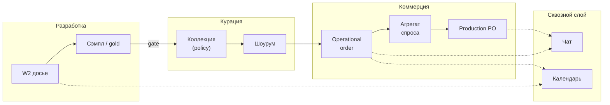
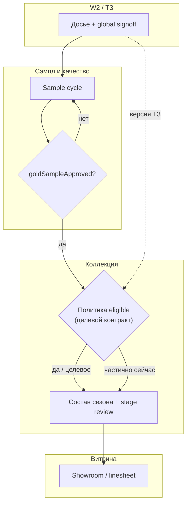
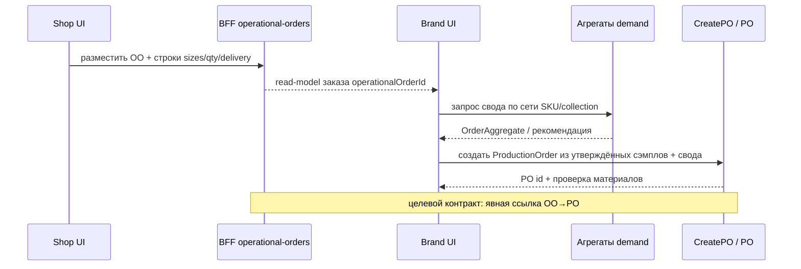
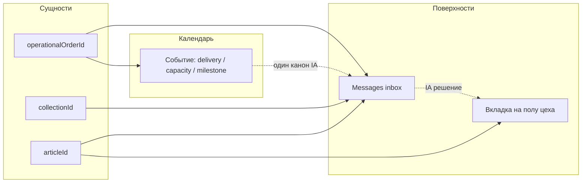

# GAP-анализ: пользовательский поток «коллекция → сэмпл → шоурум → B2B → агрегация → производство» + чат/календарь

**Дата:** 2026-05-11  
**Канон кода:** `_ai-share/synth-1-full`  
**Входы:** описание процесса пользователем (RU); канон research — `FOCUS_ONE_PAGER.md`, этот файл (`GAP`), `PLAN_RESTRUCTURE_THREE_PILLARS.md`, `FINAL_DIAGRAMS_AND_PAGES_RU.md` (**§0.1** — с чего начать: диаграммы 1–3 ↔ §11 PATCH ↔ таблицы страниц); выборочный grep по `src/`; корневой `AGENTS.md` / `INTEGRATION_MAP.md` во full при необходимости. **Архив** `.planning/research/_archive/` в этот `GAP` **не** включается и **не** цитируется как источник.

---

## 0. Карта документа и перекрёстные связи (все уровни)

| Раздел `GAP` | Уровень                           | Смысл                                    | Куда дальше                                                                                              |
| ------------ | --------------------------------- | ---------------------------------------- | -------------------------------------------------------------------------------------------------------- |
| **§1**       | Процесс                           | Целевой user flow (7 шагов)              | Столбы **`FOCUS_ONE_PAGER.md`**; узлы **`FINAL_DIAGRAMS_AND_PAGES_RU.md`** (диагр. 1–2)                  |
| **§2**       | Факт vs план                      | Есть / частично / нет по шагам           | Обновлять при каждом значимом PR (**§9.1**); статусы узлов **`FINAL`**, **Приложение F**                |
| **§3**       | Структура                         | Модули и сущности                        | **`PLAN_RESTRUCTURE_THREE_PILLARS.md` §4** артефакты в git                                               |
| **§4**       | Визуализация черновик             | Mermaid в этом файле                     | **`FINAL` §0.1** — карта «диагр 1–3 ↔ §11 PATCH ↔ таблицы»; диаграммы — **`FINAL`**; **§11** PATCH       |
| **§5**       | Capability                        | Матрица ролей × gap                      | **`PLAN` §7.8** смоки; **`FINAL` must**                                                                  |
| **§7**       | Контракты v1                      | Showcase, DTO, OO→PO, gate C1–C4, supply | **`PLAN` §7.1–7.4** (дубли по смыслу); **`PLAN` §7.7–7.8** URL; код `src/lib/order/*`                     |
| **§7.0**     | Столбы × capability × опции       | Перекрёстные потоки A/B/C                | **`FOCUS`** рёбра и таблица столбцов; **`FINAL` Приложение G**                                           |
| **§7.6**     | ADR-очередь                       | Порядок доменных решений                 | **`PLAN` §3.1** Фаза 2 строгий vs demo-mode                                                              |
| **§8**       | Продуктовые решения               | Чат ×2, календарь, thread priority       | **`PLAN` столб C**; **`FINAL`** диагр. 1 C1–C3                                                           |
| **§9**       | Аудит канона                      | Свод четырёх файлов                      | Полный индекс — **`FOCUS`** матрица уровней                                                              |
| **§9.1**     | Процесс сопровождения             | Синхрон §2/§5/runbook/FINAL              | Парные PR с кодом                                                                                        |
| **§10+**     | Вне ядра                          | Оценки зон                               | **`PLAN` §5** non-goals; не смешивать с spine                                                            |
| **—**        | Инвесторский нарратив «как в бою» | Пробелы end-to-end vs walkthrough        | **`FOCUS`** раздел «Инвестору: что уже… / чего не хватает»; деталь фактов — **§2**, **§5**, **§7.4–7.6** |

**Runbook (исполнение):** `_ai-share/synth-1-full/docs/INVESTOR_DEMO_RUNBOOK.md` — не дублирует §7 текстом в `GAP`, а **проводит** ведущего по URL; при смене §7.1/§7.7 обновлять runbook (**§9.1** п.6).

---

## 1. Целевой процесс (зафиксировано из сообщения)

| #   | Шаг процесса                                                                                                                                                        |
| --- | ------------------------------------------------------------------------------------------------------------------------------------------------------------------- |
| 1   | **Коллекция бренда** = артикулы, прошедшие создание и **финальное подтверждение при получении сэмпла**.                                                             |
| 2   | **Поставщик** в связке с брендом и производством: ткани, фурнитура, закупка, продажа, поставка, хранение.                                                           |
| 3   | **Производство** делает **сэмпл** по цепочке ТЗ → разработка → согласования.                                                                                        |
| 4   | **Бренд в шоуруме** курирует коллекцию, выборку артикулов, детализацию товара, **B2B-заказ**: селекция, объём, количество, размеры, сроки (delivery days), условия. |
| 5   | После B2B бренд **агрегирует с магазинов** и может **ставить на производство** заказы по артикулам по ТЗ/процессу разработки.                                       |
| 6   | **Чаты** — переписка бренд ↔ магазин ↔ поставщик ↔ производство в рамках проекта.                                                                                   |
| 7   | **Календарь** — даты, процессы, задачи, встречи, звонки, действия.                                                                                                  |

---

## 2. Пошаговое сопоставление с кодом: есть / частично / нет

Статусы отражают **наличие явной модели + UI/BFF**, а не маркетинговую ширину маршрутов.

| Шаг пользователя                                                                   | Статус       | Доказательство / комментарий                                                                                                                                                                                                                                                                                                                                                                                                                                                                                           |
| ---------------------------------------------------------------------------------- | ------------ | ---------------------------------------------------------------------------------------------------------------------------------------------------------------------------------------------------------------------------------------------------------------------------------------------------------------------------------------------------------------------------------------------------------------------------------------------------------------------------------------------------------------------- |
| 1. Коллекция только из артикулов с финальным подтверждением по сэмплу              | **частично** | W2: стадии подписания включают `sample` в демо-досье (`workshop2-ss27-demo-full-tz-dossier.ts`: `designerSignStages.sample`, `technologistSignStages.sample`). Отдельный флаг **`goldSampleApproved`** на артикуле production seed (`brand-production/types.ts`, `alerts.ts` → `/brand/production/gold-sample`). **Нет** найденного правила «в `/brand/collections` попадают только gold-sample-approved» без уточнения — связка коллекция ↔ gate по сэмплу **не выведена как единый контракт** в просмотренных путях. |
| 2. Поставщик: полный жизненный цикл материалов (закупка–продажа–поставка–хранение) | **частично** | `production-params.ts` перечисляет материалы/фурнитуру/семплы. Пол производства и материалы (`production-page-content-tab-materials-body-rolls.tsx` и др.). **Нет** единого доменного модуля «снабжение как ERP» для всех ролей — в `FOCUS_ONE_PAGER` поставщик пошива в данных W2, UX частично через фабрику.                                                                                                                                                                                                         |
| 3. Производство: сэмпл по ТЗ и согласованиям                                       | **частично** | W2 phase1-dossier API (`src/app/api/brand/workshop2/phase1-dossier/`), `Workshop2ArticleWorkspace`, lifecycle/signoff/merge. Этап `sample` в `floor-flow.ts`. Демо может быть **localStorage** (`W2_DOSSIER_LOCAL_STORAGE_KEY`, e2e `workshop2-smoke`).                                                                                                                                                                                                                                                              |
| 4. Шоурум бренда → выборка → B2B (объёмы, размеры, сроки)                          | **частично** | `src/app/brand/showroom/page.tsx`, `ROUTES.brand.*showroom`*, `linesheets`, shop shoppable lookbook. **Operational B2B** с контрактом: `/brand/b2b-orders`, `GET /api/b2b/operational-orders`, v1 DTO (`AGENTS.md`, `b2b-operational-orders-response.schema.ts`). Детализация строк заказа (размеры, delivery) — **уточнить по** `operational-order-dto.ts` / UI карточки; в этом анализе: **есть контур заказа**, глубина линий — не полный аудит.                                                                    |
| 5. Агрегация заказов с магазинов → постановка на производство по ТЗ                | **частично** | Доменные агрегаты в логике контроля: `OrderAggregate`, `CollectionAggregate`, `SampleAggregate` (`order-schemas.ts`, `control-aggregator.ts`, `sample-aggregate.ts`). UI **`CreatePOFromSamples`** — явный нарратив «PO из утверждённых сэмплов» + проверка «сырьё и фурнитура». **Нет** подтверждённого end-to-end «после operational order автоматически создаётся production PO в одном BFF» без чтения всего потока — **пробел интеграции** между B2B read-model и производственным PO.                            |
| 6. Чаты между ролями в рамках проекта                                              | **частично** | `/brand/messages`, `/shop/messages`, factory/distributor messages в `routes.ts`. **Нет** единого серверного канона thread-per-project для всех ролей (см. §8 TBD, `FINAL` PATCH-C); production floor — **вторая** поверхность чата (`production-page-content-shell-header-actions.tsx`).                                                                                                                                                                                                                               |
| 7. Календарь: процессы, задачи, встречи                                            | **частично** | `/brand/calendar`, shop B2B calendars, factory `production/calendar`. Риск **нескольких семантик** календаря (cutline, `FOCUS_ONE_PAGER`). Часть событий — demo (`demoCalendarEventsForProductionStage` в cutline/spine).                                                                                                                                                                                                                                                                                              |

**Итог по «есть»:** операционный B2B-контур, W2+tech-pack пилот, сообщения/календарь как **UI-слой** — **частично закрывают** историю; **узкие места** — единая модель «коллекция = только подтверждённые сэмплом», сквозная агрегация shop→brand→PO, единый чат/календарь на сущность заказа/проекта.

---

## 3. Что уже учли предыдущие доки vs новые нюансы из сообщения

| Тема                                | Уже в каноне (FOCUS / GAP / FINAL / PLAN) | Новый нюанс из сообщения                                                                                                                                                           |
| ----------------------------------- | ----------------------------------------- | ---------------------------------------------------------------------------------------------------------------------------------------------------------------------------------- |
| Три столба (ТЗ→образец, B2B, comms) | `FOCUS`, диаграммы в `FINAL`              | Пользователь явно требует **gate коллекции по финальному сэмплу** — в доках было «коллекции/showroom», без формального критерия отбора артикулов.                                  |
| Поставщик                           | `GAP` §2, `FINAL` диаграмма 1             | Пользователь описывает **полный материальный цикл** (закупка, продажа, склад) — шире, чем «контрагенты пошива» в API.                                                              |
| Шоурум                              | `FOCUS` (B), таблицы `FINAL`              | **Бренд в шоуруме** как место **курации** перед B2B-заказом с параметрами (дни доставки, условия) — нужно явно связать **один** URL-сценарий с operational order.                  |
| После B2B                           | `GAP` §2 шаг 5, `FINAL` диаграмма 2       | **Агрегация с магазинов** и **постановка на производство** по ТЗ — в коде есть зачатки (агрегаты, `CreatePOFromSamples`), **сквозной продуктовой связи** в доках не зафиксировано. |
| Чат/календарь                       | `FOCUS` (C), `PLAN` столб C               | Пользователь хочет **проектный** контекст переписки — усиливает требование к **thread id ↔ заказ/коллекция/артикул**.                                                              |

---

## 4. Структурирование в системе (предложение)

### 4.1 Доменные модули (концептуально)

| Модуль                       | Назначение                                                                                          |
| ---------------------------- | --------------------------------------------------------------------------------------------------- |
| **Article development (W2)** | Досье фазы 1, signoff, tech pack, handoff.                                                          |
| **Sample & quality gate**    | Gold sample, этапы `samples`, связь с коллекцией.                                                   |
| **Collection composition**   | Правила включения артикула в сезонную коллекцию (policy: `goldSampleApproved` + W2 global signoff). |
| **Showroom & assortment**    | Витрина, linesheet/lookbook, подборка для байера.                                                   |
| **B2B commercial**           | Operational orders, v1 API, заметки, ship window (см. B2B types в AGENTS).                          |
| **Demand aggregation**       | Свод потребности с shop/регионов → рекомендация PO.                                                 |
| **Production execution**     | PO, этаж цеха, материалы, связь с handoff.                                                          |
| **Supply & materials**       | Ткани/фурнитура/логистика (сейчас фрагментарно в production + finance).                             |
| **Comms**                    | Messages + calendar с привязкой к сущности (orderId, collectionId, articleId).                      |

### 4.2 Сущности (черновик)

`Brand`, `Collection`, `Article`/`SKU`, `Phase1Dossier`, `TechPackArtifact`, `SampleApproval`/`GoldSample`, `ShowroomSelection`, `OperationalOrder`, `OrderLine` (sizes, qty, delivery terms), `ShopAccount`, `AggregatedDemand`, `ProductionOrder`, `Supplier`/`Contractor`, `MaterialLot`, `ChatThread`, `CalendarEvent`.

### 4.3 Визуализация (экраны и потоки)

Расширение к **диаграммам в `FINAL_DIAGRAMS_AND_PAGES_RU.md`**: ветка **gate коллекции по сэмплу** (`/brand/production/gold-sample` → фильтр артикулов → `/brand/collections`) и **агрегация → PO** (`CreatePOFromSamples` / operations floor ↔ `b2b-orders`) — узлы **ELIG / AGG / PO** на диаграмме 2 **`FINAL`**; детальный **PATCH Mermaid** (gate, sequence OO→PO, IA чата) — **§11 ниже**. **Приложение D** в `FINAL` — свод **IA по кабинетам** (layout / nav), не дублирует эти потоки. **Сводная карта** «какой артефакт открыть» — **`FINAL` §0.1**.

---

## 5. Детальный чеклист: capability → роли → статус в коде → gap

| Capability                              | Роли                                 | Статус         | Gap / следующий шаг                                                                                          |
| --------------------------------------- | ------------------------------------ | -------------- | ------------------------------------------------------------------------------------------------------------ |
| ТЗ на артикул (секции, signoff, версии) | Бренд, (производство читает handoff) | частично       | Персистентность вне демо; env tech pack.                                                                     |
| Подтверждение сэмпла как бизнес-факт    | Бренд, QA                            | частично       | Связать `goldSampleApproved` + W2 sample stage **с правилом коллекции**; UI коллекций.                       |
| Коллекция = только eligible артикулы    | Бренд                                | нет / уточнить | Явная policy + API; сейчас не найдено как единый контракт.                                                   |
| Справочник пошива/контрагенты           | Бренд                                | частично       | `GET /api/brand/contractors`, `sewing-contractors`.                                                          |
| Материалы и фурнитура (закупка/склад)   | Бренд, поставщик                     | частично       | Куски UI/params; нет сквозного supplier ERP в одном модуле.                                                  |
| Шоурум / linesheet                      | Бренд, shop                          | частично       | Канон URL — **§7.1**; e2e-ассерт на витрину — после сужения IA (`PLAN` §7.8 п.5).                            |
| B2B заказ (объёмы, размеры, сроки)      | Бренд, shop                          | частично       | v1 operational; проверить полноту линий в DTO/UI.                                                            |
| Зеркало заказа у ритейла                | Shop                                 | частично       | e2e/API есть; см. AGENTS.                                                                                    |
| Агрегация заказов с магазинов           | Бренд                                | частично       | Агрегаты в `control-aggregator`; **нет** явного «merge orders» в BFF в этой выборке.                         |
| PO на производство после B2B            | Бренд, фабрика                       | частично       | `CreatePOFromSamples`, seed `INITIAL_PRODUCTION_ORDERS`; связь с B2B — **слабая**.                           |
| Чат в контексте проекта                 | Все                                  | частично       | Два уровня UX; единый backend thread — gap (см. §8).                                                         |
| Календарь задач/встреч/процессов        | Все                                  | частично       | Несколько календарей; demo-события; нужен канон IA.                                                          |
| Коллаборация этапов коллекции           | Бренд                                | частично       | `POST /api/brand/collection-stage-review`, файл `.data/workshop2-collection-stage-review.json` — узкий порт. |

---

## 7. Контракты и критерии приёмки для исполнения (инфраструктура v1)

Ниже — зафиксированная **детализация** для разработки и приёмки; источник типов в коде: `_ai-share/synth-1-full/src/lib/order/operational-order-dto.ts`, `b2b-order-payload.ts`, `routes.ts`.

### 7.0 Три столба: capability из §5 × столбец × опции × перекрёстные потоки

**Столбец** — тот же **A / B / C**, что в `FOCUS` и `PLAN` §2. **Опции** — полный реестр в **`PLAN` §8.4**; здесь — только релевантность столбу.

| Capability (§5)                          | Столбец                     | Задействованные опции / политики                        | Перекрёстный поток данных (информация)                                     |
| ---------------------------------------- | --------------------------- | ------------------------------------------------------- | -------------------------------------------------------------------------- |
| ТЗ W2, signoff, версии                   | **A**                       | Tech pack env; LS в демо                                | **A→B:** артикул как кандидат в коллекцию (`FINAL` ELIG)                   |
| Подтверждение сэмпла, eligible коллекции | **A** + **B**               | ADR №1 (`§7.6`)                                         | **A→B:** gold / W2 sample → фильтр коллекции и витрины (`§7.4`)            |
| Шоурум / linesheet                       | **B**                       | Investor spine (канон URL)                              | **B→B:** showroom → OO (`§7.1`)                                            |
| B2B заказ, зеркало shop                  | **B**                       | `B2B_V1_*`, read-model                                  | **B→C:** `operationalOrderId` в thread (`§8`)                              |
| Агрегация, PO                            | **B** (+исполнение фабрики) | ADR №2; `phase2-demo-mode`                              | **B→P4/P3** диагр. 2 (`FINAL`)                                             |
| Чат проектный                            | **C**                       | Два UX до ADR №3                                        | **C↔B** deep link приоритет (`§8`)                                         |
| Календарь                                | **C**                       | Канон `/brand/calendar`; не смешивать легенды           | **C↔A** пол производства; **C↔B** delivery shop — отдельные слои           |
| Коллаборация стадий коллекции            | **B**                       | API `collection-stage-review`                           | **B→A:** стадии vs готовность TZ (узкий порт)                              |
| Справочники пошива / материалы           | **A** (+ **supply**)        | Не отдельный столб в `FOCUS` — данные для **A** и **B** | **supply→A** W2 контрагенты; **supply→B** материалы к PO (`FINAL` **MAT**) |

**Пробел связности:** если capability помечен «частично» в §5 и строка выше не закрыта кодом — в питче **не** расширять нарратив за пределы **`FOCUS_ONE_PAGER.md`** таблицы «Инвестору: чего не хватает».

### 7.1 Канонический showcase (витрина → B2B)

- **Основной URL демо-витрины бренда:** `/brand/showroom` (`ROUTES.brand.showroom` в `src/lib/routes.ts`).
- **Альтернатива (linesheets):** `/brand/b2b/linesheets` (`ROUTES.brand.b2bLinesheets`).
- **Сквозной нарратив:** витрина → осознанный CTA к operational order → `/brand/b2b-orders` (автоматический deep link только после реализации в UI).

### 7.2 Operational Order v1 — поля DTO (список и карточка)

**List row (`OperationalOrderListRowDto`):** `wholesaleOrderId`, `status`, `shop`, `brand`, `amount`, `date`, `deliveryDate`, опционально `orderMode`, `eventId`, `passportSlotId`, `priceTier`, `territory`, `creditLimit`, проекции `paymentStatus`, `paidAmount` (rollup, не бухгалтерский SoT).

**Detail (`OperationalOrderDetailDto`):** всё из list + **`items: B2BOrderLineItem[]`**, `orderNotes`, `internalNotes`.

**Строка заказа (`B2BOrderLineItem`):** `productId`, `size`, `quantity`, `price`, опционально `currency`, `deliveryDate`, `deliveryWindowId`, `lineNotes`, `lineStatus`, `replacedByProductId`, `brandSize`, `retailerSize`, `tryBeforeBuy`.

**Заметка для UI:** в list DTO нет поля отгрузки — трекинг отдельным контуром (см. комментарий в `operational-order-dto.ts`, `AGENTS.md`). Задача [↑]: карточка отображает detail + все значимые поля строки согласованно с `GET /api/b2b/v1/operational-orders/[orderId]` / legacy fallback.

### 7.3 Целевой поток OO → агрегация → PO (шаги для BFF/UI)

1. Создание/обновление operational order через существующий BFF (v1 с fallback на legacy — `AGENTS.md`).
2. Read-model списка/карточки — `b2b-orders-list-read-model.ts`; не плодить второй источник в UI.
3. Бренд открывает **свод агрегатов** (`OrderAggregate`, `control-aggregator.ts`) — целевой UI: экран или секция «merge / свод спроса» ([+]).
4. Инициация **Production PO** из утверждённых сэмплов и/или свода — `CreatePOFromSamples`, проверка сырья/фурнитуры.
5. **ADR:** источник правды для цифр PO (платформа vs ERP); явная связь `wholesaleOrderId` ↔ `productionOrderId` (событие или таблица — один канон).
6. Смоки: обновить/добавить сценарий в `e2e/b2b-operational-orders-api.spec.ts` и/или `unified-ecosystem-smoke.spec.ts` под ручной проход `PLAN` §7.7–§7.8 (матрица приёмки).
7. При смене границы домена — `docs/B2B_AND_PRODUCTION_CORE_SPEC.md` / `docs/domain-model/` (политика `domain-canon-pr`).

### 7.4 Gate коллекции после финального сэмпла — критерии приёмки (черновик)

- **C1:** Флаг «**eligible для коллекции**» вычисляется из `goldSampleApproved` + стадий W2 sample / global signoff (точная формула — ADR).
- **C2:** В UI `/brand/collections` (и селекторах шоурума) артикулы с `eligible = false` **скрыты** или явно помечены «вне опубликованного сезона» — **один** режим, зафиксированный в ADR.
- **C3:** API состава коллекции **согласован** с тем же правилом, что UI.
- **C4:** Минимум один **e2e или контрактный тест** на негативный кейс (при строгом режиме).

### 7.5 Supply / поставщик — scope v1

- **В spine v1:** справочники контрагентов/материалов, партии и параметры в производственном UI, связь с W2 и PO.
- **Вне spine без фазы:** полный ERP закупки–продажи–склада для всех ролей.

### 7.6 Очередь ADR и обновлений доменных доков

Ниже — **последовательность решений**. Колонка **«Блокирует зелёный investor-проход»** — про проход только по URL/навигации (**`PLAN` §7.7–7.8**, Фазы 0–1), без продуктовых заявлений про eligible/PO.

| Порядок | Тема                               | Минимальное содержание ADR / PR                                                                                                | Связь                      | Блокирует зелёный investor-проход (URL-only)               | Рекомендуемая фаза `PLAN` §3                    |
| ------- | ---------------------------------- | ------------------------------------------------------------------------------------------------------------------------------ | -------------------------- | ---------------------------------------------------------- | ----------------------------------------------- |
| 1       | **Eligible для коллекции (C1–C4)** | Формула из `goldSampleApproved` + W2 sample/global signoff; режим UI (скрыть vs пометить); согласование API состава коллекции. | §7.4                       | **Нет**, если не обещаем строгий отбор в коллекции в питче | Закрыть до **строгой** Фазы 2 (**`PLAN` §3.1**) |
| 2       | **OO ↔ PO и SoT сумм**             | Событие или сущность связи `wholesaleOrderId` ↔ production PO; что в платформе vs внешний ERP; не дублировать read-model в UI. | §7.3 п.5, `FINAL` диагр. 2 | **Нет** для демо по реестру OO                             | Закрыть до **строгой** Фазы 2                   |
| 3       | **Конвергенция чат-поверхностей**  | Только после стабилизации spine; иначе сохраняем два UX по **§8**.                                                             | §8                         | **Нет**                                                    | После Фазы 2 или отдельный эпик                 |

**Интерпретация:** если внешнему наблюдателю нужны формулировки уровня «в сезоне только eligible» или «OO автоматически ведёт к PO в платформе» — без ADR **№1** и **№2** такие фразы **недопустимы**; допускается только режим **`phase2-demo-mode`** из **`PLAN` §3.1**.

После каждого ADR — точечное обновление `docs/B2B_AND_PRODUCTION_CORE_SPEC.md` / `docs/domain-model/*` и строки в **`FINAL` must** и **Приложении F**, если меняется граница [Е]/[+]/[↑].

---

## 8. Решения v0.1 (зафиксированные рекомендации)

| Тема                                                                | Решение                                                                                                                                                                                        |
| ------------------------------------------------------------------- | ---------------------------------------------------------------------------------------------------------------------------------------------------------------------------------------------- |
| Два уровня чата (`/brand/messages` vs вкладка на полу производства) | **Оба сохраняются** до отдельного ADR конвергенции. Inbox — кросс-роль; вкладка на полу (`production-page-content-shell-header-actions.tsx`) — контекст цеха с подписью в IA, не замена inbox. |
| Канонический календарь на квартал                                   | **Демо-канон:** `/brand/calendar` — сроки сделки и встречи бренда. Shop delivery и factory capacity — **отдельные слои** с подписью, без смешения легенд на одном экране.                      |
| Thread ↔ сущность                                                   | **Приоритет deep link:** `operationalOrderId` → `collectionId` → `articleId` / W2; матрица прав — `PLAN` **§8.2**; маппинг URL в смоках и сквозной e2e — `PLAN` **Фаза 2**.                    |
| Gate коллекции                                                      | Цель и критерии: **§7.4**.                                                                                                                                                                     |
| OO → агрегация → PO                                                 | Шаги и ADR: **§7.3**; визуализация узла: `FINAL` диаграмма 2.                                                                                                                                  |

---

## 9. Аудит полноты канона (свод)

**Runbook** и **реестр флагов** — см. **§0** (runbook) и **`PLAN` §8.4**; при смене канона витрины или смоков — синхрон по **§9.1** п.6.

Четыре файла покрывают стратегию, разрывы, план и визуализацию. **Навигация по уровням** — матрица L0–L4 в **`FOCUS_ONE_PAGER.md`**, **§0** в `GAP` и `PLAN`, **§0** в `FINAL`. **Пробелы для истории «как в бою»** — отдельная таблица в **`FOCUS_ONE_PAGER.md`** («Инвестору: что уже… / чего не хватает»). **Таблица полей OO v1** и **контракты showcase / OO→PO / gate** — в **§7** выше; **очередь ADR** — **§7.6** (с колонкой блокировки и фаз). В `PLAN_RESTRUCTURE_THREE_PILLARS.md`: **§3** — фазы с владельцем, артефактами git и порогами; **§3.1** — ветвление Фазы 2 (строгий vs demo-mode); **§8.4** — реестр флагов/опций; **§9** — шаблон эпика; **§7.7** — чеклист URL; **§7.8** — матрица смоков; **§8** — investor spine, **§8.2** — RBAC, **§8.3** — DoD PR. В `FINAL` — **§0** уровни артефакта и **Приложение F** (узлы → фазы). Остаётся по мере спринтов: внедрение в код, ADR из §7.6, обновление доменных доков во full при смене границ.

### 9.1 Политика обновления §2 и §5 при закрытии PR

Чтобы канон не расходился с кодом:

1. **После каждого PR**, который меняет поведение шага процесса (коллекция, OO, PO, чат, календарь, W2), ответственный за PR добавляет в описание чекбокс: «обновлён `GAP` §2 / §5» или явное «N/A».
2. **§2 (пошаговое сопоставление):** если статус шага меняется с «частично» на «есть» (или наоборот) — одна строка в таблице §2 + ссылка на PR.
3. **§5 (capability):** если закрыт или открыт gap целой capability — обновить столбцы «Статус» и «Gap / следующий шаг»; не накапливать дубликаты с §7 — для контрактов ссылаться на **§7**.
4. **Частота:** в идеале в **том же PR**; максимум — следующий рабочий день (техдолг-тикет с ссылкой на PR).
5. **FINAL:** при смене статуса узла на диаграммах — обновить **Приложение F** и при необходимости блок **must**.
6. **Runbook:** если изменились обязательные URL демо (**`PLAN` §7.7**), честные подписи или pre-flight — обновить **`_ai-share/synth-1-full/docs/INVESTOR_DEMO_RUNBOOK.md`** в том же PR или связанным тикетом (**label `docs-runbook`**). В шапке runbook зафиксировано: **§5 runbook ↔ §7.7** и прогон **`npm run validate:cabinet-nav`** после смены навигации; см. также **`PLAN` §9.4** п.4.

---

## 10. Зона вне ядра — оценки `код / продукт / использование` (1–10)

Сноска: **код** — стабильность маршрутов/API/тестов; **продукт** — позиция в IA и сквозной сценарий; **использование** — можно ли отдать без инженера. Список зон и цифры — из консолидированного анализа вне трёх столбов (см. также `FOCUS` «сознательно не делаем» и `PLAN` §5).

| Название / зона                                                                                                 | код / продукт / использование | Комментарий при оценке ниже 5                                               |
| --------------------------------------------------------------------------------------------------------------- | ----------------------------- | --------------------------------------------------------------------------- |
| Academy (`/academy`)                                                                                            | 5 / 3 / 3                     | Вне P0-питча.                                                               |
| Client: sewing patterns, preset editor, for-you, style-quiz (`/client/`*)                                       | 6 / 2 / 2                     | Non-goal для главного экрана.                                               |
| Admin (общий кабинет) (`/admin`)                                                                                | 7 / 4 / 4                     | Не целевой пользователь демо.                                               |
| Хвост `shop/b2b/`* (margin, replenishment, …)                                                                   | 7 / 3 / 3                     | Ширина без одной истории — шум для инвестора.                               |
| `brand/planning` + AI-симуляция                                                                                 | 5 / 3 / 3                     | Нужна связь «план ↔ заказ/артикул».                                         |
| `brand/ai-design` и прочие AI-витрины без spine                                                                 | 5 / 3 / 3                     | Не привязаны к трём столбам.                                                |
| Аналитика 360 / platform-sales (`/brand/analytics/*`, distributor analytics)                                    | 6 / 4 / 4                     | Риск scope creep.                                                           |
| Архивные B2B-интеграции UI (`/brand/integrations/archive/*`)                                                    | 7 / 4 / 4                     | «Карта», не полный контур на каждый коннектор.                              |
| Distributor cabinet (`/distributor`)                                                                            | 6 / 4 / 4                     | Вне узкого spine.                                                           |
| Factory (весь кабинет кроме comms/handoff) (`/factory`)                                                         | 6 / 5 / 4                     | Сценарий под демо не выровнен целиком.                                      |
| Metaverse, try-on, look-builder, live, marketroom                                                               | 4 / 2 / 2                     | Низкая зрелость для операционного питча.                                    |
| Kickstarter, wallet, loyalty, auctions                                                                          | 4 / 2 / 2                     | Побочные воронки.                                                           |
| DPP, circular-hub, merch/trade-codes, logistics/duty                                                            | 5 / 3 / 3                     | Нишевые модули вне столбов.                                                 |
| Публичные витрины: `catalog`, `products`, `search`, outlet, store-locator, `b/[brandId]`                        | 7 / 5 / 6                     | Не операционный контур кабинета в фокусе.                                   |
| Маркетинговые страницы: about, blog, press, careers, contact, faq, privacy, terms, community, partner, shipping | 6 / 5 / 7                     | Контент-сайт.                                                               |
| Checkout, orders (розница), quiz                                                                                | 6 / 4 / 5                     | Не центр B2B/производственного демо.                                        |
| Customer-360, project-info, project-status                                                                      | 5 / 3 / 4                     | Демо-мета, не spine.                                                        |
| Supplier (публичный `src/app/supplier`)                                                                         | 5 / 3 / 3                     | Исполнитель в данных W2, не отдельный столбец UX.                           |
| Python FastAPI (`app/main.py`, `pyproject.toml`)                                                                | 7 / 2 / 2                     | Код есть; без явной связки с видимым Next — низкий продукт/usage для питча. |
| Organization hub (`/brand/organization`)                                                                        | 6 / 5 / 5                     | Полезен как command center; подпись mock.                                   |
| CMS бренда (`/brand/cms`)                                                                                       | 6 / 4 / 5                     | Контент, не W2/B2B spine.                                                   |
| B2B content-syndication, order-approval-workflow (`brand/b2b/*`)                                                | 6 / 4 / 4                     | Рядом с ядром, не в коротком списке URL демо.                               |
| Shop: clienteling, career и прочие ветки вне b2b-orders/spine                                                   | 5 / 3 / 4                     | Не в union смоков без решения.                                              |

---

## 11. PATCH-диаграммы (Mermaid) — закрытие визуальных пробелов

Ниже — перенос предложенных схем в канон; дублируют смысл §4 и `FINAL` диаграмму 2, но дают **gate**, **sequence** и **IA чата/календаря**.

### PATCH-A — Gate коллекции по сэмплу

### PATCH-B — B2B → агрегация → PO (sequence)

### PATCH-C — Чат и календарь: сущности и поверхности

---

## 12. Сводка репозитория (для питча и приоритизации)

- **Канон UI/BFF:** `_ai-share/synth-1-full` — App Router (`src/app/`), ~**130** `route.ts`, **552** `page.tsx`; **Jest** (`npm run verify`), **Playwright** (в т.ч. `smoke`, `unified-ecosystem-smoke`, `workshop2-smoke`, `test:e2e:api`). Дубли: legacy и `b2b/v1` operational orders — см. `AGENTS.md`.
- **P0 (важность × зрелость):** operational B2B, integrations/export, domain events, shop API, processes.
- **P1:** Workshop 2 (dossier, tech-pack), organization, планирование↔коллекция.
- **P2–P3:** длинный хвост `shop/b2b/`*, exploratory UI — сужать демо.
- **FastAPI** (`app/main.py`): отдельный сервис; в питче Next — только если назван экран или контракт интеграции.

---

## 13. Рекомендованные уточняющие вопросы (если нет ответа в коде)

1. **Коллекция:** считается ли артикул в коллекции без `goldSampleApproved` допустимым для шоурума «черновик» или запрещён полностью?
2. **Агрегация:** источник правды — operational orders v1, отдельная витрина shop, или внешняя ERP?
3. **Чат:** один thread на `operationalOrderId` или на `collectionId`?

---

## 14. Трассировка grep (кратко)

Найдены плотные совпадения: `phase1-dossier`, `tech-pack`, `operational-orders`, `workshop2`, `showroom`, `linesheet`, `gold-sample`, `sample` (в т.ч. W2 dossier), `contractors`/`sewing`, `CreatePOFromSamples`, `OrderAggregate`/`SampleAggregate`, `collection-stage-review`. Строка **«семпл»** в UI встречается точечно (напр. `project-info`); доменный канон — **`sample`** / `goldSample`.

---

*Файл только для планирования; код не менялся.*