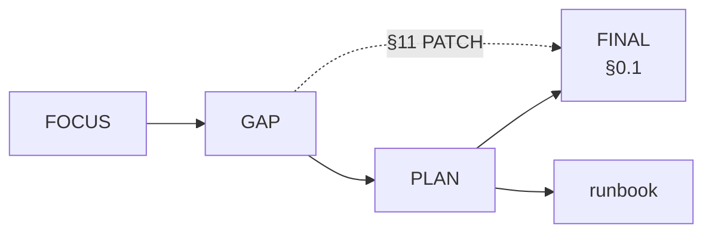

# План реструктуризации под три столба фокуса

**Дата:** 2026-05-11  
**Опора:** `.planning/research/FOCUS_ONE_PAGER.md`, `GAP_ANALYSIS_USER_FLOW_COLLECTION_B2B_CHAT_CALENDAR.md`, `FINAL_DIAGRAMS_AND_PAGES_RU.md` (**§0.1** карта диагр↔PATCH↔таблицы; таблицы IA; **Приложение F** — узлы → фазы).  
**Канон кода:** `_ai-share/synth-1-full` · **Приёмка экосистемы (вне этого файла):** `_ai-share/synth-1-full/docs/UNIFIED_ECOSYSTEM_VERIFICATION.md`, `INTEGRATION_MAP.md`. **Архив:** `.planning/research/_archive/` — вне канона FOCUS/GAP/PLAN/FINAL; не импортировать оттуда содержимое в этот `PLAN`.

### Связанные уровни (этот `PLAN` в контексте четырёх файлов + full)


| Уровень                   | Разделы `PLAN`                   | Связь                                                                     |
| ------------------------- | -------------------------------- | ------------------------------------------------------------------------- |
| Стратегия / границы       | §5 non-goals, §6 метрики         | `FOCUS`                                                                   |
| Фазы исполнения           | **§3–§3.2**, §4 список файлов    | Эпики **§9**, тикерные метки **§9.3**                                     |
| Демо-скрипт и URL         | **§7** (в т.ч. 7.5–7.8)          | `GAP` §7 контракты; `FINAL` диаграммы; `docs/INVESTOR_DEMO_RUNBOOK.md`    |
| Флаги, RBAC, DoD PR       | **§8** (в т.ч. 8.4 реестр опций) | `src/lib/feature-flags.ts`, `rbac.ts`, `AGENTS.md`                        |
| ADR и Фаза 2              | **§3.1**                         | `GAP` §7.6                                                                |
| Межстолбцовые связи A↔B↔C | **§2.1**, столбцы §2             | `FOCUS` (рёбра + таблица A/B/C); `GAP` **§7.0**; `FINAL` **Приложение G** |


**Индекс «функция → где описано»:** навигация — §2 столбцы (a) + §4; **стыки столбов** — §2.1, `GAP` §7.0, `FINAL` Приложение G; смоки/CI — §6–§7.8; презентация — §7 + runbook; трекер — §9.

**Кто что «рисует» (артефакты визуализации):** стратегия и столбы — `FOCUS`; процесс vs код и PATCH Mermaid — `GAP` (**§4**, **§11**); сквозные диаграммы, страницы, F/G/D — `FINAL` (**§0**, **§0.1**); исполняемый порядок URL — runbook во full. Ниже — одна схема потока чтения.



---

## 1. Цель и принципы

**Цель:** привести *видимую* поверхность продукта и приёмочные контуры к трём столбам из one-pager — **без переписывания домена и без снятия широкого legacy-дерева маршрутов целиком**.

**Принципы работы:**

- Сужать **IA и сайдбары** (что в «ядре», что в архив/More, порядок кластеров), а не переписывать страницы без нужды.
- Зафиксировать **приоритет смоков и preflight** под один инвесторский проход + CI-гейт на него.
- Выровнять **копирайт** (заголовки групп, подписи «демо / prod», одна фраза про календарь и про два уровня чата) с тем, что реально показывается.
- Ввести или расширить **флаги** (аналог уже существующего `NEXT_PUBLIC_SHOP_NAV_MVP` для shop) для режима «investor / demo spine», не ломая полный продукт для внутренних ролей.
- **Layout** — только тонкие правки: выделение «spine» в shell, бейджи демо, без массового редизайна.
- **Сужение без удаления кода:** страницы и API **вне** трёх столбов **не вычищаем** из репозитория; для канона опыта их **убираем из основной навигации** (spine / investor-меню / «ещё»), при необходимости помечаем в копирайте IA как **«вне фокуса»**; **не** добавляем их в **`PLAN` §7.7**, runbook и **CI-поднабор §6–7.8**, пока продукт явно не вернёт пункт в spine.

---

## 2. Три столба

### Столб (A) Разработка артикула: ТЗ → образец (Workshop 2 + tech pack)

**Текущее состояние (кратко):**  
В коде есть хаб W2, демо-досье и API `phase1-dossier/*`, смок `e2e/workshop2-smoke.spec.ts`, хелперы демо-маршрутов; tech pack — пилот с env (S3/DB), preflight `npm run w2:techpack:preflight`. Часть демо опирается на localStorage; коллекция `Investor` и сиды связаны с `investor-demo-flow-seed` / production hooks.

**Целевое состояние для инвесторского демо:**  
Один узнаваемый проход: **профиль/производство → hub W2 → демо-артикул (например SS27 / demo-ss27-01) → ключевая секция ТЗ → (при готовности env) шаг tech pack** с честной подписью «mock / env-gated».

**Конкретные изменения по слоям:**


| Слой                        | Действия                                                                                                                                                                                                                                                                                      |
| --------------------------- | --------------------------------------------------------------------------------------------------------------------------------------------------------------------------------------------------------------------------------------------------------------------------------------------- |
| **(a) IA/меню**             | В `brand-navigation.ts` + кластерах `syntha-nav-clusters.ts` закрепить W2/производство как верхний «операционный» якорь; в investor-режиме снизить визуальный шум соседних веток (PIM/аналитика — вторично или в «ещё»).                                                                      |
| **(b) Страницы/роуты**      | Оставить в фокусе: `/brand/production/workshop2`, `/brand/production/workshop2/c/[collectionId]/a/[articleId]`; опорный вход с производства `/brand/production` — по сценарию смока. Служебные глубокие URL не удалять, но не тащить в демо-меню.                                             |
| **(c) API/BFF приоритет**   | Приоритет: `src/app/api/brand/workshop2/phase1-dossier/`**, `src/app/api/brand/workshop2/tech-pack/`**; не раздувать новый legacy без ADR.                                                                                                                                                    |
| **(d) Данные mock vs real** | Явно маркировать в UI демо-досье / localStorage; tech pack — только при выполненном preflight (`docs/W2_TECHPACK_PILOT.md`, `env.w2-techpack.example`).                                                                                                                                       |
| **(e) Тесты/e2e**           | Зелёные: `e2e/workshop2-smoke.spec.ts` (запуск: `playwright test e2e/workshop2-smoke.spec.ts` из каталога full при необходимости добавить npm-скрипт); `npm run w2:techpack:preflight` в CI/ручном чеклисте демо; unit у колокированных `__tests__/route.test.ts` под W2 API — без регрессий. |


---

### Столб (B) Коллекции + B2B: заказы и шоурум

**Текущее состояние (кратко):**  
Операционные заказы — контур `GET /api/b2b/operational-orders`, UI `/brand/b2b-orders`, зеркало shop; e2e `b2b-operational-orders-api.spec.ts`, упоминания в unified smoke. B2B «витрина» — десятки маршрутов под JOOR/NuORDER-нарратив в `ROUTES.brand.b2b`*; shop — широкий `/shop/b2b/*` с табами (`shop-navigation.ts`, `b2b-hub-nav-match.ts`, `components/shop/b2b/layout.tsx`).

**Целевое состояние для инвесторского демо:**  
**Один** сквозной сценарий: витрина сезона (linesheet *или* shoppable lookbook) → переход к **операционному заказу** с подписью источника данных; интеграции как «карта экосистемы» с CTA на реестр заказов (уже зафиксировано в матрице приёмки).

**Конкретные изменения по слоям:**


| Слой                        | Действия                                                                                                                                                                                                                                                                                                                                            |
| --------------------------- | --------------------------------------------------------------------------------------------------------------------------------------------------------------------------------------------------------------------------------------------------------------------------------------------------------------------------------------------------- |
| **(a) IA/меню**             | `brand-navigation.ts`: кластер B2B — выделить **операционный реестр** и **один** showcase-маршрут; остальное — `navTier`/архив или скрытие при `NEXT_PUBLIC_*_INVESTOR` (новый флаг — решение на Фазе 1). `shop-navigation-normalized.ts` + при необходимости `NEXT_PUBLIC_SHOP_NAV_MVP` — не показывать полную ширину margin-отчётов в демо-спине. |
| **(b) Страницы/роуты**      | Видимые для демо: `/brand/b2b-orders`, `/brand/b2b-orders/[orderId]`; `/brand/integrations`; `/brand/collections` (якорь витрины по one-pager); один выбранный showroom/linesheet путь из `ROUTES` — зафиксировать в чеклисте URL. Shop: `/shop/b2b-orders` (редиректы см. `next.config.ts`, AGENTS).                                               |
| **(c) API/BFF приоритет**   | `GET/POST` operational orders, при необходимости v1 hooks из AGENTS; `GET /api/b2b/integrations/catalog-summary` для нарратива каталога (смок `e2e/b2b-catalog.spec.ts`).                                                                                                                                                                           |
| **(d) Данные mock vs real** | Read-model `b2b-orders-list-read-model.ts` — не плодить второй источник в UI; подпись demo tenant.                                                                                                                                                                                                                                                  |
| **(e) Тесты/e2e**           | Зелёные: `e2e/unified-ecosystem-smoke.spec.ts` (`npm run test:e2e:verification`), `e2e/smoke.spec.ts` (`npm run test:e2e:light`), `e2e/b2b-operational-orders-api.spec.ts` (в составе `npm run test:e2e:api`); после сужения IA — обновить только затронутые `data-testid`/маршруты в этих файлах.                                                  |


---

### Столб (C) Чат + календарь как сквозной слой

**Текущее состояние (кратко):**  
У бренда и shop — полноформатные Messages/Calendar (`/brand/messages`, `/brand/calendar`, аналоги shop). На производстве бренда — локальный UX вкладок; кросс-роль — через согласованные ссылки. В коде: коммуникации в навигации shop/brand, скрипт `scripts/validate-comms-group-ids.ts`.

**Целевое состояние для инвесторского демо:**  
В питче одна строка: **полный чат** vs **вкладка на полу производства**; один выбранный **канонический календарь** для кросс-роли на квартал (без смешения семантик в один UI).

**Конкретные изменения по слоям:**


| Слой                        | Действия                                                                                                                                                                                                                   |
| --------------------------- | -------------------------------------------------------------------------------------------------------------------------------------------------------------------------------------------------------------------------- |
| **(a) IA/меню**             | Поднять группу comms в `brand-navigation.ts` / `shop-navigation-normalized.ts` (и при демо factory — `factory-navigation.ts`) в «syntha-core» согласно `syntha-nav-clusters.ts` + валидация `validate-comms-group-ids.ts`. |
| **(b) Страницы/роуты**      | Демо-URL: `/brand/messages`, `/brand/calendar`; shop-зеркала по `ROUTES` / cutline; production floor — только встроенные вкладки, без обещания идентичности с `/brand/messages`.                                           |
| **(c) API/BFF приоритет**   | Минимальный приоритет для демо — то, что уже дергает UI сообщений/календаря и B2B-context links; **не** блокировать демо ожиданием единого enterprise realtime (явный non-goal из one-pager).                              |
| **(d) Данные mock vs real** | Подписи в empty states; не сливать brand delivery vs factory capacity в одну легенду без продуктового решения.                                                                                                             |
| **(e) Тесты/e2e**           | После фиксации копирайта/IA — точечные ассерты в `unified-ecosystem-smoke.spec.ts` / `smoke.spec.ts` на видимость comms и навигационный порядок; при смене group ids — прогон `npm run validate:comms-group-ids`.          |


### 2.1 Индекс: столбец A / B / C → разделы этого `PLAN` → `GAP` → `FINAL`

Использовать при планировании спринта и при проверке, что **все связи** трёх столбов покрыты задачами.


| Столбец | Разделы `PLAN` (якоря)                                                                                           | `GAP`                                                | `FINAL`                                                                                           |
| ------- | ---------------------------------------------------------------------------------------------------------------- | ---------------------------------------------------- | ------------------------------------------------------------------------------------------------- |
| **A**   | §2 столб A (таблица слоёв), §7.2 ветка A, §7.7 п.2–3, п.11; §4 W2/tech-pack пути; §8.4 tech pack / factory spine | §2 шаг 3–4, §5 TZ/сэмпл, §7.5 supply↔W2, §7.6 ADR №1 | Диагр. 1 **pillarA**, диагр. 2 **TZ–SM–GS**; **Приложение F** A1–A7                               |
| **B**   | §2 столб B, §7.1–7.3, §7.7 п.4–7, п.10; §3.1 Фаза 2; §8.2 OO RBAC                                                | §7.1–7.4, §5 B2B/шоурум/агрегация, §7.6 ADR №1–2     | Диагр. 1 **pillarB**, **supply**, **prodexec**; диагр. 2 **COL–PO**; таблица brand **B2B/шоурум** |
| **C**   | §2 столб C, §7.7 п.8–9; §8.3 + `validate:comms-group-ids`                                                        | §8 чат/календарь/thread                              | Диагр. 1 **pillarC**; **Приложение F** C1–C3                                                      |


**Опции, затрагивающие сразу два столба:** `NEXT_PUBLIC_BRAND_NAV_INVESTOR_SPINE` (видимость **A+B+C** в меню); `B2B_V1_API_ENFORCE_ROLES` (**B** + безопасность **C**-контекста в API). Детали — **§8.4**.

---

## 3. Фазы с таймбоксом

### 3.0 Контракт фазы (как вести проект вокруг этапов)

Каждая фаза ниже дополняется **одинаковым каркасом исполнения** (в тикетах Linear / GitHub — копировать из **§9**):


| Поле                | Смысл                                                                                                         |
| ------------------- | ------------------------------------------------------------------------------------------------------------- |
| **Владелец**        | Один именованный человек (не «команда»); право приоритизировать scope внутри таймбокса фазы.                  |
| **Артефакты в git** | Конкретные пути файлов / доков, которые **должны** измениться или явно помечены «без изменений по решению X». |
| **Измеримый порог** | Число, дедлайн или команда CI с ожидаемым exit code **0**; без этого фаза не считается закрытой.              |
| **Связь с ADR**     | Только там, где указано (критично для **Фазы 2** и узлов `FINAL` диаграммы 2).                                |


**RACI (рекомендация):** **R**esponsible — владелец фазы; **A**ccountable — продакт-владелец трёх столбов или делегат; **C**onsulted — владелец B2B API / W2 при пересечении; **I**nformed — сейлз/деврел накануне демо.

### Фаза 0 — Инвентаризация (0,5–1 д)


|                         |                                                                                                                                                                                                                                                                                                                      |
| ----------------------- | -------------------------------------------------------------------------------------------------------------------------------------------------------------------------------------------------------------------------------------------------------------------------------------------------------------------- |
| **Входы**               | `FOCUS_ONE_PAGER.md`, `FINAL_DIAGRAMS_AND_PAGES_RU.md` (таблицы brand/shop), `GAP_ANALYSIS…`, смоки в `package.json`, `e2e/README.md`.                                                                                                                                                                               |
| **Выходы**              | Таблица «столб → URL → смок/preflight» — **§7.8**; список расхождений меню vs `docs/UNIFIED_ECOSYSTEM_VERIFICATION.md`.                                                                                                                                                                                              |
| **Критерии готовности** | Зафиксирован короткий список URL для демо; владелец сценария согласован.                                                                                                                                                                                                                                             |
| **Риски**               | Переоценка ширины legacy-меню — срезать scope заранее.                                                                                                                                                                                                                                                               |
| **Владелец**            | Владелец **демо-сценария** (PM или tech lead фронта) + контакт QA для смоков; **A** — продакт-владелец spine.                                                                                                                                                                                                        |
| **Артефакты в git**     | PR или issue с **закреплённым** списком URL (**§7.7** п.1–9) и ссылкой на **§7.8**; при расхождениях с верификацией — diff в `docs/UNIFIED_ECOSYSTEM_VERIFICATION.md` (или приложенный чеклист в теле epic); опционально одна строка в `e2e/README.md` на целевой набор команд. Код навигации **может** не меняться. |
| **Измеримый порог**     | Письменно: все **9** обязательных URL из **§7.7** (п.1–9) имеют владельца «кто проверил вручную»; таблица **§7.8** сверена с актуальными `npm`-скриптами в `package.json` во full; список «меню vs verification» — **≤20** открытых вопросов или все закрыты решением.                                               |
| **Связь с ADR**         | **Нет** — ADR из `GAP` §7.6 не блокируют Фазу 0.                                                                                                                                                                                                                                                                     |


### Фаза 1 — Навигация + «investor mode» (2–4 д)


|                         |                                                                                                                                                                                                                                                                                                                                                                                                                                                                                                                                                                                                            |
| ----------------------- | ---------------------------------------------------------------------------------------------------------------------------------------------------------------------------------------------------------------------------------------------------------------------------------------------------------------------------------------------------------------------------------------------------------------------------------------------------------------------------------------------------------------------------------------------------------------------------------------------------------- |
| **Входы**               | Артефакты Фазы 0; файлы навигации из раздела 4.                                                                                                                                                                                                                                                                                                                                                                                                                                                                                                                                                            |
| **Выходы**              | Флаг(и) env для сужения сайдбаров (см. **§8**); правки `brand-navigation.ts`, `shop-navigation-normalized.ts`, при необходимости `factory-navigation.ts` / `distributor-navigation.ts`; копирайт в shell/headers; чеклист URL — **§7.7–7.8** этого файла.                                                                                                                                                                                                                                                                                                                                                  |
| **Критерии готовности** | При включённом investor-режиме в сайдбаре **не более 10** пунктов «spine» на кабинет (считать только верхний уровень кластера, уточнить при реализации); `npm run validate:cabinet-nav` зелёный.                                                                                                                                                                                                                                                                                                                                                                                                           |
| **Риски**               | Поломка RBAC (`profile-page-features.ts`, `rbac.ts`) — тестировать роли из матрицы.                                                                                                                                                                                                                                                                                                                                                                                                                                                                                                                        |
| **Владелец**            | Ответственный за **навигационные деревья** (frontend / platform); **C** — владелец `rbac.ts` при смене видимости разделов.                                                                                                                                                                                                                                                                                                                                                                                                                                                                                 |
| **Артефакты в git**     | Обязательный минимум: `_ai-share/synth-1-full/src/lib/data/brand-navigation.ts`, `shop-navigation-normalized.ts`; при смене групп — `syntha-nav-clusters.ts`; флаги — `src/lib/feature-flags.ts` (или принятый в проекте слой); опционально `factory-navigation.ts`, `distributor-navigation.ts`; shell — `src/app/brand/layout.tsx`, `src/app/shop/layout.tsx`, при необходимости `src/components/brand/BrandSidebar.tsx`, `ShopSidebar.tsx`, `cabinet-profile-section-headers.tsx`; не сломать `scripts/validate-cabinet-nav-hrefs.ts`, `validate-comms-group-ids.ts`, `validate-syntha-core-groups.ts`. |
| **Измеримый порог**     | `**npm run validate:cabinet-nav`** — exit **0**; при смене comms-групп — отдельно `**npm run validate:comms-group-ids`** если не входит в предыдущую цепочку; ручной spot-check **§7.7** п.1–9; полный чеклист `**PLAN` §8.3**; визуально ≤**10** верхнеуровневых пунктов spine на бренде (и на shop — если менялся).                                                                                                                                                                                                                                                                                      |
| **Связь с ADR**         | **Нет** для закрытия Фазы 1; ADR №3 (чат) **не** требуется.                                                                                                                                                                                                                                                                                                                                                                                                                                                                                                                                                |


### Фаза 2 — Связность сценариев (3–7 д)


|                         |                                                                                                                                                                                                                                                                                                                                                                           |
| ----------------------- | ------------------------------------------------------------------------------------------------------------------------------------------------------------------------------------------------------------------------------------------------------------------------------------------------------------------------------------------------------------------------- |
| **Входы**               | Стабильная навигация Фазы 1; маршруты W2, B2B, comms.                                                                                                                                                                                                                                                                                                                     |
| **Выходы**              | Один end-to-end сценарий вручную + обновлённые смоки под него; перекрёстные ссылки brand↔shop где уже есть в матрице (inventory и т.д.) не ломать.                                                                                                                                                                                                                        |
| **Критерии готовности** | `test:e2e:light` + `test:e2e:verification` + `workshop2-smoke` зелёные на CI; опционально `test:e2e:api` для B2B контура.                                                                                                                                                                                                                                                 |
| **Риски**               | Tech pack без env — чётко вынести в «опциональный шаг демо», не блокер Фазы 2.                                                                                                                                                                                                                                                                                            |
| **Владелец**            | Tech lead **полного стека** или пара «фронт + BFF» с единым ответственным за интеграцию; **C** — владелец e2e инфраструктуры.                                                                                                                                                                                                                                             |
| **Артефакты в git**     | Типичный набор: `e2e/unified-ecosystem-smoke.spec.ts`, `e2e/smoke.spec.ts`, `e2e/b2b-operational-orders-api.spec.ts`, `e2e/workshop2-smoke.spec.ts`, при необходимости `e2e/helpers/w2-demo-routes.ts`; BFF — только если меняется контракт (`src/app/api/b2b/…`); **не** ломать согласованные пути из `docs/UNIFIED_ECOSYSTEM_VERIFICATION.md` без явного пункта в epic. |
| **Измеримый порог**     | На CI (или локально с той же матрицей): `**npm run test:e2e:light`** = 0, `**npm run test:e2e:verification`** = 0, `**playwright test e2e/workshop2-smoke.spec.ts**` = 0; по договорённости `**npm run test:e2e:api**` = 0; **0** новых flaky-тестов (повторный прогон 3× подряд).                                                                                        |
| **Связь с ADR**         | См. **§3.1** ниже — обязательное ветвление.                                                                                                                                                                                                                                                                                                                               |


### 3.1 Фаза 2 и очередь ADR (`GAP` §7.6)

Фаза 2 закрывает **сквозную связность** в тестах и ручном сценарии. Узлы `**ELIG`**, `**AGG`**, `**PO**` на `FINAL` диаграмме 2 требуют продуктовой правды в коде.


| Режим          | Условие старта / завершения Фазы 2                                                                                                                                                                                  | Что можно говорить инвестору                                                              |
| -------------- | ------------------------------------------------------------------------------------------------------------------------------------------------------------------------------------------------------------------- | ----------------------------------------------------------------------------------------- |
| **Строгий**    | В merge-базе есть **ADR №1** (eligible коллекции) и **ADR №2** (OO↔PO, SoT) из `GAP` §7.6 — либо один объединённый ADR с двумя разделами.                                                                           | «Коллекция и PO согласованы с зафиксированной политикой и связью заказа с производством.» |
| **Демо-буфер** | ADR ещё нет: создаётся epic/label `**phase2-demo-mode`**; в описании PR — явные ограничения: *без* строгого eligible в UI/API, *без* автоматической связи OO→PO, только **наблюдаемый** текущий UX + зелёные смоки. | «Показываем связный UX и контракты API v1; норматив eligible/PO — следующий этап (ADR).»  |


**ADR №3** (конвергенция чат-поверхностей) **не** входит в критический путь Фазы 2.

**Критерий выбора режима:** если маркетинг или инвестор требуют формулировки «только утверждённые сэмплом в коллекции» или «заказ порождает PO» — без **строгого** режима Фаза 2 **не** закрывается для внешнего питча.

### Фаза 3 — Полировка демо (2–3 д)


|                         |                                                                                                                                                                                                                                                                                                                                                                                                                                                                              |
| ----------------------- | ---------------------------------------------------------------------------------------------------------------------------------------------------------------------------------------------------------------------------------------------------------------------------------------------------------------------------------------------------------------------------------------------------------------------------------------------------------------------------- |
| **Входы**               | Зелёный CI по целевому поднабору; скрипт презентации.                                                                                                                                                                                                                                                                                                                                                                                                                        |
| **Выходы**              | Единый чеклист для презентации (роли, порядок вкладок, fallback-копирайт); при необходимости лёгкие правки `PageHeader` / `SectionInfoCard` для демо-подписей.                                                                                                                                                                                                                                                                                                               |
| **Критерии готовности** | Проход по чеклисту ≤20–25 минут без «случайных» кликов в архив.                                                                                                                                                                                                                                                                                                                                                                                                              |
| **Риски**               | Scope creep в аналитику/Academy — отклонять по разделу 5.                                                                                                                                                                                                                                                                                                                                                                                                                    |
| **Владелец**            | **Demo lead** (PM, devrel или ведущий презентации) + **тех. модератор** из метрик §6; **A** — продакт.                                                                                                                                                                                                                                                                                                                                                                       |
| **Артефакты в git**     | **Канон:** `_ai-share/synth-1-full/docs/INVESTOR_DEMO_RUNBOOK.md` — пошаговый сценарий, роли, pre-flight, честные подписи, fallback (должен отражать **§7.5–7.8** этого `PLAN`). Альтернатива только при согласовании: секция в `docs/UNIFIED_ECOSYSTEM_VERIFICATION.md` + **перекрёстная ссылка** из runbook на неё. Лёгкие UI-правки — `PageHeader`, `SectionInfoCard`, копирайт демо-бейджей; синхронизация `**FINAL` must** и **Приложение F** при смене границ [Е]/[+]. |
| **Измеримый порог**     | Два независимых прогона runbook (второй — другим человеком) за **≤25** мин каждый, **0** обязательных кликов в «архив» / `More` для завершения сценария; все fallback из **§7.5** произносимы с листа.                                                                                                                                                                                                                                                                       |
| **Связь с ADR**         | **Нет**; при изменении продуктовых обещаний после ADR — обновить runbook в том же спринте.                                                                                                                                                                                                                                                                                                                                                                                   |


### 3.2 Матрица «фаза × тип работ» (планирование спринта)


| Тип работ              | Фаза 0 | Фаза 1  | Фаза 2          | Фаза 3    |
| ---------------------- | ------ | ------- | --------------- | --------- |
| Док / согласование URL | ●      | ○       | ○               | ● runbook |
| Навигация / флаги      | ○      | ●       | ○               | ○         |
| E2E / API тесты        | ○      | ● гейты | ●               | ○ регресс |
| RBAC / безопасность    | ○      | ●       | ●               | ○         |
| Доменные ADR           | ○      | ○       | ● строгий режим | ○         |


Легенда: **●** — основной фокус; **○** — вторично или только при регрессе.

---

## 4. Список артефактов (подтверждено grep по репо)

Ниже — пути относительно `**_ai-share/synth-1-full/`**, если не указано иное.

### Навигация и кластеры

- `src/lib/data/brand-navigation.ts`
- `src/lib/data/shop-navigation-normalized.ts`
- `src/lib/data/shop-navigation.ts` (реэкспорт/legacy B2B hub)
- `src/lib/data/syntha-nav-clusters.ts`
- `src/lib/data/factory-navigation.ts`
- `src/lib/data/distributor-navigation.ts`
- `src/lib/data/admin-navigation-normalized.ts`
- `src/lib/data/entity-links.ts`
- `src/lib/data/cabinet-matrix-anchors.ts`
- `src/lib/data/cabinet-sidebar-naming-proposals.ts`
- `src/lib/shop/b2b-hub-nav-match.ts` + тест `src/lib/shop/__tests__/b2b-hub-nav-match.test.ts` (при смене табов B2B shop)
- `src/components/shop/b2b/layout.tsx`

### Layout shell кабинетов

- `src/app/brand/layout.tsx`
- `src/app/shop/layout.tsx`
- `src/components/brand/BrandSidebar.tsx`
- `src/components/shop/ShopSidebar.tsx`
- `src/components/layout/shop-layout.tsx` (импорт `shop-navigation`)
- `src/components/layout/cabinet-profile-section-headers.tsx`

### Маршруты и флаги

- `src/lib/routes.ts`
- `src/lib/feature-flags.ts` (`NEXT_PUBLIC_FEATURE_`*)
- `src/lib/b2b-features/feature-config.ts`, `src/lib/b2b-features/index.ts`
- Документированный shop-флаг: `NEXT_PUBLIC_SHOP_NAV_MVP` — в `docs/shop-retailer-cabinet-roadmap.md`
- `next.config.ts` (редиректы B2B shop)

### W2 / production демо-логика

- `src/lib/production/investor-demo-flow-seed.ts`
- `src/app/brand/production/use-brand-production-local-articles.ts`
- `e2e/helpers/w2-demo-routes.ts`
- `docs/W2_TECHPACK_PILOT.md`, `scripts/w2-techpack-preflight.mjs`

### Валидация навигации (прогон после правок)

- `scripts/validate-cabinet-nav-hrefs.ts`
- `scripts/validate-cabinet-nav-routes.ts`
- `scripts/validate-syntha-core-groups.ts`
- `scripts/validate-comms-group-ids.ts`
- `package.json` → скрипты `validate:cabinet-nav`*, `test:e2e:*`, `w2:techpack:preflight*`

### E2E (целевой зелёный набор под три столба)

- `e2e/workshop2-smoke.spec.ts`
- `e2e/unified-ecosystem-smoke.spec.ts`
- `e2e/smoke.spec.ts`
- `e2e/b2b-operational-orders-api.spec.ts`
- (опционально расширение) `e2e/b2b-catalog.spec.ts`, `e2e/cabinet-hubs-smoke.spec.ts`

### Документация приёмки (синхронизация текста с IA)

- `INTEGRATION_MAP.md`
- `docs/UNIFIED_ECOSYSTEM_VERIFICATION.md`
- `AGENTS.md` (разделы smoke / B2B / W2)

**Корень монорепо:** `package.json` — скрипт `"smoke"` → `smoke:fast` во full (контрактные гварды); полные e2e — только из `package.json` внутри `synth-1-full`.

---

## 5. Что НЕ делаем в этом реструктурировании

- Не позиционируем как главный продукт **весь** хвост `/shop/b2b/`* без одного выбранного демо-сценария.
- Не обещаем **единый enterprise realtime-чат** на все роли в этом эпике.
- Не смешиваем **несколько семантик календаря** в один нарратив без отдельного продуктового решения.
- Не делаем **Academy**, **client sewing patterns** (`e2e/client-sewing-patterns.spec.ts`), **админские метрики досье** центром инвесторского экрана.
- Не скрываем честно **demo vs prod** (organization hub, localStorage W2, tenant inventory).
- Не раздуваем питч **Python FastAPI** без связки с видимым Next.
- Не требуем от **каждого** showroom/linesheet экрана отдельного e2e до сужения IA.
- Не тащим в обязательный демо-проход `**/brand/planning`** с AI-симуляцией без явной связки «план ↔ заказ/артикул».

---

## 6. Метрики успеха для демо


| Метрика                  | Описание                                                                                                                                                                                                                                                                                                                 |
| ------------------------ | ------------------------------------------------------------------------------------------------------------------------------------------------------------------------------------------------------------------------------------------------------------------------------------------------------------------------ |
| **Один проход**          | Один человек проходит чеклист столбов A → B → C (или согласованный порядок) за ≤25 минут без правки кода; сценарий и fallback — `**docs/INVESTOR_DEMO_RUNBOOK.md`** во full (Фаза 3).                                                                                                                                    |
| **Список URL (минимум)** | `/brand/profile` (вход); `/brand/production/workshop2` + демо-артикул W2; `**/brand/showroom`** (альт. `/brand/b2b/linesheets`); `/brand/b2b-orders` + одна карточка; `/brand/messages` и `/brand/calendar`; при сценарии shop — зеркальные пути из `ROUTES` / cutline; опционально tech pack шаг при зелёном preflight. |
| **Роли**                 | **Бренд** — ведёт демо spine; **Shop** — зеркало заказа/склада по сценарию; **Наблюдатель** — задаёт вопросы про mock vs real; **Тех. модератор** — переключает env/флаги и при необходимости запускает `npm run test:e2e:verification` перед встречей.                                                                  |
| **CI**                   | Целевой поднабор: `smoke:fast` (корень `npm run smoke`) + `test:e2e:light` + `test:e2e:verification` + `playwright test e2e/workshop2-smoke.spec.ts`; API-контур — `test:e2e:api` по договорённости команды.                                                                                                             |


**Инвестор vs «как в бою»:** метрики выше и **§7** закрывают **демонстрацию**; чтобы нарратив был без оговорок «частично», нужны продуктовые закрытия из таблицы `**FOCUS`** («Инвестору: чего не хватает») — в основном **ADR `GAP` §7.6** и UI Фазы 2 `**PLAN` §3.1**.

---

## 7. Инвесторское демо: суть, золотой сценарий, подготовка, скрипт

Слитый материал из прежнего варианта «три столба максимально рабочие»; опора на `FOCUS`, `e2e/helpers/w2-demo-routes.ts`, `AGENTS.md`.

**Исполняемый runbook презентации (Фаза 3):** `_ai-share/synth-1-full/docs/INVESTOR_DEMO_RUNBOOK.md` — дублирует порядок **§7.2–7.7** в форме чеклиста для ведущего и модератора; в шапке runbook — явный **синхрон с §7.7** и `validate:cabinet-nav`; при расхождении приоритет у **§7** в этом файле и кода, runbook обновлять в том же PR.

### 7.1 Суть (60–90 секунд)

**Elevator:** Fashion OS — один Next.js с кабинетами бренда, ритейла и смежных ролей; показываем **три связанные оси**: (A) ТЗ → образец, (B) коллекция и оптовый контур до **operational order**, (C) **сообщения и календарь**. Доказываем **UI + BFF** под смоками, **навигацию** производство ↔ B2B ↔ comms, **подпись** mock / localStorage / seed / env-gated (tech pack).

### 7.2 Золотой сценарий (ведущий бренд, ~15–20 мин)

**Ветка A — W2:** `/brand/production/workshop2` → `/brand/production/workshop2/c/SS27/a/demo-ss27-01` (deep-link `?w2pane=tz` уточнять в коде). Досье может быть в **localStorage** (`synth.brand.workshop2Phase1Dossier.v1`) — озвучить честно. **Опционально tech pack:** только при зелёном `npm run w2:techpack:preflight` и `.env` из `env.w2-techpack.example`; иначе пропустить шаг.

**Ветка B — коллекция → OO:** `/brand/collections` → **канон витрины:** `/brand/showroom` (альт. `/brand/b2b/linesheets`) — см. `GAP` §7.1 → `/brand/b2b-orders` → карточка `[orderId]` из демо-tenant; `GET /api/b2b/operational-orders`. Коротко `/brand/integrations` + при нарративе `GET /api/b2b/integrations/catalog-summary`. **Shop:** при необходимости `/shop/b2b-orders` (редиректы `next.config.ts` / `AGENTS.md`).

**Ветка C — comms:** `/brand/messages`, `/brand/calendar`; опционально вкладки чат/календарь на полу производства — не обещать идентичность с inbox; не позиционировать единый enterprise realtime без фазы.

### 7.3 Подготовка окружения

- Node 20–23 (`.nvmrc` во full), `npm ci`, `npm run dev` → `http://localhost:3000` (см. корневой `AGENTS.md`).
- Демо-tenant / логин: `src/lib/auth/demo-hub-email.ts`; детали — матрица `UNIFIED_ECOSYSTEM_VERIFICATION.md`.
- W2 slug: `**SS27`**, артикулы `**demo-ss27-01`** / `**demo-ss27-02**` — контракт e2e.
- Перед встречей: `npm run smoke`; во full — `npm run test:e2e:light`, `npm run test:e2e:verification`, `playwright test e2e/workshop2-smoke.spec.ts`; по договорённости `npm run test:e2e:api`.

### 7.4 Не показывать без сужения

Весь хвост `shop/b2b/*`; Academy; client sewing patterns как центр; админские метрики досье; `brand/planning` без связи с заказом; organization как «живые прод-метрики» без подписи mock; FastAPI без связи с видимым Next.

### 7.5 Fallback

W2 пустой — hub + смок-контракт, при необходимости сброс LS-ключа досье. B2B API ошибка — UI реестра + интеграции. Tech pack недоступен — одна фраза про пилот. Пустые сообщения/календарь — empty states.

### 7.6 Буллеты для ведущего

- **Профиль:** точка входа; три опоры — артикул, опт, коммуникации.
- **W2 hub:** ТЗ фазы 1, signoff — договорённость для фабрики, не PDF в почте.
- **Артикул demo-ss27-01:** slug из e2e; localStorage — осознанно для стабильного демо.
- **Tech pack (если есть):** пилот env; иначе не продавать как shipped.
- **Коллекции / витрина:** сезон; канон showcase `**/brand/showroom`** (или linesheets); не вести по всем JOOR/NuORDER экранам.
- **B2B-заказы:** единый read-model и API.
- **Интеграции:** карта коннекторов; каталог-summary — с подписью demo-источника.
- **Messages / calendar:** сквозной слой; не смешивать семантики календаря; realtime на все роли — отдельная история.
- **Shop:** зеркало того же OO.
- **Закрытие:** три столба завязаны на смоки; следующий шаг — investor mode в навигации.

### 7.7 Нумерованный чеклист URL v1 (минимум для Фазы 0)

1. `/brand/profile`
2. `/brand/production/workshop2`
3. `/brand/production/workshop2/c/SS27/a/demo-ss27-01`
4. `/brand/collections`
5. `**/brand/showroom`** (канон; альт. `**/brand/b2b/linesheets`**) — `GAP` §7.1
6. `/brand/b2b-orders` + одна карточка `/brand/b2b-orders/[orderId]`
7. `/brand/integrations`
8. `/brand/messages`
9. `/brand/calendar`
10. опционально `/shop/b2b-orders`
11. опционально tech pack шаг при зелёном preflight

### 7.8 Матрица URL → столбец → смоки / команды (инфраструктура приёмки)


| №   | URL                                               | Столбец         | Проверка / команда (из каталога full, см. `package.json`)                   |
| --- | ------------------------------------------------- | --------------- | --------------------------------------------------------------------------- |
| 1   | `/brand/profile`                                  | вход / оболочка | `unified-ecosystem-smoke`, `smoke` (матрица)                                |
| 2   | `/brand/production/workshop2`                     | A               | `playwright test e2e/workshop2-smoke.spec.ts`                               |
| 3   | `…/c/SS27/a/demo-ss27-01`                         | A               | тот же + ручной deep-link `?w2pane=tz`                                      |
| 4   | `/brand/collections`                              | B               | `unified-ecosystem-smoke` / матрица verification                            |
| 5   | `/brand/showroom` (альт. `/brand/b2b/linesheets`) | B               | точечный ассерт после сужения IA; при отсутствии — ручной чеклист Фазы 0    |
| 6   | `/brand/b2b-orders` + карточка                    | B               | `npm run test:e2e:api` (контур `b2b-operational-orders-api`)                |
| 7   | `/brand/integrations`                             | B               | `unified-ecosystem-smoke`, при каталоге — `b2b-catalog` / `catalog-summary` |
| 8   | `/brand/messages`                                 | C               | `unified-ecosystem-smoke`, `validate:comms-group-ids` после смены меню      |
| 9   | `/brand/calendar`                                 | C               | тот же                                                                      |
| 10  | `/shop/b2b-orders`                                | B зеркало       | `smoke` / verification по матрице                                           |
| 11  | tech pack шаг                                     | A               | `npm run w2:techpack:preflight` + ручной шаг                                |


Корень монорепо: `**npm run smoke**`; во full дополнительно строки из §6.

---

## 8. Investor spine: env-флаги и RBAC (черновик внедрения)

### 8.1 Предлагаемые переменные окружения (согласовать с `feature-flags.ts` при реализации)


| Переменная                                                 | Назначение                                                                                                                                                   |
| ---------------------------------------------------------- | ------------------------------------------------------------------------------------------------------------------------------------------------------------ |
| `NEXT_PUBLIC_BRAND_NAV_INVESTOR_SPINE=1`                   | Сужение сайдбара бренда до spine трёх столбов + входы в профиль/организацию по политике PR.                                                                  |
| `NEXT_PUBLIC_SHOP_NAV_INVESTOR_SPINE=1`                    | Аналог для shop; **не** отменяет уже существующий `NEXT_PUBLIC_SHOP_NAV_MVP` — при конфликте приоритет: сначала явная матрица в PR, затем один флаг на демо. |
| *(опционально)* `NEXT_PUBLIC_FACTORY_NAV_INVESTOR_SPINE=1` | Если фабрика входит в демо второй ролью.                                                                                                                     |
| *(опционально)* `NEXT_PUBLIC_DISTRIBUTOR_NAV_INVESTOR_SPINE=1` | Сужение сайдбара дистрибутора (опт / логистика / связь в spine).                                                                                          |


**Целевое число пунктов:** ≤ **10** видимых spine-пунктов на кабинет (измерение: договориться в PR — верхний уровень без вложенных «More» или с одним уровнём «Ещё»).

### 8.2 RBAC spine (минимальная матрица; деталь — `src/lib/rbac.ts`, `b2b-v1-api-guard.ts`, `AGENTS.md`)


| Действие / зона                      | Бренд (кабинет) | Shop                         | Фабрика                     | Примечание                           |
| ------------------------------------ | --------------- | ---------------------------- | --------------------------- | ------------------------------------ |
| Чтение operational order list/detail | да              | да (зеркало)                 | нет / read-only по политике | v1 headers `x-syntha-api-actor-role` |
| PATCH заметок OO v1                  | да              | ограниченно (роль sales_rep) | нет                         | см. `OperationalOrderNoteV1Panel`    |
| W2 dossier lifecycle / signoff       | да              | нет                          | read / коммент по сценарию  |                                      |
| CreatePOFromSamples / production PO  | да              | нет                          | да (исполнение)             | уточнить внедрение связи OO↔PO       |
| Tech pack upload / complete          | да              | нет                          | нет                         | env-gated                            |


При расхождении с кодом — **код и `rbac.ts` первичны**; таблицу обновить в том же PR, что меняет права.

### 8.3 Приёмка после включения investor-флагов (Definition of Done PR)

Минимальный прогон перед мержем ветки с навигацией:

1. `**npm run validate:cabinet-nav`** (или эквивалент из `package.json` во full) — без битых `href`.
2. При смене групп comms — `**npm run validate:comms-group-ids`**.
3. `**npm run smoke**` из корня монорепо + во full: `**npm run test:e2e:light**` (и при затронутом B2B — `**npm run test:e2e:api**` по договорённости).
4. Ручной spot-check: все пункты `**§7.7**` 1–9 открываются; spine визуально ≤**10** верхнеуровневых пунктов при включённом флаге бренда (и shop — если менялся).

После закрытия **ADR** из `GAP` §7.6 — добавить в этот чеклист целевой сценарий **OO→AGG→PO** в `test:e2e:verification` или отдельный spec (Фаза 2).

### 8.4 Реестр опций и флагов (навигация, B2B, W2 — единая таблица связей)

Все имена — сверять с **`src/lib/feature-flags.ts`**, **`src/lib/cabinet-nav-env.ts`** (spine / investor env), **`AGENTS.md`**, **`env.cabinet-nav.example`**, `env.w2-techpack.example`; при добавлении нового публичного флага — строка сюда + упоминание в **`FOCUS`** (если влияет на демо) и в **`GAP` §5** (если меняет capability).


| Имя / опция                              | Тип                               | Назначение                        | Связанные разделы                   | Проверка                                           |
| ---------------------------------------- | --------------------------------- | --------------------------------- | ----------------------------------- | -------------------------------------------------- |
| `NEXT_PUBLIC_BRAND_NAV_INVESTOR_SPINE`   | env                               | Spine бренда ≤10                  | §8.1, §3 Фаза 1, `FOCUS` DoD        | `validate:cabinet-nav`, визуальный spot            |
| `NEXT_PUBLIC_SHOP_NAV_INVESTOR_SPINE`    | env                               | Spine shop                        | §8.1, §3 Фаза 1                     | то же для shop                                     |
| `NEXT_PUBLIC_SHOP_NAV_MVP`               | env                               | Уже существующее сужение shop B2B | §8.1, столб B `PLAN` §2             | Не конфликтовать с investor spine без матрицы в PR |
| `NEXT_PUBLIC_FACTORY_NAV_INVESTOR_SPINE` | env                               | Опция второй роли (фабрика)       | §8.1, §3 Фаза 1                     | По сценарию                                        |
| `NEXT_PUBLIC_DISTRIBUTOR_NAV_INVESTOR_SPINE` | env                           | Spine дистрибутора                | §8.1, §3 Фаза 1                     | `validate:cabinet-nav`, визуальный spot            |
| `B2B_V1_API_ENFORCE_ROLES`               | env (сервер)                      | Жёсткий RBAC на B2B v1 API        | §8.2, `AGENTS`                      | API-тесты, ручной shop/brand                       |
| `NEXT_PUBLIC_B2B_V1_API_ACTOR_ROLE`      | env                               | Роль клиента для v1 headers       | §8.2, `OperationalOrderNoteV1Panel` | UI PATCH заметок                                   |
| Tech pack bundle                         | env см. `env.w2-techpack.example` | S3 / DB пилот                     | §7.7 п.11, `GAP` §7, `FOCUS` (A)    | `w2:techpack:preflight`                            |
| Label **`phase2-demo-mode`**             | трекер, не env                    | Фаза 2 без ADR №1–2               | §3.1, `GAP` §7.6                    | Описание в PR                                      |
| Label **`docs-runbook`**                 | трекер                            | Правка runbook                    | `GAP` §9.1 п.6                      | Пара PR с URL                                      |


---

## 9. Шаблон эпика / issue (Linear, GitHub, Jira) — копировать в тикет

Ниже — **полный каркас** одного эпика под одну **фазу** из §3. Заголовок эпика: `[Spine P0] Фаза N — <короткое имя>`.

### 9.1 Поля тикета (обязательные)

```text
## Цель фазы
(Одна фраза из столбца «Выходы» §3 для Фазы N.)

## Владелец и RACI
- Responsible: @...
- Accountable: @...
- Consulted: @... (B2B / W2 / e2e — по необходимости)
- Informed: @...

## Канон ссылок (не дублировать текст)
- FOCUS: .planning/research/FOCUS_ONE_PAGER.md
- GAP: .planning/research/GAP_ANALYSIS_USER_FLOW_COLLECTION_B2B_CHAT_CALENDAR.md (§7 контракты, §7.6 ADR)
- PLAN: .planning/research/PLAN_RESTRUCTURE_THREE_PILLARS.md (§0 связи, §3 фаза N, §7.7–7.8 URL, §8 при навигации, §8.4 реестр флагов)
- FINAL: .planning/research/FINAL_DIAGRAMS_AND_PAGES_RU.md (диаграммы + must)
- Runbook (Фаза 3+): _ai-share/synth-1-full/docs/INVESTOR_DEMO_RUNBOOK.md

## Артефакты в git (Definition of Done)
- [ ] Список файлов из «Артефакты в git» строки фазы §3
- [ ] CI / команды из «Измеримый порог» §3
- [ ] При Фазе 1: дополнительно §8.3 этого файла
- [ ] При Фазе 2: указать режим §3.1 (строгий vs phase2-demo-mode) + ссылка на ADR или явный waiver

## Подзадачи (декомпозиция)
1. …
2. …

## Риски и откат
- Риск: … → митигация: …
- Откат: feature flag off / revert PR #…

## Пост-мерж
- [ ] Обновить GAP §2 / §5 при закрытии доменного пробела (см. GAP §9.1)
- [ ] Обновить FINAL Приложение F при смене статуса узла [Е]/[+]/[↑]
- [ ] При **любом сдвиге spine** (пункты меню, порядок, новый URL демо): **синхрон `docs/INVESTOR_DEMO_RUNBOOK.md` ↔ §7.7** (порядок шагов и подписи = чеклист §7.7); см. GAP §9.1 п.6, label **`docs-runbook`**
- [ ] **`npm run validate:cabinet-nav`** — зелёный после правок навигации
- [ ] Реестр **§8.4** сверен с `src/lib/feature-flags.ts` / env-примером; при новом флаге — строка в §8.4 в том же PR
- [ ] Кластеры **§4** / `syntha-nav-clusters.ts` + `*-navigation*.ts`: spine ≤10 (бренд и shop при изменениях)
```

### 9.2 Маппинг «фаза → типичные подзадачи»


| Фаза  | Подзадачи (пример декомпозиции)                                                                                                                          |
| ----- | -------------------------------------------------------------------------------------------------------------------------------------------------------- |
| **0** | Сверка `package.json` со **§7.8**; ручной проход **§7.7**; список расхождений с `UNIFIED_ECOSYSTEM_VERIFICATION.md`; назначение владельца Фазы 1.        |
| **1** | Дизайн списка spine ≤10; PR навигации; включение `NEXT_PUBLIC_*_INVESTOR_SPINE`; прогон **§8.3**; роли RBAC smoke вручную по **§8.2**.                   |
| **2** | Выбор режима **§3.1**; правки e2e перечисленных spec; при строгом режиме — PR ADR и код формулы eligible / OO↔PO; регресс API B2B.                       |
| **3** | Поддержка `**docs/INVESTOR_DEMO_RUNBOOK.md`** в синхроне с **§7.5–7.8**; два репетиции по runbook; фиксация fallback-фраз; опционально UI-бейджи «demo». |


### 9.3 Метки (labels) в трекере


| Label               | Назначение                                 |
| ------------------- | ------------------------------------------ |
| `spine-p0`          | Входит в инвесторский контур трёх столбов. |
| `phase0` … `phase3` | Номер фазы из этого `PLAN`.                |
| `phase2-demo-mode`  | Фаза 2 без ADR №1–2; см. **§3.1**.         |
| `docs-runbook`      | Фаза 3; артефакт — runbook в `docs/`.      |
| `rbac-touch`        | Любая смена видимости разделов или прав.   |
| `nav-clusters`      | Правки **§4** — `syntha-nav-clusters.ts`, кластеры spine / More. |
| `flags-8.4`         | Правки **§8.4** — новый/изменённый env или запись в реестре.     |
| `cabinet-nav-check` | После навигации — обязательный прогон **`validate:cabinet-nav`**. |
| `ci-investor-spine`   | (опционально, трекинг PR) Дублирует смысл безусловного job **`investor-spine-e2e`** в **`synth-1-full-ci.yml`**: второй **`test:e2e:light`** со всеми **`NEXT_PUBLIC_*_INVESTOR_SPINE=1`**. Ручной только e2e: **`investor-spine-e2e-dispatch.yml`**. |


### 9.4 Чеклист «следующие задачи» (копировать в трекер или один эпик)

Один блок работ после согласования **«сужение без удаления кода»** (`FOCUS`, принципы **§1** выше):

| # | Задача | Канон в `PLAN` | Команда / артефакт |
|---|--------|----------------|---------------------|
| 1 | Сверить **реестр флагов** с кодом и env-примером; не оставлять «висячих» `NEXT_PUBLIC_*` без строки в таблице | **§8.4** | `src/lib/feature-flags.ts`, `env.*.example`, PR с одной строкой §8.4 на флаг |
| 2 | Зафиксировать **кластеры навигации**: что в spine, что в More/вторично; бренд + shop синхронно при смене B2B-зеркала | **§4**, **§2 (a)** | `brand-navigation.ts`, `syntha-nav-clusters.ts`, `shop-navigation-normalized.ts` |
| 3 | После каждого PR навигации — **`npm run validate:cabinet-nav`** (exit 0); при смене comms-групп — `validate:comms-group-ids` по §8.3 | **§8.3**, **§3** пороги | CI или обязательный шаг в шаблоне PR |
| 4 | **Runbook:** при изменении spine или **§7.7** — обновить `_ai-share/synth-1-full/docs/INVESTOR_DEMO_RUNBOOK.md` в **том же или парном PR** (порядок URL, fallback, pre-flight); label **`docs-runbook`** | **§7.7**, **GAP** §9.1 п.6 | Дифф runbook ↔ нумерация §7.7 |

**Порядок по смыслу:** 2 → 1 → 3 → 4 (сначала IA, потом флаги под неё, затем валидация, затем текст ведущему).


---

*Документ предназначен для исполнения по фазам; при расхождении кода и плана приоритет у фактических маршрутов и тестов в репозитории.*