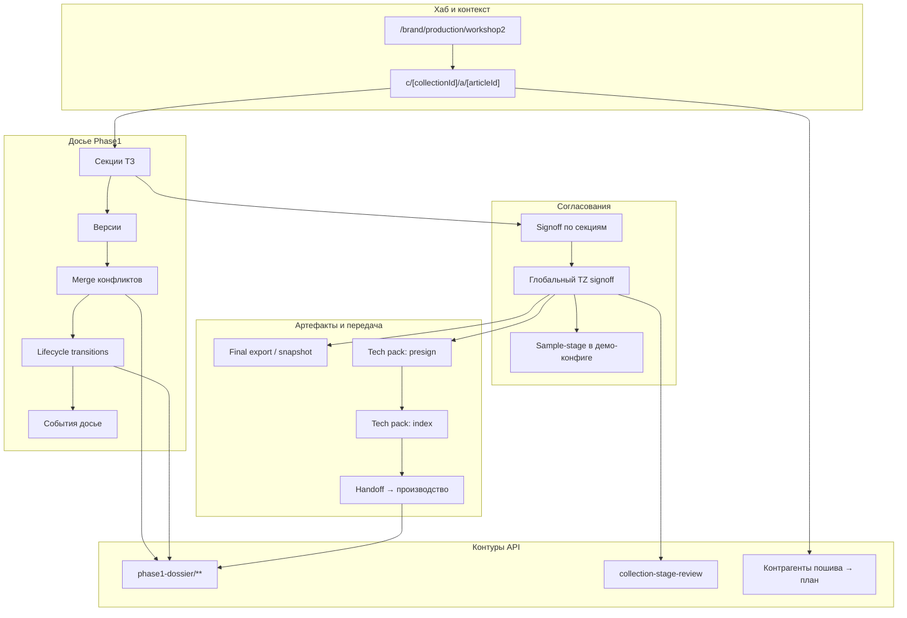
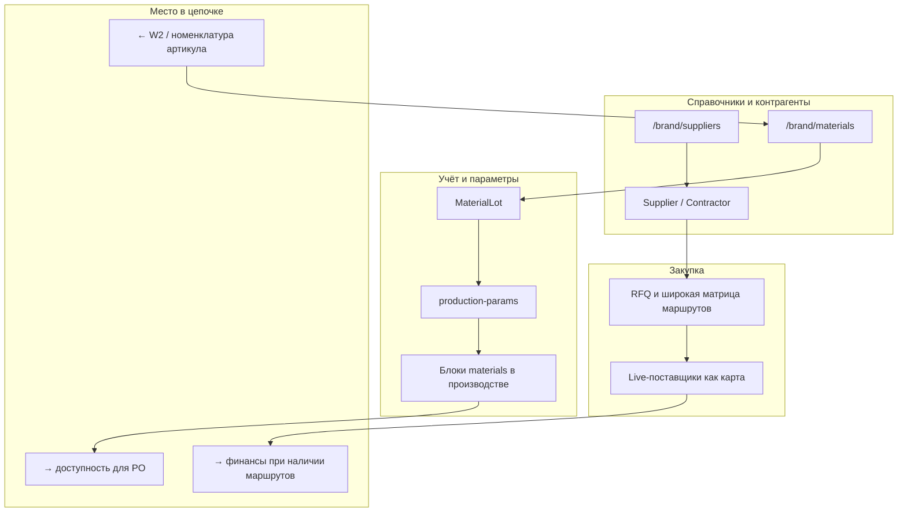
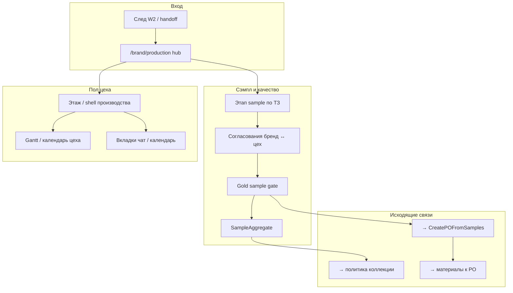
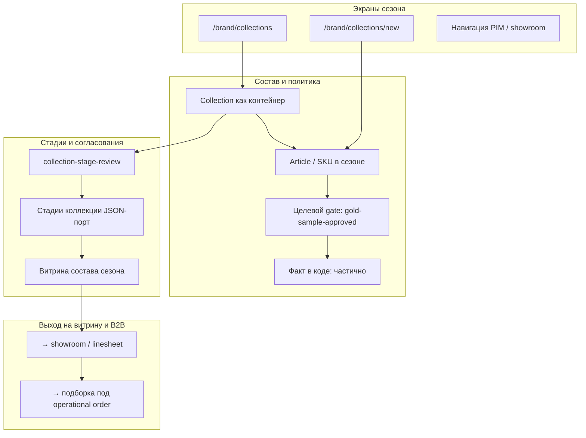
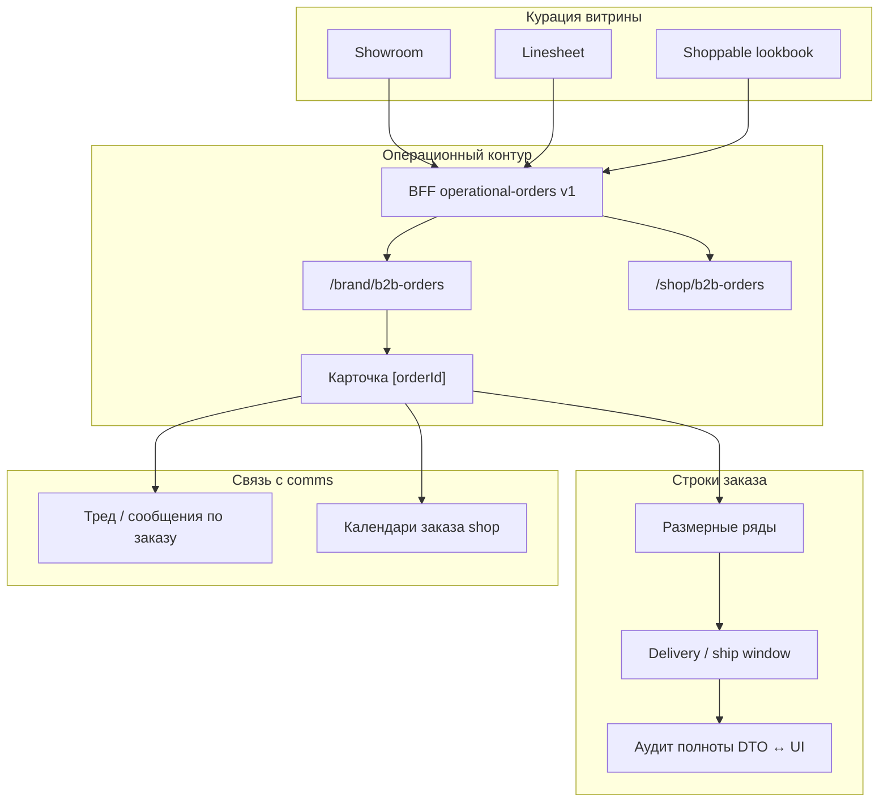
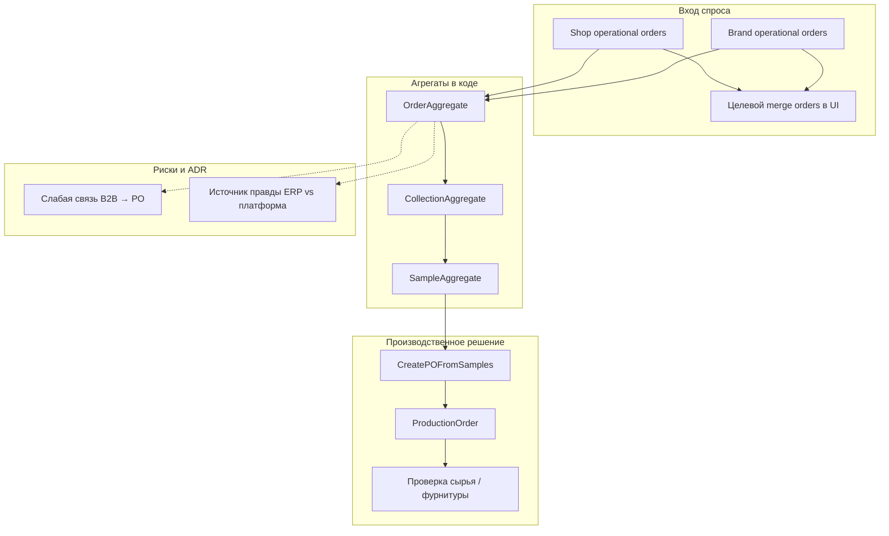
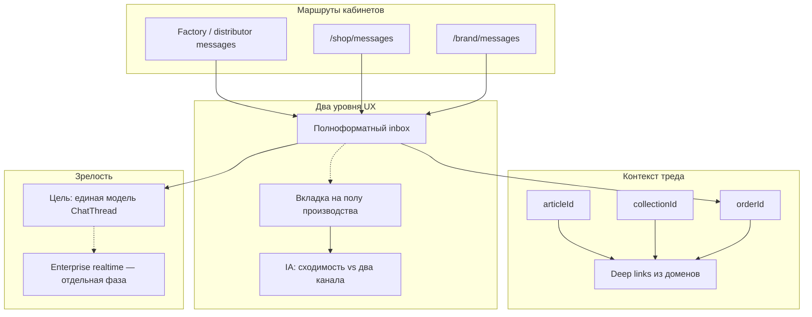
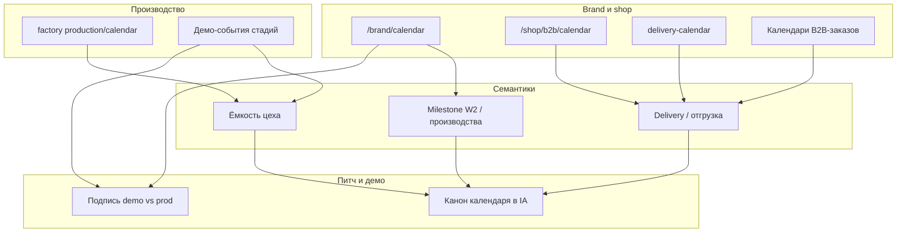
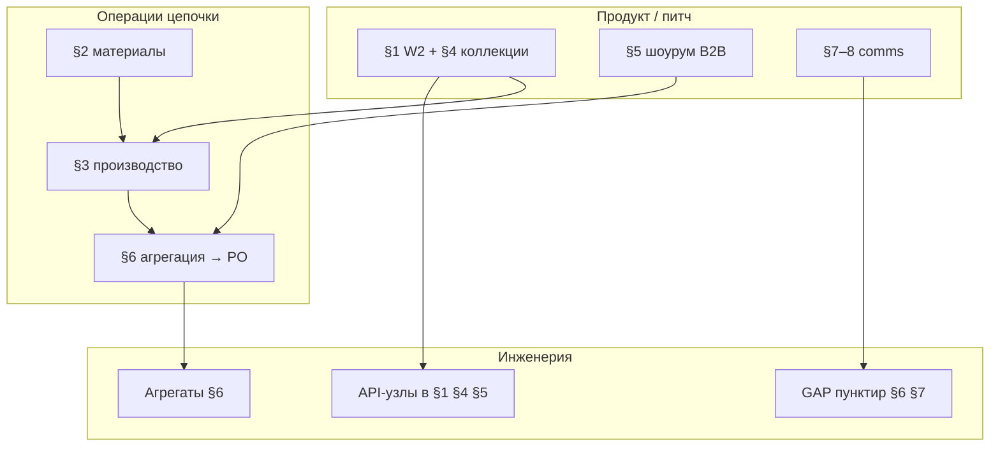

# Схемы по удерживаемым разделам (расширенный слой)

**Дата:** 2026-05-11 · **Источники:** `VISUAL_DETAILED_SECTIONS_STATUS.md`, `FOCUS_ONE_PAGER.md`, `DIAGRAMS_RETAINED_STRUCTURE_MASTER.md` (без повторения его сводных §1–§5) · **Канон кода:** `_ai-share/synth-1-full`

---

## Назначение документа

Здесь — **погружение по каждому сохраняемому модулю**: этапы внутри подсистем, типовые функции и зависимости в формате **Mermaid `flowchart TB`** с `subgraph`. Сводный «три столба + сквозной LR» остаётся в мастер-файле; ниже — опорные **детальные карты** для питча и дорожной карты.

---

## 1. Разработка артикула, ТЗ и Workshop 2

Подпись: внутри столба A показан **скелет W2** — от входа в артикул до API и tech pack; пересечение с коллекцией (`collection-stage-review`) и пошивом вынесено как явные рёбра, а не как дублирование общей «триады» из мастера.

---

## 2. Поставщик и материалы

Подпись: раздел **не ERP целиком**, а удерживаемый контур справочников, партий и связки с производством; отдельно отмечены **вход из ТЗ** и **выход на партию**.

---

## 3. Производство, сэмпл и гейт качества

Подпись: акцент на **мосте ТЗ → качество образца → допуск к сезону и PO**; вкладки comms на полу показаны как **локальный UX** поверх того же производственного контекста.

---

## 4. Коллекции бренда

Подпись: визуализированы **три слоя** — UI сезона, желаемая **политика eligible** и текущий **узкий порт стадий**; связь со шоурумом и B2B как следующий шаг цепочки.

---

## 5. Шоурум и B2B-заказ

Подпись: столб B «в глубину» — **один узкий сценарий** от витрины к BFF и карточке заказа, плюс явные **пробелы по строкам** и **связь с чатом/календарём** без перечисления архивных интеграций.

---

## 6. Агрегация спроса и производственный заказ

Подпись: показан **путь от зеркальных заказов к типам агрегатов и PO**, с пунктиром на **GAP** из матрицы зрелости — без дублирования LR-ромбов из мастер-§2.

---

## 7. Чаты (сквозной слой) — часть A

Подпись: схема фиксирует **маршруты, привязку к сущностям и продуктовый разрыв** между полноформатным чатом и вкладкой в производстве — в духе FOCUS и §8 визуального статуса.

---

## 8. Календарь — часть B

Подпись: календарь разложен по **ролевым поверхностям и семантикам риска**; отдельно выделены **решения для питча** (один канон) и **честность демо** из FOCUS.

---

## Связь с мастер-файлом

| Мастер (`…MASTER`)                    | Этот файл                                                                                                    |
| ------------------------------------- | ------------------------------------------------------------------------------------------------------------ |
| §1 три столба + supply + prod + cross | Здесь **нет** повторения того же TB-«пилона»; вместо этого — **внутренние** TB по §2–§9 визуального статуса. |
| §2 LR end-to-end с ромбами            | LR не дублируется; детали **внутри доменов** (§1–§6 выше).                                                   |
| §3 роли LR, §4 stateDiagram           | Сохранены на уровне мастера; здесь **flowchart TB** по подсистемам.                                          |
| §5 компактная карта функций           | Расшита в **отдельные разделы** §1–§8.                                                                       |

---

## Сжатая карта «кто читает какой блок»

Подпись: вспомогательная **одна диаграмма-оглавление** для навигации по разделам документа; не заменяет мастер-сводку столбов.

---

*Документ планирования; код не изменялся.*