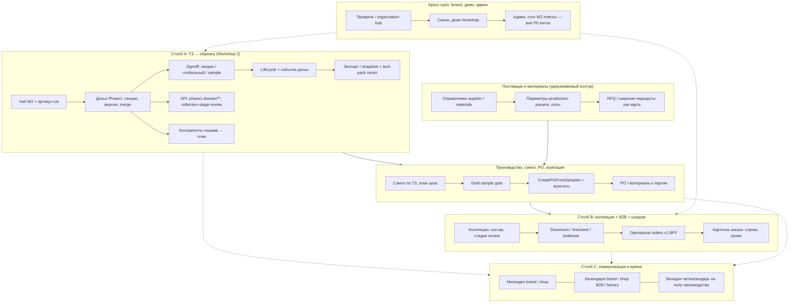
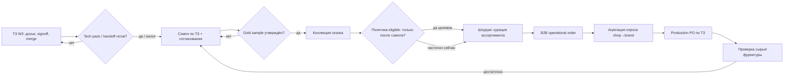
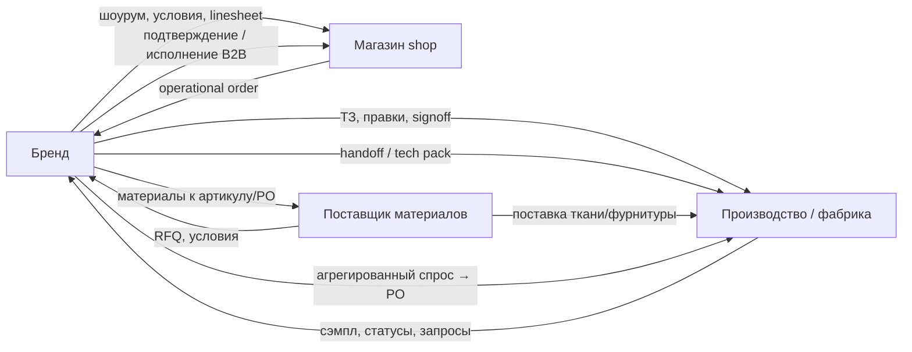
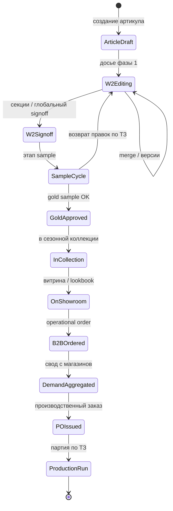
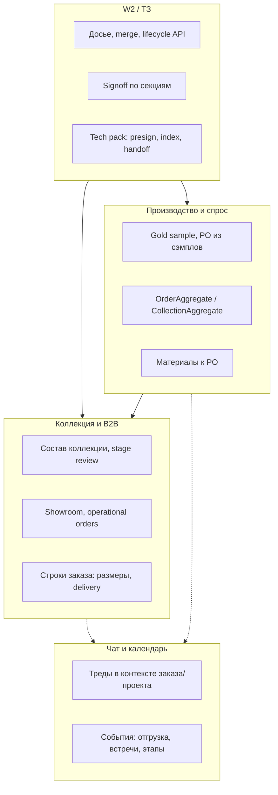

# Схемы удерживаемой структуры продукта (мастер)

**Дата:** 2026-05-11 · **Источники:** `VISUAL_DETAILED_SECTIONS_STATUS.md`, `FOCUS_ONE_PAGER.md`, фрагмент `GAP_ANALYSIS_USER_FLOW_COLLECTION_B2B_CHAT_CALENDAR.md` · **Канон кода:** `_ai-share/synth-1-full`

---

## Введение

Документ фиксирует **структуру того, что сознательно сохраняем** в продуктовом нарративе: три столба фокуса, сквозные слои и контекст админа. Внутри модулей — **стадии, секции, взаимодействия и функции**, сгруппированные в кластеры (без перечисления каждой микрофичи).

## Легенда типов диаграмм

| Тип                           | Назначение                                                                                         |
| ----------------------------- | -------------------------------------------------------------------------------------------------- |
| **flowchart TB** с `subgraph` | Иерархия доменов/модулей и вложенные подсистемы с ключевыми функциями.                             |
| **flowchart LR**              | Сквозной **процесс по стадиям** с ветвлениями (решения).                                           |
| **flowchart** (роли)          | **Кто с кем** по материалам, сэмплу и заказам — рёбра с подписями.                                 |
| **stateDiagram-v2**           | Упрощённый **жизненный цикл** артикула/коллекции (целевые состояния из GAP и визуального статуса). |

Синтаксис **Mermaid**, совместимый с рендером на GitHub: `flowchart`, `subgraph id["…"]`, кавычки для длинных подписей узлов.

---

## 1. Три столба + сквозные слои и контекст

**Подпись:** верхний уровень — **что остаётся в фокусе** (FOCUS): (A) разработка артикула и ТЗ, (B) коллекции и B2B, (C) чат и календарь; плюс **поставщик/материалы**, **производство/агрегация** как опорные домены цепочки и **общий слой** tenant/админ.

---

## 2. Сквозные стадии: от ТЗ до PO

**Подпись:** целевой **end-to-end** поток из GAP и визуального статуса: ТЗ и согласования → сэмпл и качество → допуск в коллекцию → витрина и B2B → свод спроса → производственный заказ. Ромбы — продуктовые **решения/гейты** (часть ещё не как единый контракт в коде).

---

## 3. Взаимодействия ролей: материалы, сэмпл, заказы

**Подпись:** **кто с кем** в удерживаемой истории: бренд ведёт ТЗ и B2B; магазин — зеркало заказов; производство — сэмпл, календарь цеха, приём handoff; поставщик материалов — в связке с брендом и производством (часть UX через фабрику по FOCUS).

---

## 4. Жизненный цикл артикула и коллекции (целевые состояния)

**Подпись:** упрощённая **машина состояний** для питча и дорожной карты: от черновика ТЗ до продажи в B2B; отдельно — **коллекция** как контейнер сезона с желаемым гейтом по сэмплу (в коде — частично, см. GAP).

---

## 5. Компактная карта функций по разделам (кластеры)

**Подпись:** группировка **функций**, которые документируем как удерживаемые (из таблиц §2–§10 визуального статуса), без полного списка URL.

---

## Связь с приоритетами

Диаграммы **не заменяют** матрицу зрелости и топ-10 из `VISUAL_DETAILED_SECTIONS_STATUS.md`: они визуализируют **ту же** удерживаемую структуру на уровне модулей, стадий и ролей. Узкие места (gate коллекции, B2B→агрегация→PO, канон календаря и чата) на схемах отмечены явно в §2–§4.

---

*Документ планирования; код не изменялся.*