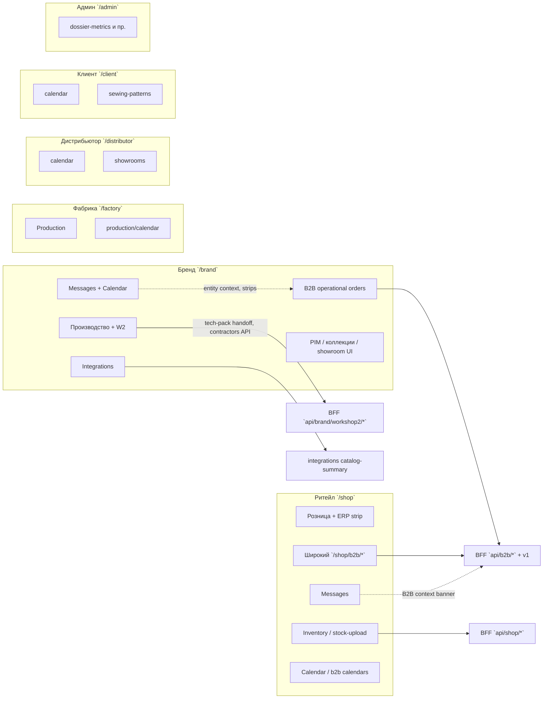

# Функциональный стержень, роли и P0-нарратив (ТЗ → образец, B2B-витрина, чат/календарь)

**Дата:** 2026-05-11  
**Корень монорепо:** `/Users/petr/Projects`  
**Канон фронта:** `_ai-share/synth-1-full`  
**Язык тела:** русский; технические пути — в обратных кавычках.

**Входные артефакты:** `.planning/research/INVESTOR_IA_CUTLINE.md`, `.planning/research/PROJECT_ANALYSIS_INVESTOR_PRIORITIES.md`, выборочный grep по `_ai-share/synth-1-full`, фрагменты `src/lib/routes.ts`, e2e `e2e/workshop2-smoke.spec.ts`, `e2e/helpers/w2-demo-routes.ts`.

---

## 1. Назначение документа

Зафиксировать **как связаны** основные функции между собой и **между ролями**, выделить **P0-стержень** (разработка артикула ТЗ → образец; коллекции и оптовые заказы в духе JOOR/NuORDER; кросс-роль коммуникации), честно отметить **пробелы** и предложить **дорожную карту усиления** без правок кода в этом задании.

---

## 2. Роли ↔ ядро модулей (обзор)




**ASCII (кратко):**

```
[Brand: production/W2]──HTTP──►[/api/brand/workshop2/phase1-dossier|tech-pack/*]
[Brand: b2b-orders]────HTTP──►[/api/b2b/operational-orders + v1]
[Shop: b2b-orders]─────HTTP──►[тот же контур + redirect legacy]
[Brand ↔ Shop inventory]──►[cross-cabinet guards + unified-ecosystem-smoke]
[Messages/Calendar]──►[UI слой + demo stores; не единый realtime-backend в этом доке]
```

---

## 3. Главные функции и связность

### 3.1 Ось «операционный B2B»


| Узел                     | Где в UI                                                                                                              | Где в BFF / данные                                                                      | Связь с ролями                                                                                                                                                      |
| ------------------------ | --------------------------------------------------------------------------------------------------------------------- | --------------------------------------------------------------------------------------- | ------------------------------------------------------------------------------------------------------------------------------------------------------------------- |
| Реестр и карточка заказа | `src/app/brand/b2b-orders/page.tsx`, `src/app/brand/b2b-orders/[orderId]/page.tsx`; shop: `src/app/shop/b2b-orders/*` | `GET /api/b2b/operational-orders`, v1 в `AGENTS.md`; хуки `useB2BOperationalOrdersList` | **Бренд** ведёт заказы с партнёрами; **shop** — зеркало для ритейла/репа; ссылки из сообщений: `brandB2bMessagesHref` / `shopB2bMessagesHref` в `src/lib/routes.ts` |
| Интеграции               | `src/app/brand/integrations/page.tsx`                                                                                 | `GET /api/b2b/integrations/catalog-summary`                                             | Объясняет экосистему; смок `unified-ecosystem-smoke`                                                                                                                |


### 3.2 Ось «разработка артикула / Workshop 2»


| Узел                   | Где в UI                                                                                                   | Где в BFF                                                                                         | Связь                                                                                                                                                  |
| ---------------------- | ---------------------------------------------------------------------------------------------------------- | ------------------------------------------------------------------------------------------------- | ------------------------------------------------------------------------------------------------------------------------------------------------------ |
| Хаб W2                 | `/brand/production/workshop2`                                                                              | —                                                                                                 | Вход в коллекции/артикулы                                                                                                                              |
| Рабочее место артикула | `src/app/brand/production/workshop2/c/[collectionId]/a/[articleId]/page.tsx` → `Workshop2ArticleWorkspace` | Коллокация тестов под `src/app/api/brand/workshop2/phase1-dossier/**/route.ts`                    | ТЗ, секции, signoff, merge, versions, events, lifecycle, final-export                                                                                  |
| Tech pack (пилот)      | Маршруты в `ROUTES.brand` (напр. tech-pack по style), BFF                                                  | `src/app/api/brand/workshop2/tech-pack/{presign,index,complete,download,handoff,remote}/route.ts` | **Бренд → производство/фабрика**: handoff; зависимость от env (S3/DB) — см. `docs/W2_TECHPACK_PILOT.md`, `npm run w2:techpack:preflight` в `AGENTS.md` |
| Контрагенты пошива     | UI справочников в контуре production / W2                                                                  | `GET /api/brand/contractors`, `GET /api/brand/sewing-contractors`                                 | **Бренд + поставщик (пошив)**: read-model из `resolveWorkshop2SewingContractorsPayload`                                                                |
| Демо-слуги e2e         | `e2e/workshop2-smoke.spec.ts`, `e2e/helpers/w2-demo-routes.ts`                                             | `buildWorkshop2Ss27MenCoat01FullTzDemoDossier`, LS-ключ `W2_DOSSIER_LOCAL_STORAGE_KEY`            | Стабильные slug `SS27`, `demo-ss27-01`                                                                                                                 |


### 3.3 Ось «планирование / коллекция»


| Узел                    | Путь                                                                                                  | Зрелость (по cutline)                                                                          |
| ----------------------- | ----------------------------------------------------------------------------------------------------- | ---------------------------------------------------------------------------------------------- |
| Smart / matrix planning | `src/app/brand/planning/page.tsx` (`/brand/planning`)                                                 | UI с AI-симуляцией на клиенте; **не** заявлен как жёсткий контрактный spine в investor cutline |
| Пол производства        | `src/app/brand/production/*`, табы чат/календарь в `production-page-content-shell-header-actions.tsx` | Частично: локальные вкладки поверх production shell                                            |
| Коллекции бренда        | `src/app/brand/collections/page.tsx`, навигация `brand-nav-priority` (`pim`: collections, showroom)   | Частично / витрина в зависимости от экрана                                                     |


### 3.4 Ось «JOOR / NuORDER-аналог» (широкая поверхность shop + brand B2B showcase)

В коде это **не один модуль**, а **семейство маршрутов** и дизайн-нарратив:

- `src/lib/routes.ts`: `ROUTES.shop.shoppableLookbook`, `b2bLookbooks`, `b2bShowroom`, `b2bSelection`-соседние сценарии, `b2bCalendar`, `b2bDeliveryCalendar`, десятки путей под `ROUTES.brand.b2b*`, `ROUTES.shop.b2b*`.
- Явные комментарии в страницах: `src/app/shop/b2b/lookbooks/[lookbookId]/shoppable/page.tsx` (JOOR Shoppable Lookbook), `src/app/shop/b2b/margin-calculator/page.tsx` (NuOrder), `src/app/shop/b2b/reports/page.tsx` (JOOR / FashioNexus).
- Константы стиля: `src/lib/b2b/joor-constants.ts`; архив интеграций NuOrder: `src/app/api/b2b/archive/nuorder/shipment/route.ts`.
- **Риск:** `INVESTOR_IA_CUTLINE.md` и `PROJECT_ANALYSIS_INVESTOR_PRIORITIES.md` прямо предупреждают о «ширине без глубины» для инвесторского питча.

### 3.5 Кросс-срез: сообщения и календарь


| Артефакт                      | Назначение                                                 | Доказательство в коде                                                                                                                                            |
| ----------------------------- | ---------------------------------------------------------- | ---------------------------------------------------------------------------------------------------------------------------------------------------------------- |
| Brand messages                | Полноценная оболочка коммуникаций + связи с B2B/календарём | `src/app/brand/messages/page.tsx` — `MessagesPage` из `messages-os`, `CommunicationsNavBar`, `CommunicationsOperationalStrip`, ссылки на `ROUTES.brand.calendar` |
| Brand calendar                | Календарь + слои (tasks/events), live process              | `src/app/brand/calendar/page.tsx` — `getCalendarEvents`, `getAllCalendarEvents`, `CollaborationCalendarSection`, `demoCalendarEventsForProductionStage`          |
| Shop messages                 | Тот же `MessagesOS`, B2B-контекст                          | `src/app/shop/messages/page.tsx`                                                                                                                                 |
| Production header             | Быстрые вкладки «Чат / Календарь» внутри пола              | `production-page-content-shell-header-actions.tsx` — `setActiveTab('chat'                                                                                        |
| Навигационный приоритет       | «comms»: messages, calendar                                | `src/lib/data/brand-nav-priority.ts`                                                                                                                             |
| Роль-хелпер                   | `calendarHrefForRole`                                      | `src/lib/routes.ts`                                                                                                                                              |
| Factory / distributor / admin | Свои `messages` и `calendar` в `ROUTES`                    | `routes.ts` (например `ROUTES.factory.productionCalendar`, `ROUTES.distributor.calendar`)                                                                        |


**Вывод по глубине:** UI и маршруты **есть у всех ключевых кабинетов**; единый «enterprise realtime chat + единая модель потоков сообщений на всех ролях» в этом документе **не подтверждён** отдельным каноническим BFF-слоем в просмотренных фрагментах — см. раздел 7.

---

## 4. Таблицы по ролям

### 4.1 Бренд (`/brand`)


| Блок                       | Содержание (функции, опции, наполнение)                                    | Какие вопросы отвечает                        | Какие проблемы снимает          | Бизнес-ценность                   | Пробелы / усиление                                 |
| -------------------------- | -------------------------------------------------------------------------- | --------------------------------------------- | ------------------------------- | --------------------------------- | -------------------------------------------------- |
| Профиль / реестр           | `src/app/brand/profile/`*, demo seed                                       | Кто мы на рынке, контакты, showroom в профиле | Единая карточка бренда          | Доверие, вход в экосистему        | Часть данных seed; синхронизация с боевым профилем |
| Organization               | `src/app/brand/organization/`*, `organization-demo-data.ts`                | «Как у нас дела в широком смысле»             | Обзор здоровья, алёрты          | Command center нарратив           | Явный mock без API — усилить live metrics          |
| B2B operational            | `b2b-orders`, v1 панели заметок                                            | Статус заказов, заметки, ship window          | Разрыв email/Excel              | Повторяемый B2B workflow (**P0**) | RBAC/env; чёткая подпись demo vs prod              |
| Production + W2            | `production`, `workshop2/c/.../a/...`                                      | ТЗ по артикулу, signoff, handoff              | Ошибки на границе бренд–фабрика | Тяжёлая мода, комплаенс (**P1**)  | Tech pack env-gated; DB для полного pipeline       |
| Планирование               | `src/app/brand/planning/page.tsx`                                          | Спрос/маржа по SKU (демо)                     | Перегруз ассортимента           | Ранний отбор                      | Нужна связка заказ ↔ план как контракт             |
| PIM / коллекции / showroom | `collections`, `ROUTES.brand.showroom`*, `b2b/linesheets*`, merch showroom | Как показываем сезон опту                     | Разрозненные PDF                | Выручка B2B                       | Много витрин без e2e на каждый сценарий            |
| Коммуникации               | `messages`, `calendar`                                                     | Где договорились, когда дедлайн               | Потеря контекста                | Сквозная коллаборация             | Единый backend чата/календаря vs локальные сторы   |
| Интеграции                 | `integrations`                                                             | Что подключено                                | Скрытый technical debt          | Снижение TCO интеграций           | Каталог summary частично константа                 |


### 4.2 Ритейл / Shop (`/shop`)


| Блок                | Содержание                                                     | Вопросы                  | Проблемы                      | Ценность                               | Пробелы                                        |
| ------------------- | -------------------------------------------------------------- | ------------------------ | ----------------------------- | -------------------------------------- | ---------------------------------------------- |
| Розничный хаб + ERP | `/shop`, `erp-sync-status`                                     | Работает ли связка с ERP | Дрейф данных                  | Операционная розница (**P0**)          | —                                              |
| Inventory           | `/shop/inventory`, stock-upload API                            | Сколько в наличии        | Ошибки учёта                  | Снижение out-of-stock (**P0**)         | Демо CSV                                       |
| B2B хаб             | Огромный `/shop/b2b/`* (lookbooks, showroom, margin, reports…) | Как байер закупает       | Фрагментированные инструменты | Wholesale опыт (JOOR/NuORDER-нарратив) | «Ширина без глубины» — сузить сценарий         |
| Сообщения           | `/shop/messages`                                               | Переговоры с брендом     | Потеря переписки              | Связь с operational order              | Тот же вопрос realtime/единой модели           |
| Календари           | `/shop/b2b/calendar`, `delivery-calendar`, `/shop/calendar`    | Когда отгрузка/закупка   | Промахи сроков                | Синхронизация с брендом                | Несколько календарных продуктов — упростить IA |


### 4.3 Клиент (`/client`)


| Блок                     | Содержание                                                               | Вопросы                    | Проблемы                   | Ценность                  | Пробелы                                        |
| ------------------------ | ------------------------------------------------------------------------ | -------------------------- | -------------------------- | ------------------------- | ---------------------------------------------- |
| Хаб / профиль / гардероб | `client`, `client/me`, `wardrobe`                                        | Персональный сервис        | Разрозненность каналов     | Удержание B2C             | Не в центре P0 spine                           |
| Швейные паттерны         | `src/app/client/sewing-patterns/*`, e2e `client-sewing-patterns.spec.ts` | Как клиент влияет на пошив | Разрыв клиент–производство | Кросс-роль к W2-намерению | Связь с заказом артикула как продуктовый хвост |
| Календарь                | `ROUTES.client.calendar`                                                 | Личные события             | —                          | Удобство                  | Вне P0                                         |


### 4.4 Фабрика (`/factory`)


| Блок                     | Содержание                               | Вопросы                | Проблемы         | Ценность             | Пробелы                                           |
| ------------------------ | ---------------------------------------- | ---------------------- | ---------------- | -------------------- | ------------------------------------------------- |
| Production / supplier UI | `factory/production`, `factory/supplier` | Где наш цех в цепочке  | Прозрачность     | Исполнение контракта | Смоки есть, глубина сценария переменная           |
| Сообщения                | `factory/messages` (маршрут в дереве)    | Коммуникация с брендом | —                | Операционка          | Связка с `brand/messages` не детализирована здесь |
| Календарь                | `factory/production/calendar`            | Загрузка мощностей     | Конфликты слотов | Планирование         | Нужна явная связь W2 handoff → factory task       |


### 4.5 Дистрибьютор (`/distributor`)


| Блок                          | Содержание               | Вопросы                | Проблемы         | Ценность     | Пробелы                                 |
| ----------------------------- | ------------------------ | ---------------------- | ---------------- | ------------ | --------------------------------------- |
| Showrooms, calendar, messages | см. `ROUTES.distributor` | Как ведём мульти-бренд | Дублирование CRM | Оптовая сеть | Меньше контрактных e2e чем у brand/shop |


### 4.6 Админ (`/admin`)


| Блок                   | Содержание                                     | Вопросы                | Проблемы          | Ценность        | Пробелы                                |
| ---------------------- | ---------------------------------------------- | ---------------------- | ----------------- | --------------- | -------------------------------------- |
| Метрики досье W2 и пр. | `admin/production/dossier-metrics` (в cutline) | Как здоровье данных W2 | Риски качества ТЗ | Ops, compliance | Не pitch-UI для инвестора по умолчанию |


---

## 5. Стержневой сценарий (P0–P1): пошагово с привязкой к URL и коду

### 5.1 Разработка артикула: формирование ТЗ → образец (бренд + производство + поставщик пошива)

**Цель нарратива:** показать **единый артефакт ТЗ**, согласование секций, возможный **tech pack handoff** к фабрике и участие **контрагентов пошива** в данных.


| Шаг | Действие пользователя                                                                   | URL / компонент                                                                                        | API / данные                                                                                                                                                                                                               |
| --- | --------------------------------------------------------------------------------------- | ------------------------------------------------------------------------------------------------------ | -------------------------------------------------------------------------------------------------------------------------------------------------------------------------------------------------------------------------- |
| 1   | Войти в кабинет бренда (канонический дом — профиль)                                     | `/brand/profile` (редирект с `/brand`, см. cutline)                                                    | —                                                                                                                                                                                                                          |
| 2   | Открыть производственный контур / W2-хаб                                                | `/brand/production/workshop2`                                                                          | e2e: `workshop2-smoke.spec.ts`                                                                                                                                                                                             |
| 3   | Открыть артикул в коллекции (демо slug)                                                 | `/brand/production/workshop2/c/SS27/a/demo-ss27-01?w2pane=tz`                                          | `w2BrandProductionArticlePath` в `e2e/helpers/w2-demo-routes.ts`                                                                                                                                                           |
| 4   | Работа с досье ТЗ (секции, валидация, signoff)                                          | `#w2-dossier-main` в `Workshop2ArticleWorkspace` (`src/app/brand/production/workshop2/c/.../page.tsx`) | `GET/POST/PATCH…` под `src/app/api/brand/workshop2/phase1-dossier/`**; события `.../events`; lifecycle `.../lifecycle/transition`; merge `.../merge`; signoff `.../section-signoff/commit`, `.../tz-global-signoff/commit` |
| 5   | (Опционально пилот) Получить presign / завершить загрузку / скачать / handoff tech pack | UI по `ROUTES.brand` tech-pack                                                                         | `api/brand/workshop2/tech-pack/`*                                                                                                                                                                                          |
| 6   | Просмотр контрагентов пошива для привязки к плану                                       | UI production/W2 (справочник)                                                                          | `GET /api/brand/contractors`, `GET /api/brand/sewing-contractors`                                                                                                                                                          |
| 7   | Перейти к операционному заказу, если ТЗ породило закупку                                | `/brand/b2b-orders` → карточка                                                                         | `GET /api/b2b/operational-orders`, v1 DTO                                                                                                                                                                                  |


**Граница честности:** демо-досье может жить в **localStorage** (`W2_DOSSIER_LOCAL_STORAGE_KEY`); полный production-контур = **Postgres + env tech pack** (см. приоритеты P1).

### 5.2 Коллекции и B2B-пространство (JOOR/NuORDER-аналог)


| Шаг | Действие                                                                                     | URL / модули                                                                                        | Заметка                                                             |
| --- | -------------------------------------------------------------------------------------------- | --------------------------------------------------------------------------------------------------- | ------------------------------------------------------------------- |
| 1   | Бренд формирует витрину сезона (linesheets, lookbooks, showroom — в зависимости от сценария) | `ROUTES.brand.b2bLinesheets`*, `lookbookProjects`, `showroom`* в `routes.ts`                        | Много страниц — выбрать **один** сквозной сценарий для демо         |
| 2   | Ритейл открывает подборку / shoppable lookbook                                               | `ROUTES.shop.shoppableLookbook(id)`, `b2bLookbooks`                                                 | Комментарий JOOR в `shoppable/page.tsx`                             |
| 3   | Оформление / операционный заказ                                                              | `/brand/b2b-orders`, `/shop/b2b-orders` + legacy→redirect в `next.config.ts` (цитата в `AGENTS.md`) | **P0** — operational read-model + v1                                |
| 4   | Маржа / отчёты как NuORDER/JOOR-слой                                                         | `/shop/b2b/margin-calculator`, `/shop/b2b/reports`                                                  | **P2/P3** по приоритетам — не смешивать с P0 без отдельной зрелости |


### 5.3 Чат и календарь для всех ролей


| Роль                    | Календарь                                                    | Сообщения                              | Примечание                                                     |
| ----------------------- | ------------------------------------------------------------ | -------------------------------------- | -------------------------------------------------------------- |
| Brand                   | `ROUTES.brand.calendar`, вложенный `[slug]`                  | `ROUTES.brand.messages`                | Полноценные коммуникационные полосы + календарь с live/process |
| Shop                    | `ROUTES.shop.calendar`, `b2bCalendar`, `b2bDeliveryCalendar` | `ROUTES.shop.messages`                 | B2B order context banner                                       |
| Client                  | `ROUTES.client.calendar`                                     | — (в этой выборке — фокус на calendar) |                                                                |
| Factory                 | `ROUTES.factory.productionCalendar`                          | `ROUTES.factory.messages` (в routes)   |                                                                |
| Distributor             | `ROUTES.distributor.calendar`                                | `ROUTES.distributor.messages`          |                                                                |
| Admin                   | `ROUTES.admin.calendar`                                      | `ROUTES.admin.messages`                |                                                                |
| Внутри production floor | Вкладки в `production-page-content-shell-header-actions.tsx` | Локальный `activeTab`                  | Дополняет, но не заменяет полноформатные `/brand/messages`     |


---

## 6. Вспомогательное (кратко, только если материально реализовано)

- **Academy** (`/brand/academy`, `/academy`) — параллельный контур обучения; не P0 spine.
- **Python FastAPI** — отдельный сервис; в investor cutline: не позиционировать как shipped без явной связи.
- **Архив NuOrder API** — `api/b2b/archive/nuorder/shipment` — интеграционный хвост, не ядро UI.
- **Client sewing patterns** — материальный кросс-роль хвост к производству, отдельный e2e.

---

## 7. Честные пробелы

1. **Chat:** богатый UI (`messages-os`, коммуникационные полосы), но **единый серверный канон** «одна нить на заказ на всех ролях» в просмотренных путях не выведен; production floor использует **вкладку** чата отдельно от `/brand/messages`.
2. **Calendar:** несколько семантик (brand calendar vs shop b2b calendars vs factory production calendar) — риск **дублирования IA**; часть событий из **demo** (`demoCalendarEventsForProductionStage`).
3. **Shop B2B ширина:** десятки URL при неоднородной зрелости — противоречит узкому инвесторскому демо.
4. **Tech pack:** env-gated; без S3/DB сценарий может «не взлететь».
5. **Multi-tenant / permissions:** RBAC на v1 описан в `AGENTS.md` (`B2B_V1_API_ENFORCE_ROLES`); полная матрица на все маршруты W2/B2B — отдельный аудит.
6. **JOOR/NuORDER:** в основном **UX-нарратив + отдельные API-архивы**, а не один замкнутый продуктовый модуль.

---

## 8. Дорожная карта усиления (без кода в этом задании)

1. **Зафиксировать демо-границу URL** — union смоков из `package.json` (`smoke`, `unified-ecosystem-smoke`, `workshop2-smoke`, при необходимости `test:e2e:api`), как в cutline.
2. **Один сквозной сценарий W2:** hub → артикул `demo-ss27-01` → секция материалов → (опционально) tech pack handoff с чеклистом env из `W2_TECHPACK_PILOT`.
3. **Один сквозной сценарий B2B showcase:** linesheet или shoppable lookbook → operational order (v1 или честный mock) с подписью источника данных.
4. **Коммуникации:** либо признать **два уровня** (полноформатный `/brand/messages` vs вкладка в production), либо спланировать конвергенцию на общий thread id (отдельная фаза / ADR).
5. **Календарь:** продуктово решить, что такое «канонический» календарь для кросс-роли (tasks vs delivery vs production capacity) и отразить в навигации (`brand-navigation`, `shop-navigation-normalized`).
6. **Сократить shop/b2b меню** до сценария демо (флаг по аналогии `NEXT_PUBLIC_SHOP_NAV_MVP`).
7. **Organization hub:** путь от demo-констант к API, согласованный с FastAPI dashboard если нужен live.

---

## 9. Связь с приоритетами (резюме)

- **P0:** operational B2B orders, integrations, shop retail/inventory cross-cabinet, processes/domain events (менее визуально).
- **P1:** Workshop 2 dossier + tech pack pilot + production floor + planning touchpoints.
- **P2/P3:** длинный хвост shop/b2b, маркетинговые витрины.

---

*Документ подготовлен как read-only обзор по состоянию репозитория на дату файла; при смещении кода проверять маршруты в `src/lib/routes.ts` и матрицу `e2e/README.md`.*