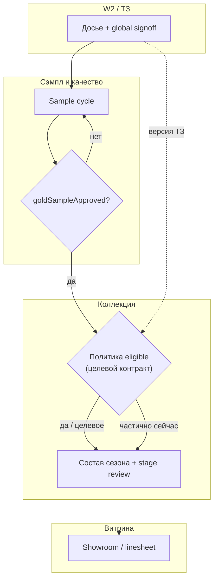
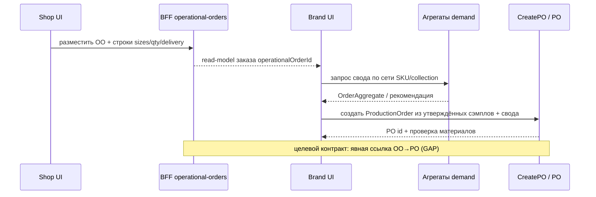
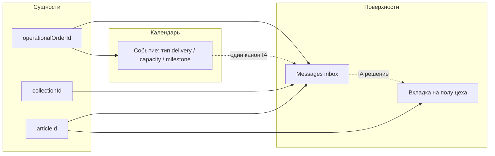

# Полнота визуализации удерживаемых модулей: пробелы и доработки

**Дата:** 2026-05-11 · **Опора:** `DIAGRAMS_RETAINED_SECTIONS_EXTENDED.md`, `DIAGRAMS_RETAINED_STRUCTURE_MASTER.md`, `VISUAL_DETAILED_SECTIONS_STATUS.md`, `GAP_ANALYSIS_USER_FLOW_COLLECTION_B2B_CHAT_CALENDAR.md` · **Канон кода:** `_ai-share/synth-1-full`

**Назначение:** зафиксировать, чего **не хватает** в текущем наборе схем для «максимально полной и работающей» картины процесса; по каждому удерживаемому модулю — этапы, бизнес-смысл, выходы, переходы к соседям, достаточность диаграмм и обрывы процесса. **Ниже §PATCH** — только предложения к вставке в `DIAGRAMS_RETAINED_SECTIONS_EXTENDED.md`, без правок существующих файлов диаграмм.

---

## 1. Глобально по визуализации (набор схем)

| Тема                           | Что уже есть                                                                                                                                     | Чего не хватает (конкретно)                                                                                                                                                                         |
| ------------------------------ | ------------------------------------------------------------------------------------------------------------------------------------------------ | --------------------------------------------------------------------------------------------------------------------------------------------------------------------------------------------------- |
| **Типы диаграмм**              | Мастер: TB-пилоны, LR end-to-end с ромбами, LR ролей, `stateDiagram-v2` артикула; EXTENDED: TB по модулям §1–§8, вспомогательная карта читателей | Отдельные **sequenceDiagram** для критичных handoff (ТЗ→цех, B2B→агрегация→PO, уведомления в чат); **ER/C4-уровень** связей сущностей (опционально); **journey** для байера shop — по желанию питча |
| **Единый глоссарий сущностей** | Разброс по подписям узлов (`Phase1Dossier`, `OperationalOrder`, агрегаты)                                                                        | **Одна таблица** «узел схемы → доменное имя → экран/API → статус ●/◐/○» в начале набора или ссылка на §4.2 GAP как канон; иначе дублирование имён и риск расхождения с кодом                        |
| **Happy-path vs исключения**   | LR §2 мастера: ветка «tech pack не готов»; ромбы GS/ELIG                                                                                         | Нет **веток ошибок** для merge-конфликтов, отклонённого сэмпла, нехватки материала, отмены B2B-строки, сбоя presign — хотя бы пунктиром «exception lane»                                            |
| **Метрики / SLA**              | Не визуализированы                                                                                                                               | На LR или отдельном TB: **целевые SLA** (напр. «signoff ≤ N дней») как задел дорожной карты; **cron W2 metrics** — вне P0, но стрелка «наблюдаемость» из cross-слоя                                 |
| **Права / роли на стрелках**   | Мастер §3: кто с кем                                                                                                                             | Нет **RBAC** (read-only ритейл, кто может lifecycle); для питча — подписи **«brand / shop / factory / supplier»** на рёбрах между модулями, не только внутри §3                                     |
| **Mock / real legenda**        | Легенда зрелости в `VISUAL_DETAILED_SECTIONS_STATUS` §1                                                                                          | На **каждой** Mermaid-схеме в питче: мини-легенда **«● реальный путь / ◐ демо-seed / ○ env-gated»** или сноска «узлы без маркировки = смешанный контур»                                             |
| **Версии документов**          | Даты в шапках                                                                                                                                    | Явное **«версия набора схем vN»** + «синхронизировано с коммитом / тегом» при жёсткой привязке к коду                                                                                               |
| **Данные на стрелках**         | Концептуально «handoff», «gate»                                                                                                                  | **Именованные полезные нагрузки**: что именно передаётся (идентификаторы артикула, snapshotId, operationalOrderId, агрегат по SKU) — сейчас в основном на уровне намерения                          |
| **Интеграции вне фокуса**      | Сознательно вычищены из EXTENDED §5                                                                                                              | Короткий **«интеграционный приложок»** (JOOR и др.) как пунктир от showroom, чтобы не смешивать с одним демо-путём, но не ломать целостность IA                                                     |
| **Tenant / админ**             | Мастер §1 `cross`                                                                                                                                | Нет **отдельного mini-flow** bootstrap демо → tenant → смоки; для полноты «процесса платформы» — один subgraph                                                                                      |

**Итог:** набор **хорошо закрывает топологию модулей и главный LR-поток**, но **слабее** на уровне **контрактов данных между модулями**, **исключений**, **sequence-уровня** и **сквозной маркировки зрелости узлов**. Для «полного процесса» критично дорисовать **G: gate коллекции**, **H: B2B→агрегация→PO**, **I: единый thread/calendar binding** — это же топ приоритетов из `VISUAL_DETAILED_SECTIONS_STATUS` §13.

---

## 2. По модулям

### 2.1. Workshop 2 / ТЗ (артикул, досье Phase1, tech pack)

| Поле                            | Содержание                                                                                                                                                                                                                                                                                                                                                                     |
| ------------------------------- | ------------------------------------------------------------------------------------------------------------------------------------------------------------------------------------------------------------------------------------------------------------------------------------------------------------------------------------------------------------------------------ |
| **Этапы (нумерованно)**         | 1) Вход в хаб W2 и артикул `c/a`. 2) Редактирование секций досье, версии. 3) Merge при конфликтах. 4) Lifecycle transitions + события досье. 5) Signoff по секциям → глобальный TZ signoff (в т.ч. sample в демо-конфиге). 6) Final export / snapshot. 7) Tech pack: presign → index → handoff в производство. 8) Связь `collection-stage-review` и контрагенты пошива → план. |
| **Бизнес-проблема по этапам**   | Единая правда по ТЗ; согласование ответственности; управляемая передача на фабрику без потери версий; согласование стадий коллекции.                                                                                                                                                                                                                                           |
| **Выход артефакта / состояния** | Подписанное досье (или явная стадия), экспорт/snapshot, индексированный tech pack (пилот), handoff-контур для цеха; привязка к коллекции через review API.                                                                                                                                                                                                                     |
| **Переход к следующему модулю** | **Триггер:** глобальный signoff + (пилот) готовый tech pack. **Данные:** handoff-пакет, ссылки на артефакты, `articleId`/`collectionId`, события для аудита. **→** производство/сэмпл; **↔** чат/календарь по срокам этапов.                                                                                                                                                   |
| **Достаточно ли схем?**         | **Частично (да+нет).** EXTENDED §1 и мастер §1/§5 покрывают структуру и API-узлы.                                                                                                                                                                                                                                                                                              |
| **Что добавить**                | Subgraph **«демо vs prod персистенция»**; **sequence** «presign → S3 → index → handoff»; **состояния ошибок** merge и failed presign; явная стрелка **«goldSample / sample stage → политика коллекции»** (сейчас логика в текстах GAP, не в одной диаграмме с коллекцией).                                                                                                     |
| **Обрывы процесса**             | Нет визуализированного **замкнутого цикла** «правки после сэмпла → повторный signoff» как количественного контура; tech pack **○** не связан с SLA preflight в диаграммах.                                                                                                                                                                                                     |

---

### 2.2. Поставщик и материалы

| Поле                    | Содержание                                                                                                                                                                                                                                                                          |
| ----------------------- | ----------------------------------------------------------------------------------------------------------------------------------------------------------------------------------------------------------------------------------------------------------------------------------- |
| **Этапы**               | 1) Справочники suppliers/materials, контрагенты. 2) Партии `MaterialLot`, production-params. 3) Блоки материалов в производстве. 4) RFQ / live-поставщики (широкая матрица). 5) Связь с номенклатурой артикула (из W2). 6) Выход: доступность для PO / финансы (где есть маршруты). |
| **Бизнес-проблема**     | Видимость сырья под заказ и партию; снижение разрыва «закупили — пошили».                                                                                                                                                                                                           |
| **Выход**               | Привязанные лоты/параметры, сигнал достаточности для PO; RFQ как карта возможностей, не обязательно ERP.                                                                                                                                                                            |
| **Переход**             | **→** производство (материалы к PO); **←** W2 (номенклатура); косвенно **←** агрегированный спрос. **Триггер:** создание/утверждение PO, запрос цеха. **Данные:** SKU/артикул, объёмы, лоты, резервы (концептуально).                                                               |
| **Достаточно ли схем?** | **Частично.** EXTENDED §2 задаёт место в цепочке.                                                                                                                                                                                                                                   |
| **Что добавить**        | Отдельный **«supply минимум vs ERP максимум»** fork; **нет** полного цикла закупка–склад–продажа (и не должен без стратегии) — визуально **граница продукта**; при необходимости **роль supplier** на рёбрах к shop/brand.                                                          |
| **Обрывы**              | **Нет** end-to-end «заказ поставщику → приход → списание в партию» в одном subgraph — осознанный пробел; на схеме стоит явно пометить **«вне P0»** или ADR.                                                                                                                         |

---

### 2.3. Производство, сэмпл, гейт качества

| Поле                    | Содержание                                                                                                                                                                                                                                                                   |
| ----------------------- | ---------------------------------------------------------------------------------------------------------------------------------------------------------------------------------------------------------------------------------------------------------------------------- |
| **Этапы**               | 1) Вход после W2 handoff; хаб `/brand/production`. 2) Сэмпл по ТЗ, согласования бренд↔цех. 3) Gold sample gate. 4) `SampleAggregate` / учёт образца. 5) Пол цеха: Gantt/календарь, вкладки чат/календарь. 6) Выход: политика коллекции; CreatePOFromSamples; материалы к PO. |
| **Бизнес-проблема**     | Допуск качества до сезона и B2B; управляемый запуск партии.                                                                                                                                                                                                                  |
| **Выход**               | Утверждённый сэмпл (бизнес-факт), готовность к включению в коллекцию и к PO; операционный контекст цеха.                                                                                                                                                                     |
| **Переход**             | **→** коллекции (**gate**); **→** агрегация/PO; **↔** материалы. **Триггер:** gold approved / отклонение. **Данные:** статус сэмпла, ссылка на ТЗ-версию, привязка к `articleId`.                                                                                            |
| **Достаточно ли схем?** | **Частично.** EXTENDED §3 + мастер LR/state.                                                                                                                                                                                                                                 |
| **Что добавить**        | Явная **диаграмма связи gold sample ↔ правило коллекции** (сейчас в GAP текстом); **ветка «сэмпл не принят → возврат в W2»** на том же LR, что мастер §4 state; **связь вкладки чата на полу ↔ inbox** как развилка IA.                                                      |
| **Обрывы**              | Слабая визуализация **B2B operational order → PO** (остаётся в §6 и GAP); демо **localStorage** W2 vs production seed — не на слое «пол» в диаграммах.                                                                                                                       |

---

### 2.4. Коллекции бренда

| Поле                    | Содержание                                                                                                                                                                                                                                                                                                       |
| ----------------------- | ---------------------------------------------------------------------------------------------------------------------------------------------------------------------------------------------------------------------------------------------------------------------------------------------------------------- |
| **Этапы**               | 1) Список/создание сезона (`/brand/collections`). 2) Состав: `Article`/`SKU` в коллекции. 3) Целевой gate `gold-sample-approved` (желаемый); факт в коде — частично. 4) `collection-stage-review` (узкий JSON-порт). 5) Витрина состава сезона. 6) Выход на showroom/linesheet и подборку под operational order. |
| **Бизнес-проблема**     | Сезон как контейнер для мерча и опта; защита от «сырого» артикула в продаже.                                                                                                                                                                                                                                     |
| **Выход**               | Согласованный состав и стадии; (целево) только eligible-артикулы.                                                                                                                                                                                                                                                |
| **Переход**             | **→** шоурум/B2B. **Триггер:** стадии review + (целево) gate по сэмплу. **Данные:** `collectionId`, список артикулов с флагами eligibility.                                                                                                                                                                      |
| **Достаточно ли схем?** | **Нет** для целевого контракта gate. EXTENDED §4 честно помечает C4 «частично».                                                                                                                                                                                                                                  |
| **Что добавить**        | **Отдельный subgraph или state** «CollectionEligibility»; **ромб** как в мастер §2, но **привязанный к коллекции**, не только к LR «COL»; **BFF-контракт** вместо «узкий порт» — пунктир до будущего.                                                                                                            |
| **Обрывы**              | **Ключевой пробел продукта:** нет единого правила «в коллекции только после финального сэмпла» — на схемах это **упомянуто**, но не как **обязательный gate** на всех путях в showroom.                                                                                                                          |

---

### 2.5. Шоурум и B2B-заказ

| Поле                    | Содержание                                                                                                                                                                                                                                             |
| ----------------------- | ------------------------------------------------------------------------------------------------------------------------------------------------------------------------------------------------------------------------------------------------------ |
| **Этапы**               | 1) Курация: showroom, linesheet, shoppable lookbook. 2) BFF operational orders v1. 3) Кабинеты brand/shop, карточка `[orderId]`. 4) Строки: размерные ряды, delivery/ship window. 5) Аудит полноты DTO↔UI. 6) Связь с тредом и календарями заказа.     |
| **Бизнес-проблема**     | От витрины до денег B2B с согласованными условиями строк.                                                                                                                                                                                              |
| **Выход**               | Подтверждённый operational order с прозрачными линиями и сроками.                                                                                                                                                                                      |
| **Переход**             | **→** агрегация спроса. **Триггер:** размещение/подтверждение заказа shop. **Данные:** `operationalOrderId`, строки (qty, sizes, delivery), ссылки на lookbook selection.                                                                              |
| **Достаточно ли схем?** | **Частично.** EXTENDED §5 хорош для узкого сценария.                                                                                                                                                                                                   |
| **Что добавить**        | **Sequence** «байер shop → BFF → brand view»; **validation lane** для неполных строк; **один URL-сценарий** (из GAP) — callout на схеме; опционально **parallel** для зеркала shop.                                                                    |
| **Обрывы**              | Нет полной **юридически значимой** глубины строк на уровне диаграммы (отмечено как задача в статусе); интеграции вне одного пути **намеренно** обрезаны — для полноты нарратива инвестора может не хватать **одной** пунктирной ветки «внешний канал». |

---

### 2.6. Агрегация спроса → производственный заказ (PO)

| Поле                    | Содержание                                                                                                                                                                                                                                                                     |
| ----------------------- | ------------------------------------------------------------------------------------------------------------------------------------------------------------------------------------------------------------------------------------------------------------------------------ |
| **Этапы**               | 1) Вход: shop + brand operational orders. 2) Целевой merge orders в UI. 3) Агрегаты `OrderAggregate`, `CollectionAggregate`, `SampleAggregate`. 4) `CreatePOFromSamples`. 5) `ProductionOrder`, проверка сырья/фурнитуры. 6) Риски: слабая связь B2B→PO, ADR источника правды. |
| **Бизнес-проблема**     | Свести спрос ритейла с запуском цеха по ТЗ; избежать двойного учёта.                                                                                                                                                                                                           |
| **Выход**               | PO (или явное решение «не запускаем») с проверкой материалов.                                                                                                                                                                                                                  |
| **Переход**             | **→** производство/исполнение; **←** B2B + сэмплы. **Триггер:** порог агрегированного спроса / ручное решение бренда. **Данные:** свод по SKU, ссылки на operational orders, привязка к ТЗ-версии.                                                                             |
| **Достаточно ли схем?** | **Нет** для сквозного продукта. EXTENDED §6 честно рисует GAP пунктиром.                                                                                                                                                                                                       |
| **Что добавить**        | **Обязательный** LR или sequence **«operationalOrderId → агрегат → PO id»** с именованными шагами BFF; **решение стейкхолдера** (ERP vs платформа) — узел **«источник правды»**; метрика **«время от OO до PO»** как placeholder.                                              |
| **Обрывы**              | **Главный обрыв цепочки:** нет зафиксированного e2e в одном контракте; на схемах это видно, но **не закрыто** альтернативным happy-path.                                                                                                                                       |

---

### 2.7. Чат (сквозной слой)

| Поле                    | Содержание                                                                                                                                                                                                                                   |
| ----------------------- | -------------------------------------------------------------------------------------------------------------------------------------------------------------------------------------------------------------------------------------------- |
| **Этапы**               | 1) Маршруты brand/shop/factory/distributor messages. 2) Контекст: `orderId`, `collectionId`, `articleId`, deep links. 3) Два уровня UX: inbox vs вкладка на полу. 4) Цель: единая модель `ChatThread`; enterprise realtime — отдельная фаза. |
| **Бизнес-проблема**     | Согласования без потери контекста заказа/проекта.                                                                                                                                                                                            |
| **Выход**               | Доставленное сообщение и прослеживаемый тред в привязке к сущности.                                                                                                                                                                          |
| **Переход**             | **↔** все модули. **Триггер:** событие заказа, правка ТЗ, эскалация цеха. **Данные:** thread id (целевой), ссылки на доменные id.                                                                                                            |
| **Достаточно ли схем?** | **Частично.** EXTENDED §7 фиксирует разрыв UX.                                                                                                                                                                                               |
| **Что добавить**        | **Матрица** «сущность × где открывается чат»; **sequence** уведомления из B2B/W2 в тред; **решение IA** (два канала vs конвергенция) — **state** или **ромб**.                                                                               |
| **Обрывы**              | Нет **единого серверного канона** — на диаграмме как roadmap, но не хватает **целевой целевой архитектуры** одним рисунком для команды.                                                                                                      |

---

### 2.8. Календарь

| Поле                    | Содержание                                                                                                                                                                                                                       |
| ----------------------- | -------------------------------------------------------------------------------------------------------------------------------------------------------------------------------------------------------------------------------- |
| **Этапы**               | 1) Brand calendar, shop B2B/delivery, календари заказов. 2) Factory production/calendar, демо-события стадий. 3) Семантики: delivery vs ёмкость цеха vs milestone W2/производства. 4) Питч: канон в IA; маркировка demo vs prod. |
| **Бизнес-проблема**     | Единые сроки между кабинетами; встречи и отгрузки не расходятся с ТЗ.                                                                                                                                                            |
| **Выход**               | Согласованное событие с понятным типом и владельцем.                                                                                                                                                                             |
| **Переход**             | **↔** B2B (ship window), производство, W2. **Триггер:** изменение строки заказа, сдвиг этапа цеха, milestone signoff. **Данные:** даты, тип события, привязка к сущности.                                                        |
| **Достаточно ли схем?** | **Частично.** EXTENDED §8 раскладывает семантики риска.                                                                                                                                                                          |
| **Что добавить**        | **Один «канонический» объединённый вид** (хотя бы **concept TB**: один индекс событий с типами); **legend на схеме** для demo events; опционально **sync** с внешним календарём — пунктир.                                       |
| **Обрывы**              | Нет визуализации **разрешения конфликта** двух семантик на одной дате (например delivery vs capacity).                                                                                                                           |

---

## 3. Сводная таблица «модуль × зрелость визуализации процесса»

| Модуль              | Процесс «от начала до выхода» на схемах | Критичный пробел                                    |
| ------------------- | --------------------------------------- | --------------------------------------------------- |
| W2/ТЗ               | **Высокий**                             | Исключения, demo/prod, явная связь к gate коллекции |
| Поставщик/материалы | **Средний**                             | Граница продукта vs ERP, закупочный цикл            |
| Производство/сэмпл  | **Высокий**                             | Замыкание с B2B и коллекцией на одном LR            |
| Коллекции           | **Низкий** для gate                     | Политика eligible как обязательный ромб/state       |
| Шоурум+B2B          | **Средний**                             | Sequence, валидация строк                           |
| Агрегация→PO        | **Низкий**                              | Именованный e2e поток данных                        |
| Чат                 | **Средний**                             | Целевая модель треда + IA развилка                  |
| Календарь           | **Средний**                             | Единый канон + конфликт семантик                    |

---

## 4. PATCH-предложения (Mermaid) для вставки в `DIAGRAMS_RETAINED_SECTIONS_EXTENDED.md`

> **Важно:** блоки ниже — **только предложения**; существующие файлы не менялись. Вставлять в конец EXTENDED или в новый подраздел «§9–§11 GAP closure (предложение)».

### PATCH-A — Gate коллекции по сэмплу (связка W2 / gold / коллекция / шоурум)

**Смысл для вставки:** вынести из текста GAP **обязательный ромб политики** между сэмплом и коллекцией; пунктир — версия ТЗ как вход в правило.

---

### PATCH-B — Сквозной поток данных B2B → агрегация → PO (именованные шаги)

**Смысл для вставки:** закрыть **обрыв нарратива** между §5 и §6 одной диаграммой уровня контракта.

---

### PATCH-C — Чат и календарь: привязка к сущности и развилка IA

**Смысл для вставки:** визуализировать **GAP вопрос 3** (thread на order vs collection) и **конкуренцию** двух UX-каналов чата плюс **сходимость** календаря с inbox.

---

## 5. Итог одной фразой

Текущий набор схем **сильно покрывает карту модулей и главный LR-поток**, но для «полного и работающего» процесса не хватает **именованных контрактов между модулями**, **обязательного gate коллекции**, **e2e B2B→PO**, **sequence-уровня** и **явной обработки исключений и зрелости узлов** — предложенные PATCH-блоки закрывают три самых критичных визуальных пробела.

---

*Документ планирования; существующие файлы диаграмм не изменялись.*