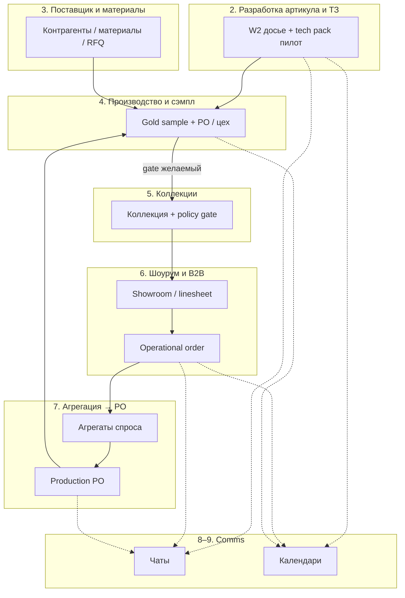

# Визуал: крупные разделы продукта, наполнение, связи и статусы

**Дата:** 2026-05-11 · **Канон кода:** `_ai-share/synth-1-full` · **Опора:** `GAP_ANALYSIS_USER_FLOW_COLLECTION_B2B_CHAT_CALENDAR.md`, `FOCUS_ONE_PAGER.md`, `VISUAL_INVESTOR_DEMO.md` (легенда зрелости).

---

## Оглавление

1. [Легенда статусов](#1-легенда-статусов)
2. [Разработка артикула и ТЗ (Workshop 2)](#2-разработка-артикула-и-тз-workshop-2)
3. [Поставщик и материалы](#3-поставщик-и-материалы)
4. [Производство, сэмпл и гейт качества](#4-производство-сэмпл-и-гейт-качества)
5. [Коллекции бренда](#5-коллекции-бренда)
6. [Шоурум и B2B-заказ](#6-шоурум-и-b2b-заказ)
7. [Агрегация спроса и производственный заказ](#7-агрегация-спроса-и-производственный-заказ)
8. [Чаты (сквозной слой)](#8-чаты-сквозной-слой)
9. [Календарь](#9-календарь)
10. [Общее и админ (контекст)](#10-общее-и-админ-контекст)
11. [Сводная схема связей (Mermaid)](#11-сводная-схема-связей-mermaid)
12. [Матрица раздел × зрелость](#12-матрица-раздел--зрелость)
13. [Топ-10 приоритетов доработок](#13-топ-10-приоритетов-доработок)

---

## 1. Легенда статусов

Как в `VISUAL_INVESTOR_DEMO.md`:

| Символ | Смысл                                                                     |
| ------ | ------------------------------------------------------------------------- |
| **●**  | Прод-путь: реальный маршрут, UI и контрактные смоки                       |
| **◐**  | UI/API есть, данные: read-model, seed, демо-tenant или localStorage досье |
| **○**  | Пилот / env-gated (например tech pack: S3, БД, preflight)                 |
| **◌**  | Заглушка или следующий спринт — не обещать как shipped                    |

В таблицах разделов ниже колонка **Статус** сокращённо: **✅** ≈ ● (готово по контракту), **◐** ≈ ◐/○ (частично / демо / пилот), **❌** ≈ ◌ или явный пробел в GAP-анализе.

**Слова для дорожной карты:** *улучшить* — укрепить существующее; *доделать* — закрыть известный пробел; *развить* — новый объём (новая модель, новый модуль).

---

## 2. Разработка артикула и ТЗ (Workshop 2)

**Назначение для бизнеса.** Здесь бренд фиксирует техническое задание на артикул: секции досье, согласования, версии и передачу в производство. Это основа сроков и качества всей цепочки «модель → фабрика». Без устойчивого ТЗ невозможно честно обещать повторяемость партий и согласованный handoff.

**Наполнение раздела**

- **Экраны:** `/brand/production/workshop2`, артикул `…/workshop2/c/[collectionId]/a/[articleId]`, tech pack `/brand/production/tech-pack/[id]` (пилот).
- **Сущности:** `Phase1Dossier`, секции signoff, merge/lifecycle, `TechPackArtifact`, события досье, финальный экспорт / snapshot (по API `phase1-dossier/`**).
- **Ключевые действия:** редактирование секций ТЗ, подписание этапов (в т.ч. sample в демо-конфиге), merge, lifecycle transitions, (опционально) presign/index/handoff tech pack.

**Связи**

- **Исходящие:** → этап сэмпла и gold sample; → производство (handoff, PO); → календарь (сроки этапов); ↔ чат (обсуждение правок).
- **Входящие:** ← справочники контрагентов пошива; ← материалы/параметры производства как контекст.

| Функция                             | Роли                | Бизнес-вопрос                     | Статус | Улучшить / доделать / развить                                                                         |
| ----------------------------------- | ------------------- | --------------------------------- | ------ | ----------------------------------------------------------------------------------------------------- |
| Досье фазы 1, версии, merge         | Бренд, технолог     | Единая правда по ТЗ?              | ◐      | **Доделать:** персистентность вне демо; **Улучшить:** явная подпись «демо vs prod» в UI.              |
| Signoff по секциям / глобальный     | Бренд, QA           | Кто утвердил и когда?             | ◐      | **Развить:** аудит и отчётность для ритейла/фабрики (read-only).                                      |
| Tech pack: presign, индекс, handoff | Бренд, производство | Передали ли артефакты на фабрику? | ◐      | **Доделать:** env и preflight (`W2_TECHPACK_PILOT`); **Улучшить:** один «зелёный» чеклист готовности. |
| API `collection-stage-review`       | Бренд               | Согласованы ли стадии коллекции?  | ◐      | **Развить:** вынести из узкого файлового порта в общий BFF-контракт.                                  |

---

## 3. Поставщик и материалы

**Назначение для бизнеса.** Поставщик обеспечивает ткани, фурнитуру и логистику: закупка, поставка, учёт и связь с производственным планом. В идеале бренд видит материальный след рядом с артикулом и заказом, без разрыва между «заказали ткань» и «пошили партию».

**Наполнение раздела**

- **Экраны:** блоки материалов в производстве (`materials`, rolls и др.), `/brand/suppliers/`**, `/brand/materials/`**, контрагенты в данных W2.
- **Сущности:** `Supplier`/`Contractor`, `MaterialLot`, параметры `production-params`, RFQ и live-поставщики (широкая матрица маршрутов).
- **Ключевые действия:** привязка контрагента к плану пошива, учёт материалов к артикулу/PO, резервирование (где реализовано).

**Связи**

- **Исходящие:** → производство (доступность сырья для PO); → финансы/закупка (где есть маршруты).
- **Входящие:** ← W2/артикул (номенклатура); ← агрегированный спрос (косвенно).

| Функция                              | Роли             | Бизнес-вопрос                   | Статус | Улучшить / доделать / развить                                                             |
| ------------------------------------ | ---------------- | ------------------------------- | ------ | ----------------------------------------------------------------------------------------- |
| Справочник пошива / API contractors  | Бренд            | Кто шьёт и на каких условиях?   | ◐      | **Улучшить:** связка UI ↔ единый справочник без дублирования.                             |
| Материалы и фурнитура в производстве | Бренд, снабжение | Хватает ли материала под заказ? | ◐      | **Развить:** единый модуль «снабжение», не только куски UI.                               |
| Полный цикл закупка–склад–продажа    | Поставщик, бренд | ERP-уровень для всех ролей?     | ❌      | **Доделать:** границы продукта в IA; **Развить:** только если стратегия — отдельная фаза. |

---

## 4. Производство, сэмпл и гейт качества

**Назначение для бизнеса.** Производство исполняет сэмпл и серии по согласованному ТЗ; бренд фиксирует финальное качество образца (gold sample). Это мост между разработкой артикула и допуском артикула в коллекцию и шоурум.

**Наполнение раздела**

- **Экраны:** `/brand/production`, gold sample `/brand/production/gold-sample`, этаж цеха, Gantt/календарь производства, вкладки чат/календарь в shell.
- **Сущности:** этапы `sample`, `goldSampleApproved`, `SampleAggregate`, производственные заказы (seed/UI `CreatePOFromSamples`).
- **Ключевые действия:** утверждение сэмпла, постановка партии, контроль материалов к PO, просмотр handoff.

**Связи**

- **Исходящие:** → коллекции (ожидаемый gate); → B2B/шоурум (косвенно через eligible артикулы); → чат/календарь на полу.
- **Входящие:** ← W2 handoff; ← материалы; ← агрегированный спрос / B2B (слабая связь — см. раздел 7).

| Функция                     | Роли           | Бизнес-вопрос                          | Статус | Улучшить / доделать / развить                              |
| --------------------------- | -------------- | -------------------------------------- | ------ | ---------------------------------------------------------- |
| Сэмпл по ТЗ и согласованиям | Бренд, фабрика | Соответствует ли образец ТЗ?           | ◐      | **Доделать:** единая персистентность W2 sample vs демо LS. |
| Gold sample как бизнес-факт | Бренд, QA      | Можно ли продавать/показывать артикул? | ◐      | **Доделать:** явная связь с правилом коллекции (см. §5).   |
| PO из утверждённых сэмплов  | Бренд          | Когда запускаем партию?                | ◐      | **Улучшить:** связь с B2B operational order (раздел 7).    |

---

## 5. Коллекции бренда

**Назначение для бизнеса.** Коллекция — сезонный контейнер артикулов для мерча, шоурума и опта. Пользовательский процесс требует: в активной коллекции только артикулы с финальным подтверждением по сэмплу. Сейчас в коде есть куски (W2 sample stage, gold sample), но единый контракт «коллекция = eligible» не выведен.

**Наполнение раздела**

- **Экраны:** `/brand/collections`, `/brand/collections/new`, навигация PIM/showroom из фокус-дока.
- **Сущности:** `Collection`, `Article`/`SKU`, политика включения (желаемая), стадии коллекции (`collection-stage-review`).
- **Ключевые действия:** составление сезона, (желаемо) фильтр по gold sample / W2 global signoff, ревью стадий.

**Связи**

- **Исходящие:** → шоурум, linesheets, B2B-витрины; → operational order (подборка).
- **Входящие:** ← W2 / утверждение сэмпла; ← мерч-инструменты (часть путей широкая).

| Функция                           | Роли  | Бизнес-вопрос               | Статус | Улучшить / доделать / развить                       |
| --------------------------------- | ----- | --------------------------- | ------ | --------------------------------------------------- |
| Состав коллекции                  | Бренд | Что в сезоне?               | ◐      | **Улучшить:** один showcase-сценарий (FOCUS).       |
| Gate: только gold-sample-approved | Бренд | Не продаём «сырой» артикул? | ❌      | **Доделать:** policy + API + UI коллекций.          |
| Стадии коллекции (review API)     | Бренд | Где застряли согласования?  | ◐      | **Развить:** бэкенд-канон вместо узкого JSON-порта. |

---

## 6. Шоурум и B2B-заказ

**Назначение для бизнеса.** Бренд курирует витрину и ассортимент для байера; магазин оформляет оптовый заказ с объёмами, размерами и сроками. Это ядро выручки B2B и проверка зрелости «коллекция → деньги».

**Наполнение раздела**

- **Экраны:** `/brand/showroom`, linesheets, shoppable lookbook; `/brand/b2b-orders`, `[orderId]`; зеркало `/shop/b2b-orders`; календари заказов shop.
- **Сущности:** `OperationalOrder`, строки заказа (размеры, delivery — глубина по DTO/UI), lookbook/linesheet как витрина.
- **Ключевые действия:** отбор артикулов, условия, размещение заказа, просмотр статуса у бренда и shop.

**Связи**

- **Исходящие:** → агрегация спроса; → производство (ожидаемо); ↔ чат/календарь по заказу.
- **Входящие:** ← коллекции/шоурум; ← интеграции (JOOR и др. — не смешивать с одним демо-путём).

| Функция                          | Роли         | Бизнес-вопрос           | Статус | Улучшить / доделать / развить                            |
| -------------------------------- | ------------ | ----------------------- | ------ | -------------------------------------------------------- |
| Operational orders v1 (BFF)      | Бренд, shop  | Единый контракт заказа? | ◐      | **Улучшить:** e2e один путь + подпись источника данных.  |
| Строки: размеры, delivery days   | Байер, бренд | Сошлись ли условия?     | ◐      | **Доделать:** явный аудит полноты DTO/UI (GAP).          |
| Шоурум как курация перед заказом | Бренд        | Один URL-сценарий?      | ◐      | **Улучшить:** связать showcase с operational order в IA. |

---

## 7. Агрегация спроса и производственный заказ

**Назначение для бизнеса.** После B2B бренд сводит заказы с магазинов и ставит производственные заказы по ТЗ. Это снижает риск недопроизводства и перепроизводства и связывает спрос ритейла с цехом.

**Наполнение раздела**

- **Экраны:** логика `CreatePOFromSamples`, агрегаты в контроле, brand production / PO страницы; доменные типы `OrderAggregate`, `CollectionAggregate`, `SampleAggregate`.
- **Сущности:** `AggregatedDemand`, `ProductionOrder`, связь с operational order (частично отсутствует).
- **Ключевые действия:** свод потребности, создание PO из утверждённых сэмплов, проверка сырья/фурнитуры (где реализовано).

**Связи**

- **Исходящие:** → производство / фабрика; → материалы.
- **Входящие:** ← operational orders shop/brand; ← сэмплы.

| Функция                         | Роли    | Бизнес-вопрос              | Статус | Улучшить / доделать / развить                             |
| ------------------------------- | ------- | -------------------------- | ------ | --------------------------------------------------------- |
| Агрегаты спроса в коде          | Бренд   | Сколько в сумме по сети?   | ◐      | **Доделать:** явный BFF «merge orders» в продуктовом UI.  |
| PO после B2B по одному сценарию | Бренд   | От заказа до запуска цеха? | ◐      | **Доделать:** end-to-end связь B2B read-model → PO (GAP). |
| Источник правды для агрегации   | Продукт | ERP vs платформа?          | ❌      | **Развить:** ADR после ответа стейкхолдера.               |

---

## 8. Чаты (сквозной слой)

**Назначение для бизнеса.** Переписка бренд ↔ магазин ↔ поставщик ↔ производство в контексте заказа или проекта снижает потери в согласованиях и ускоряет реакцию на изменения.

**Наполнение раздела**

- **Экраны:** `/brand/messages`, `/shop/messages`, factory/distributor messages в `ROUTES`; вкладка чата на production shell.
- **Сущности:** `ChatThread` (желаемая единая модель), привязка к `orderId` / `collectionId` / `articleId` (частично).
- **Ключевые действия:** написать сообщение, открыть тред из контекста B2B/производства.

**Связи**

- **Исходящие:** ↔ все доменные разделы (контекстные deep links).
- **Входящие:** ← уведомления; ← навигация из заказа/досье.

| Функция                            | Роли      | Бизнес-вопрос               | Статус | Улучшить / доделать / развить                         |
| ---------------------------------- | --------- | --------------------------- | ------ | ----------------------------------------------------- |
| Полноформатные messages brand/shop | Все       | Есть ли «одно окно»?        | ◐      | **Улучшить:** thread id ↔ сущность (GAP вопрос 3).    |
| Вкладка чата на полу производства  | Бренд     | Тот же канал, что messages? | ◐      | **Доделать:** IA: два уровня vs конвергенция (FOCUS). |
| Единый серверный канон тредов      | Платформа | Масштаб и поиск?            | ❌      | **Развить:** отдельная фаза; не обещать как shipped.  |

---

## 9. Календарь

**Назначение для бизнеса.** Календарь объединяет даты отгрузок, встреч, этапов ТЗ и производства, чтобы сроки не расходились между кабинетами.

**Наполнение раздела**

- **Экраны:** `/brand/calendar`, `/shop/b2b/calendar`, `/shop/b2b/delivery-calendar`, factory `production/calendar`, календари B2B-заказов.
- **Сущности:** `CalendarEvent`, демо-события (`demoCalendarEventsForProductionStage` и аналоги в cutline/spine).
- **Ключевые действия:** просмотр/планирование встреч и milestone, привязка к стадиям (где есть).

**Связи**

- **Исходящие:** ↔ B2B (ship window); ↔ производство; ↔ W2 (этапы).
- **Входящие:** ← синхронизации (ограниченно).

| Функция                                    | Роли        | Бизнес-вопрос                | Статус | Улучшить / доделать / развить                                |
| ------------------------------------------ | ----------- | ---------------------------- | ------ | ------------------------------------------------------------ |
| Календарь бренда и shop                    | Бренд, shop | Видим ли одни и те же сроки? | ◐      | **Доделать:** один «канонический календарь» в питче (FOCUS). |
| Разделение семантик (delivery vs capacity) | Продукт     | Нет ли путаницы?             | ◐      | **Улучшить:** подписи в UI + IA cutline.                     |
| Демо-события vs реальные данные            | Демо        | Честна ли витрина?           | ◐      | **Улучшить:** явная маркировка demo.                         |

---

## 10. Общее и админ (контекст)

**Назначение для бизнеса.** Профиль бренда, tenant, интеграции и админские экраны задают доверие к демо и границы экосистемы. Для инвесторского потока это вспомогательный слой относительно трёх столбов.

**Наполнение раздела**

- **Экраны:** `/brand/profile`, organization hub, `admin/`*, интеграции ERP/PLM, архивные B2B-коннекторы.
- **Сущности:** tenant, пользователи, настройки, cron/метрики W2 (не главный экран питча по FOCUS).
- **Ключевые действия:** вход в демо, переключение контекста, справочные интеграции.

**Связи:** обслуживает все разделы (аутентификация, данные, смоки).

| Функция                    | Роли      | Бизнес-вопрос           | Статус | Улучшить / доделать / развить                         |
| -------------------------- | --------- | ----------------------- | ------ | ----------------------------------------------------- |
| Демо-bootstrap / tenant    | Платформа | Воспроизводимо ли демо? | ◐      | **Улучшить:** список URL для смоков (FOCUS шаг 1).    |
| Админ и тяжёлые метрики W2 | Админ     | Нужны ли в P0?          | ◐      | **Улучшить:** сознательно вне главного питча (FOCUS). |

---

## 11. Сводная схема связей (Mermaid)

---

## 12. Матрица раздел × зрелость

| Раздел                   | Зрелость (кратко)                                  |
| ------------------------ | -------------------------------------------------- |
| 2. ТЗ / W2               | ◐ — сильный UI/API; демо-персистенция; tech pack ○ |
| 3. Поставщик / материалы | ◐ — фрагменты; нет единого ERP-модуля              |
| 4. Производство / сэмпл  | ◐ — контуры PO и gold sample; связь с B2B слабая   |
| 5. Коллекции             | ◐ UI; ❌ единый gate по сэмплу                      |
| 6. Шоурум / B2B          | ◐ operational v1; уточнить глубину строк           |
| 7. Агрегация → PO        | ◐ зачатки; ❌ сквозной BFF-нарратив                 |
| 8. Чаты                  | ◐ два уровня UX; ❌ единый backend-тред             |
| 9. Календарь             | ◐ несколько семантик; нужен канон IA               |
| 10. Общее / админ        | ◐ инфраструктура демо и смоков                     |

---

## 13. Топ-10 приоритетов доработок

1. **Политика коллекции = только после финального сэмпла** — закрывает ключевой бизнес-риск «продаём неготовое»; сейчас правило не зафиксировано как контракт.
2. **Сквозная связь B2B operational order → агрегация → PO** — делает ценность платформы измеримой для бренда.
3. **Один канонический календарь в IA и питче** — снимает когнитивный шум между brand / shop delivery / factory.
4. **Решение по двум уровням чата** (messages vs вкладка на полу) — честность демо и меньше вопросов у инвестора.
5. **Персистентность W2 вне localStorage для целевого артикула** — основа доверия к столбу A.
6. **Завершение tech pack пилота по env + preflight** — переносит ○ в управляемый ◐/●.
7. **Аудит полноты operational order lines** (размеры, delivery) — снимает юридически значимые пробелы в B2B.
8. **BFF/UI для «merge orders» с магазинов** — визуализация агрегата для бренда без чтения кода.
9. **Расширение `collection-stage-review` в общий контракт** — стадии коллекции как управляемый процесс.
10. **ADR: источник правды для агрегации** (платформа vs ERP) — предотвращает двойной учёт и расползание модели.

---

*Документ планирования; код не изменялся.*