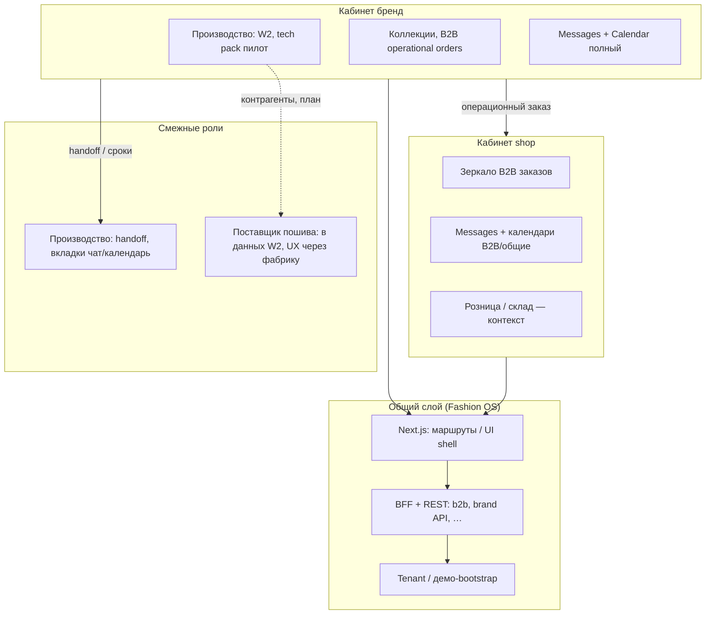
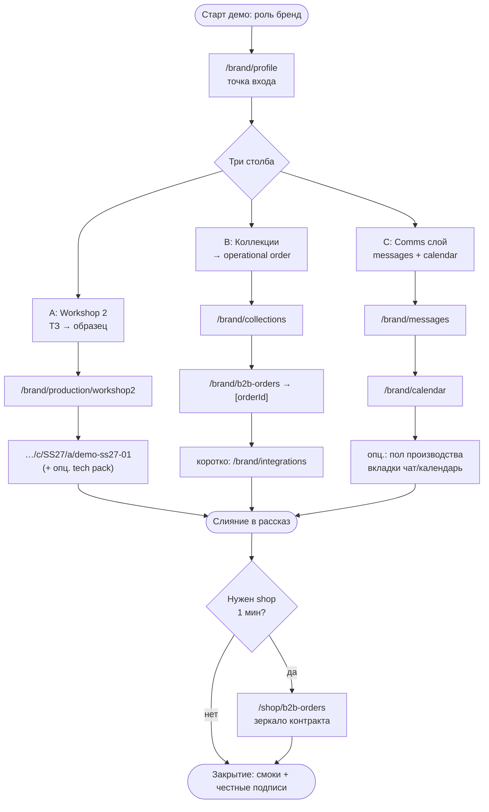
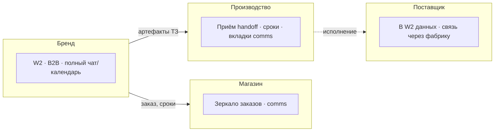

# Визуал: инвесторское демо и три столба

**Дата:** 2026-05-11 · **Опора:** `FOCUS_ONE_PAGER.md`, `INVESTOR_DEMO_VARIANT_THREE_PILLARS.md` · Без скриншотов — схемы и wireframe-блоки.

**Не канон:** актуальные диаграммы, таблицы страниц и карта «большая схема ↔ PATCH ↔ таблицы» — в **`../FINAL_DIAGRAMS_AND_PAGES_RU.md`** (**§0.1**); исполняемый порядок URL — **`_ai-share/synth-1-full/docs/INVESTOR_DEMO_RUNBOOK.md`**. Этот файл — **черновик нарратива**; при противоречии приоритет у **`FINAL`** + **`GAP` §7** + **`PLAN` §7.7**. Канонические **FOCUS / GAP / PLAN / FINAL** содержимое из `.planning/research/_archive/` **не** импортируют и на этот каталог **не** ссылаются (см. шапку **`../FOCUS_ONE_PAGER.md`**).

---

## 1. Информационная архитектура (высокий уровень)

Один Next-приложение: кабинеты **бренд** и **shop** делят BFF/API и аутентификацию; **общий слой коммуникаций** пересекает роли с разной глубиной UX.




---

## 2. Золотой путь и ветки A / B / C

**Spine:** бренд → точка входа → три опоры по порядку (или короткие «окна» с возвратом). **Ветки:** A = ТЗ→образец, B = коллекция→операционный заказ, C = чат+календарь.




---

## 3. Роли (компактная «дорожка»)




---

## 4. ASCII-wireframes (схематично, не пиксели)

### 4.1 Навигация после сужения (investor mode — концепт)

```
┌─────────────────────────────────────────────────────────────────┐
│  Fashion OS · Бренд          [Профиль] [Производство▼] [B2B▼] [Связь▼]   │
├─────────────────────────────────────────────────────────────────┤
│  Производство▼ → Workshop 2 | (остальное свёрнуто)              │
│  B2B▼          → Заказы опер. | Коллекции (1 showcase)          │
│  Связь▼       → Сообщения | Календарь                            │
└─────────────────────────────────────────────────────────────────┘
```

### 4.2 Экран досье W2 (фаза 1, артикул)

```
┌─────────────────────────────────────────────────────────────────┐
│  ← SS27 · demo-ss27-01          [Секции] [Версии] [Signoff] [События]   │
├──────────────┬──────────────────────────────────────────────────┤
│ Список       │  Содержимое секции ТЗ / чеклисты / статус        │
│ секций       │  …                                                │
│ (дерево)     │  [Опц. блок tech pack — только если env OK]      │
└──────────────┴──────────────────────────────────────────────────┘
```

### 4.3 Список и карточка B2B operational order

```
┌─────────────────────────────────────────────────────────────────┐
│  Операционные заказы B2B                    [Фильтр] [Поиск]     │
├─────────────────────────────────────────────────────────────────┤
│  ┌──────────────┐ ┌──────────────┐ ┌──────────────┐             │
│  │ Заказ …001   │ │ Заказ …002   │ │ Заказ …003   │  …         │
│  │ бренд · сезон│ │              │ │              │             │
│  └──────────────┘ └──────────────┘ └──────────────┘             │
└─────────────────────────────────────────────────────────────────┘
        │ клик
        ▼
┌─────────────────────────────────────────────────────────────────┐
│  Заказ [id] · статус · партнёр        [Вкладки: сводка | позиции]      │
│  … read-model / демо-tenant — озвучить вслух                       │
└─────────────────────────────────────────────────────────────────┘
```

### 4.4 Чат и календарь (два столбца — «рядом» в раскладке)

```
┌────────────────────────────┬────────────────────────────────────┐
│  Сообщения                 │  Календарь бренда                  │
│  [треды B2B-контекст]      │  [события — один слой семантики    │
│                            │   не смешивать с factory capacity] │
│  …                         │  …                                 │
└────────────────────────────┴────────────────────────────────────┘
```

### 4.5 Shop: зеркало (короткий заход)

```
┌─────────────────────────────────────────────────────────────────┐
│  Shop · Оптовые заказы          (тот же API / зеркало контракта)     │
│  Список → карточка — «вид со стороны ритейла»                    │
└─────────────────────────────────────────────────────────────────┘
```

---

## 5. Легенда: что «реально», что демо / пилот


| Символ | Значение                                                                                                                  |
| ------ | ------------------------------------------------------------------------------------------------------------------------- |
| **●**  | Реальный маршрут, UI и контрактные смоки в репозитории                                                                    |
| **◐**  | Реальный UI/API, но данные: **read-model**, демо-tenant, seed или **localStorage** досье — озвучить как демо-персистенция |
| **○**  | Пилот / **env-gated** (напр. tech pack: S3, `DATABASE_URL`, preflight) — не продавать как shipped                         |
| **◌**  | Заглушка, empty state, следующий спринт — одна честная фраза                                                              |


На слайде/доске можно дублировать легенду в углу: **● прод-путь · ◐ демо-данные · ○ пилот по env · ◌ не обещаем**.

---

## 6. Подпись к визуалу

Схемы отражают **один Next** и **три столба** из one-pager; золотой путь и URL — из варианта «три столба»; роли и ограничения (два уровня comms, календари без смешения семантик) — как в `FOCUS_ONE_PAGER.md`.