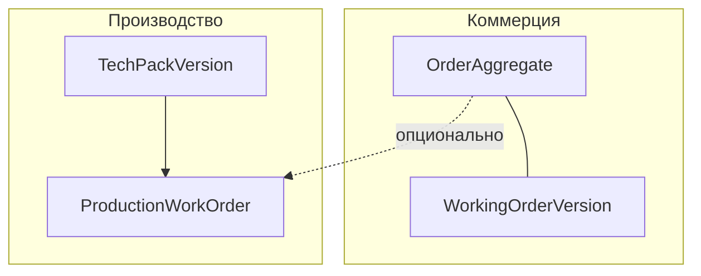

# Ядро продукта: B2B-заказы и ТЗ → производство

**Версия:** 2.5 · **Статус:** рабочий канон для приоритизации и приёмки · **Репозиторий:** `_ai-share/synth-1-full` · **Связанные документы:** `docs/ACADEMY_CABINET_UI_STANDARD.md`, `AGENTS.md` (раздел Design System).

Документ детализирует: заявленное ядро, инвентарь источников правды, канонический агрегат заказа (Phase 2), **полный** список переходов из `order-state-machine.ts`, legacy-маппинги, Working Order, operational API, tech pack, чаты/календарь, целевую архитектуру, RACI, сценарии приёмки, матрицу зазоров, фазы P0–P2, расширенный указатель файлов.

---

## Оглавление

1. [Термины и границы](#1-термины-и-границы)
2. [Заявленное ядро](#2-заявленное-ядро)
3. [Инвентарь источников правды](#3-инвентарь-источников-правды)
4. [Канонический агрегат заказа (Phase 2)](#4-канонический-агрегат-заказа-phase-2)
5. [Полная машина состояний](#5-полная-машина-состояний)
6. [Legacy-статусы и mapLegacyStatus](#6-legacy-статусы-и-maplegacystatus)
7. [Working Order (NuOrder-паттерн)](#7-working-order-nuorder-паттерн)
8. [Operational API и хуки](#8-operational-api-и-хуки)
9. [Legacy B2BOrderWholesaleStatus](#9-legacy-b2borderwholesalestatus)
10. [Процесс A: Tech pack](#10-процесс-a-tech-pack--задание-на-отшив)
11. [Процесс C: чаты и календарь](#11-процесс-c-чаты-и-календарь)
12. [Целевая архитектура данных](#12-целевая-архитектура-данных)
13. [Роли и RACI](#13-роли-и-raci)
14. [Сценарии приёмки](#14-сценарии-приёмки)
15. [Матрица зазоров](#15-матрица-зазоров)
16. [Фазы P0–P2](#16-фазы-p0p2)
17. [Указатель файлов](#17-указатель-файлов)
18. [Приложение: проекции dispute в машине](#18-приложение-проекции-dispute-в-машине-состояний)
19. [Приложение: поля Operational DTO](#19-приложение-поля-operational-dto)
20. [Приложение: HTTP operational v1](#20-приложение-http-operational-v1)
21. [Приложение: Working Order](#21-приложение-working-order)
22. [HTTP API: полная матрица](#22-http-api-полная-матрица)
23. [Заголовки и envelope ответа](#23-заголовки-и-envelope-ответа)
24. [Серверный read-model: цепочка данных](#24-серверный-read-model-цепочка-данных)
25. [Zod-парсинг ответов v1](#25-zod-парсинг-ответов-v1)
26. [Detail: v1 DTO и legacy `B2BOrder`](#26-detail-v1-dto-и-legacy-b2border)
27. [PATCH operational-note](#27-patch-operational-note)
28. [Примеры JSON](#28-примеры-json)
29. [Working Order: серверный слой v1](#29-working-order-серверный-слой-v1)
30. [Operational и internal заметки (PATCH)](#30-operational-и-internal-заметки-patch)
31. [Примеры файлов пилота](#31-примеры-файлов-пилота)

---

## 1. Термины и границы

| Термин | Значение |
|--------|----------|
| **ТЗ / tech pack** | Документ изделия (BOM, спеки, размеры, уход, история). Тип `TechPackDraftV1` в `src/lib/production-data/port.ts`; UI: `src/app/brand/production/tech-pack/[id]/page.tsx`. |
| **Задание на отшив** | Производственная сущность по утверждённому ТЗ. В коде как **единый обязательный серверный агрегат** пока не закреплено — см. §12. |
| **Оптовый заказ** | Сделка бренд ↔ магазин. Канон в коде: `OrderAggregate`, `OrderCommercialStatus` (`order-schemas.ts`). |
| **Working Order** | Версии загружаемого файла заказа, сравнение с матрицей, подтверждение брендом. Хранение: `localStorage` (`working-order-store.ts`). |
| **Operational UI** | Списки/карточки заказов; DTO `OperationalOrderListRowDto` / `OperationalOrderDetailDto` (`operational-order-dto.ts`). |

**Граница документа:** описывается то, что есть в Next-репозитории или требуется как явный контракт; внешние БД/ERP не специфицируются.

---

## 2. Заявленное ядро

1. Бренд: **ТЗ → отшив** (согласование документа изделия и запуск производства).
2. Бренд ↔ магазин: **оптовый заказ** в духе JOOR / NuOrder (согласование, линии, статусы, операционные заметки).
3. Чаты и календарь — **надстройка** над п.1–2 (контекстные сущности, не «отдельный продукт»).

---

## 3. Инвентарь источников правды

| # | Область | Файлы / механизм | Где правда сейчас | Риск |
|---|---------|------------------|-------------------|------|
| 1 | Коммерческий агрегат | `order-aggregate.ts`, `order-schemas.ts`, `order-state-machine.ts` | Модель и переходы в коде | UI/API могут не вызывать все переходы |
| 2 | Read-model списков | `b2b-orders-list-read-model.ts`, при необходимости snapshot | In-memory / JSON для демо | Не единственный источник с HTTP |
| 3 | HTTP operational | `/api/b2b/v1/operational-orders`, `/api/b2b/operational-orders` | v1 + legacy | Два формата ответа, разбор в хуке |
| 4 | Working Order | store + `GET/PUT` v1, `data/b2b-working-order-versions.json` | Клиент + **файл на сервере** | Полная замена списка при PUT; кэш localStorage |
| 5 | Tech pack черновик | `ProductionDataPort`, `tech-pack-draft-store` | localStorage по умолчанию | Нет серверного ID версии |
| 6 | Задачи цеха (демо) | `brand-tasks-store` / `listTasks` в порте | localStorage | Связь с ТЗ/заказом не канонизирована |

**Цель интеграции:** один согласованный **поток данных** для заказа (1)+(3); прототипы (4)(5) — либо миграция на API, либо явная маркировка «до миграции».

---

## 4. Канонический агрегат заказа (Phase 2)

### 4.1 Схема Zod (`order-schemas.ts`)

**`OrderCommercialStatus`:**  
`draft` | `pending_approval` | `negotiation` | `confirmed` | `partially_shipped` | `shipped` | `delivered` | `cancelled` | `disputed`.

**`OrderPaymentStatus`:**  
`pending` | `partial` | `paid` | `overdue` | `refunded` | `escrow_held` | `escrow_released`.

**`OrderFulfillmentStatus`:**  
`not_started` | `picking` | `packed` | `ready_for_shipment` | `shipped` | `partially_shipped` | `in_transit` | `delivered`.

**Режим `mode`:** `buy_now` | `reorder` | `pre_order`.

**Участники `participants`:** обязательны `brandId`, `buyerAccountId`; опционально `distributorId`, `retailerLocationId`, `originLocationId`, `tenantId`.

**Проекции:** `payment`, `fulfillment`; опционально `dispute` (`none` | `open` | `resolved`), `sync`, `financialImpact`.

### 4.2 Дискриминаторы (`order-state-machine.ts`)

- `isB2BOrder(order)`: `!!order.participants.buyerAccountId && !!order.id`.
- `isPreOrder(order)`: `order.mode === 'pre_order'`.

### 4.3 Связь с operational DTO

- Идентификатор оптового заказа в DTO: `WholesaleOrderId` (строка); в legacy `B2BOrder` поле заказа — `order` (см. `operational-order-dto.ts`).
- `mapLegacyToAggregate` в `order-aggregate.ts` задаёт `id: o.order`, участников `brandId`/`buyerAccountId` из полей бренда и магазина.

---

## 5. Полная машина состояний

Источник истины: массив `STATE_TRANSITIONS` в `src/lib/order/order-state-machine.ts`.  
Проверка: `canTransitionTo(order, to, actor)` — учитывает `allowedActors` и необязательные `conditions`.

| # | from | to | allowedActors | conditions (логика из кода) |
|---|------|-----|---------------|-----------------------------|
| 1 | draft | pending_approval | shop, brand | `order.lines.length > 0` |
| 2 | pending_approval | confirmed | brand | `order.lines.length > 0` |
| 3 | pending_approval | negotiation | brand, shop | — |
| 4 | negotiation | pending_approval | shop, brand | — |
| 5 | confirmed | shipped | system, brand | fulfillment ∈ packed, ready_for_shipment, shipped, partially_shipped, in_transit |
| 6 | confirmed | partially_shipped | system, brand | fulfillment === partially_shipped |
| 7 | partially_shipped | shipped | system, brand | fulfillment === shipped |
| 8 | shipped | delivered | system, brand | fulfillment === delivered |
| 9 | draft | cancelled | shop, brand | — |
| 10 | pending_approval | cancelled | brand, shop | — |
| 11 | negotiation | cancelled | brand, shop | — |
| 12 | confirmed | cancelled | brand, shop | fulfillment === not_started |
| 13 | delivered | disputed | shop | dispute === open |
| 14 | shipped | disputed | shop | dispute === open |
| 15 | disputed | delivered | brand, system | dispute === resolved |
| 16 | delivered | cancelled | shop, brand | fulfillment === delivered (комментарий в коде: возврат/аннуляция) |

**Важно:** переходы в shipped/delivered/disputed зависят от `order.projections.fulfillment` и `order.projections.dispute`. Если проекции не обновляются вместе с UI, `canTransitionTo` вернёт отказ.

---

## 6. Legacy-статусы и mapLegacyStatus

Функция `mapLegacyStatus` (внутри `order-aggregate.ts`, рядом с `mapLegacyToAggregate`) переводит **русские** строки статуса из legacy в `OrderCommercialStatus`:

| Строка legacy | OrderCommercialStatus |
|-----------------|------------------------|
| Черновик | draft |
| На проверке | pending_approval |
| Согласован | confirmed |
| Подтверждён | confirmed |
| Отменён | cancelled |
| **default** | confirmed |

**Риск:** любой неизвестный статус становится `confirmed`. При расширении snapshot/API нужны явная таблица, логирование и тесты.

**Дополнительно в `mapLegacyToAggregate`:** если `o.status === 'Отгружен'`, то `projections.fulfillment` выставляется в `shipped`, иначе `not_started` — это **не** дублируется в `mapLegacyStatus` (отдельная ось «исполнение»).

---

## 7. Working Order (NuOrder-паттерн)

**Файлы:** `src/lib/b2b/working-order-store.ts`, UI `src/app/shop/b2b/working-order/page.tsx`, обёртка `ShopB2bNuOrderScope`.

### 7.1 Статусы версии

`WorkingOrderVersionStatus`: `draft` | `pending_review` | `confirmed` | `rejected`.

### 7.2 Хранение

Ключ localStorage: `b2b_working_order_versions`.

### 7.3 Интерфейс версии (поля)

`id`, `createdAt`, `uploadedBy`, `uploadedByUserId?`, `fileName`, `rows`, `status`, **`wholesaleOrderId?`** (оптовый id = поле `order` в `B2BOrder`), `brandComment?`, `confirmedAt?`, `confirmedBy?`.

### 7.4 Связь с оптовым заказом

- **Клиент:** при импорте CSV на `/shop/b2b/working-order` контекст заказа берётся из селектора или из `?wholesaleOrderId=` (если id есть в списке `useShopB2BOperationalOrdersList`). Для каждой версии можно сменить привязку (`setWorkingOrderVersionWholesaleOrderId`) и перейти в карточку заказа (`shopB2bOrderHref`).
- **Хранение:** по-прежнему только `localStorage` — сервер не знает о WO; репликация на бэкенд остаётся следующим шагом (G2).

---

## 8. Operational API и хуки

### 8.1 Маршруты (ожидаемые по структуре репозитория)

| Назначение | Путь |
|------------|------|
| Список (v1) | `GET /api/b2b/v1/operational-orders` |
| Деталь (v1) | `GET /api/b2b/v1/operational-orders/[orderId]` |
| Список (legacy) | `GET /api/b2b/operational-orders` |
| Деталь (legacy) | `GET /api/b2b/operational-orders/[orderId]` |

Файлы: `src/app/api/b2b/v1/operational-orders/route.ts`, `[orderId]/route.ts`, зеркально под `src/app/api/b2b/operational-orders/`.

### 8.2 Хук `useOperationalOrdersList` (`use-b2b-operational-orders-list.ts`)

Порядок:

1. `fetch('/api/b2b/v1/operational-orders')` с заголовком `x-syntha-api-actor-role: brand|shop`, ответ парсится через `parseOperationalOrdersV1ListResponse`, строки маппятся через `operationalOrderListRowDtoToB2BOrder`.
2. Иначе `fetch('/api/b2b/operational-orders')` — ожидается `{ ok, data: { orders } }`.
3. Иначе fallback: `listB2BOrdersForOperationalUi({ actorRole })` (read-model).

Экспорты:

- `useB2BOperationalOrdersList()` — кабинет бренда (`/brand/b2b-orders`).
- `useShopB2BOperationalOrdersList()` — хаб shop (`/shop/b2b/orders`).

### 8.3 Операционные заметки (v1)

Логика PATCH: `src/lib/order/v1/patch-operational-order-note-v1.ts` (маршрут вида `/api/b2b/v1/operational-orders/{id}/operational-note` — уточнять по `src/app/api` при изменениях).

---

## 9. Legacy B2BOrderWholesaleStatus

**Файл:** `src/lib/types/b2b.ts`.

Тип: `draft` | `pending_brand` | `pending_retailer` | `pending_admin` | `confirmed` | `production` | `shipped`.

Используется в `B2BNegotiation` и смежных типах. **Не совпадает** с `OrderCommercialStatus` — нужна явная **карта соответствия** или постепенный отказ в пользу агрегата Phase 2.

**Черновик карты (для обсуждения):**

| B2BOrderWholesaleStatus | Ближайший OrderCommercialStatus |
|-------------------------|----------------------------------|
| draft | draft |
| pending_brand / pending_retailer / pending_admin | pending_approval или negotiation |
| confirmed | confirmed |
| production | confirmed + проекция fulfillment / отдельный workflow производства |
| shipped | shipped |

---

## 10. Процесс A: Tech pack → задание на отшив

### 10.1 `TechPackDraftV1` (`production-data/port.ts`)

Поля: `v: 1`, `styleId`, `selectedSizeScale`, `isApproved`, `isEditing?`, `bomData`, `gradingData`, `patternsData`, `careData`, `specsData`, `seamsData`, `smvData`, `packData`, `historyData`, `updatedAt`.

### 10.2 Порт `ProductionDataPort`

Методы включая: `getTechPackDraft` / `saveTechPackDraft`, `getSkuFlow` / `saveSkuFlow`, `listTasks` / `saveTasks`, `getFloorTabDraft` / `saveFloorTabDraft` для вкладок цеха.

### 10.3 Целевые сущности (логическая модель, вне кода)

| Сущность | Назначение |
|----------|------------|
| TechPackVersion | Версия документа с server id и жизненным циклом |
| ProductionWorkOrder | Задание на отшив: ссылка на версию ТЗ, линии, срок, исполнитель |

### 10.4 Предлагаемые статусы ТЗ

`draft` → `in_review` → `approved` | `superseded`.

### 10.5 Предлагаемые статусы work order

`planned` → `released` → `in_progress` → `qc_hold` → `completed` | `cancelled`.

### 10.6 Чеклист пробелов

- [ ] Серверный ID и API для версий ТЗ
- [ ] Связь `ProductionWorkOrder.techPackVersionId`
- [ ] Единая версия для бренда и цеха
- [ ] Аудит approve / release

### 10.7 UI

`src/app/brand/production/tech-pack/[id]/page.tsx` — основной экран (крупный файл; при работе может быть в `.cursorignore` как монстр-файл — проверять локальные правила).

---

## 11. Процесс C: чаты и календарь

### 11.1 Принцип

Привязка к доменным id: `orderId` (wholesale), `techPackVersionId`, `workOrderId` — чаты и события календаря отражают **контекст**, а не изолированный модуль.

### 11.2 Код

- Сообщения и сущности: `ChatMessage`, `entityType` / `entityId` в типах чата (см. `types` / провайдеры чата).
- Маршруты: `ROUTES.brand.messages`, `ROUTES.shop.messages`, хелперы `messagesChat(id)` где применимо.
- Календарь: `calendarHrefForRole`, маршруты `ROUTES.*.calendar`.

### 11.3 Пробелы

- [ ] Автосоздание/привязка чата при ключевых событиях заказа/ТЗ
- [ ] Календарь из реальных дат агрегата, а не только демо-данных

---

## 12. Целевая архитектура данных



**Инвариант:** один стабильный `wholesaleOrderId` на оптовую сделку; после миграции Working Order хранит ссылку на него.

---

## 13. Роли и RACI

| Действие | Магазин | Бренд | Система |
|----------|---------|-------|---------|
| Черновик заказа | R/A | I | I |
| Отправка на согласование | R | I | I |
| Подтверждение | I | R/A | I |
| Переход к shipped (по правилам машины) | I | R* | A* |
| Working Order: загрузка | R | I | — |
| Working Order: confirm/reject | I | R/A | — |
| Утверждение ТЗ | I | R/A | — |
| Release на фабрику | I | R | I |

*Зависит от того, кто в `allowedActors` для конкретного перехода (`system` часто участвует в исполнении).

(Legend: R=Responsible, A=Accountable, I=Informed)

---

## 14. Сценарии приёмки

### 14.1 Заказ (минимальный P0)

1. Магазин в контуре B2B создаёт черновик с непустыми линиями и инициирует переход в `pending_approval`.
2. Бренд видит заказ в списке operational; данные согласованы между GET и отображаемой строкой.
3. Бренд подтверждает — статус `confirmed` (или эквивалент в DTO) без расхождения при повторном запросе.

### 14.2 Working Order (после введения связи)

1. Версия создаётся с `wholesaleOrderId = X`.
2. Статус `pending_review` → бренд `confirmed`.
3. Заказ `X` отображает ссылку/метку последней подтверждённой версии.

### 14.3 Tech pack

1. Черновик сохраняется; утверждение фиксируется.
2. Создаётся work order с `techPackVersionId`.
3. Цех читает ту же версию в read-only.

---

## 15. Матрица зазоров

| ID | Тема | Критичность | Статус |
|----|------|-------------|--------|
| G1 | Один источник правды для заказа в API + UI | P0 | Зазор |
| G2 | WO ↔ wholesaleOrderId + сервер | P0 | **Частично:** поле + UI + GET/PUT v1 + файл `data/b2b-working-order-versions.json`; единый SoT без мерджа конфликтов — позже |
| G3 | Tech pack: серверная версия | P0 | Зазор |
| G4 | ProductionWorkOrder сущность + API | P1 | Зазор |
| G5 | Карта B2BOrderWholesaleStatus ↔ OrderCommercialStatus | P1 | Зазор |
| G6 | Все переходы state machine доступны/согласованы в UI | P1 | Частично |
| G7 | Чаты от событий домена | P2 | Зазор |
| G8 | Календарь из дат агрегата | P2 | Зазор |
| G9 | Реализация `PATCH …/operational-note` на сервере | P0/P1 | Реализовано (файловый слой; prod — БД/ACL) |

---

## 16. Фазы P0–P2

### P0 (блокирует формулировку «ядро закрыто»)

- Сквозной заказ: draft → pending_approval → confirmed через **один** согласованный канал (HTTP и read-model не противоречат друг другу для демо).
- Документировать таблицу legacy ↔ `OrderCommercialStatus` и убрать silent `default → confirmed` или зафиксировать как осознанное ограничение.
- Решение по Working Order: остаётся прототипом **или** получает привязку к заказу (минимальный API/JSON).

### P1

- Tech pack: серверный draft/version API.
- Минимальный DTO ProductionWorkOrder.

### P2

- Чаты/календарь с явной привязкой к сущностям.

---

## 17. Указатель файлов

| Тема | Путь |
|------|------|
| Zod статусы | `src/lib/order/order-schemas.ts` |
| Агрегат и mapLegacy | `src/lib/order/order-aggregate.ts` |
| Машина состояний | `src/lib/order/order-state-machine.ts` |
| Operational DTO | `src/lib/order/operational-order-dto.ts` |
| Схема ответа v1 | `src/lib/order/operational-order-dto.schema.ts` |
| Список хук | `src/hooks/use-b2b-operational-orders-list.ts` |
| Read model | `src/lib/order/b2b-orders-list-read-model.ts` |
| Read model (сервер, snapshot) | `src/lib/order/b2b-orders-list-read-model.server.ts` |
| Снимок заказов на диске | `src/lib/order/b2b-order-persistence.file.ts`, `data/b2b-orders.snapshot.json` |
| Фильтр бренд/ритейлер | `src/lib/order/b2b-orders-read-model-shared.ts` |
| Working Order | `src/lib/b2b/working-order-store.ts`, `src/app/shop/b2b/working-order/page.tsx` |
| API v1 | `src/app/api/b2b/v1/operational-orders/` |
| Сборка списка v1 на сервере | `src/lib/order/b2b-operational-api-server.ts` |
| Legacy API | `src/app/api/b2b/operational-orders/` |
| Типы wholesale / переговоры | `src/lib/types/b2b.ts` |
| Tech pack порт | `src/lib/production-data/port.ts` |
| PATCH operational note v1 | `src/lib/order/v1/patch-operational-order-note-v1.ts` |
| PATCH operational note (route) | `src/app/api/b2b/v1/operational-orders/[orderId]/operational-note/route.ts` |
| Файл operational notes | `src/lib/order/b2b-operational-notes-persistence.file.ts` |

---

## 18. Приложение: проекции dispute в машине состояний

- Для переходов в `disputed` требуется `order.projections.dispute === 'open'`.
- Для выхода `disputed` → `delivered` требуется `dispute === 'resolved'`.
- Если поле `dispute` отсутствует в старых данных, поведение зависит от парсинга/дефолтов в агрегате — при интеграции задать явный default `none`.

---

## 19. Приложение: поля Operational DTO

Источник: `src/lib/order/operational-order-dto.ts`.

### 19.1 List row (`OperationalOrderListRowDto`)

| Поле | Назначение |
|------|------------|
| `wholesaleOrderId` | Канонический id опта (в legacy `B2BOrder` — поле `order`) |
| `status` | Строковый статус (legacy / UI) |
| `shop`, `brand` | Участники |
| `amount`, `date`, `deliveryDate` | Сумма и даты |
| `orderMode`, `eventId`, `passportSlotId`, `priceTier` | Контекст сделки |
| `territory`, `creditLimit` | Расширение кредитного/территориального контекста |
| `paymentStatus`, `paidAmount` | **Проекция** (rollup для UI), не бухгалтерский ledger |

Комментарий в коде: в list DTO **нет** поля отгрузки; трекинг — отдельный контур (`useOrderShipmentTracking` и т.д.).

### 19.2 Detail (`OperationalOrderDetailDto`)

Всё из list, плюс:

| Поле | Назначение |
|------|------------|
| `items` | Линии заказа (`B2BOrderLineItem[]`) |
| `orderNotes` | Общие заметки |
| `internalNotes` | Внутренние заметки бренда (JOOR-паттерн; не для ритейлера) |

---

## 20. Приложение: HTTP operational v1

**Файл:** `src/app/api/b2b/v1/operational-orders/route.ts`.

- Метод: **GET** только.
- Тело: `{ ok: true, data: { orders }, meta: { requestId, mode, apiVersion: 'v1' } }`.
- Список строится через `operationalOrdersForRequest(req)` и `toV1ListDto` (`b2b-operational-api-server`).

Заголовок ответа: `x-request-id`.

---

## 21. Приложение: Working Order

Экспортируемые функции (см. `working-order-store.ts`):

- `getWorkingOrderVersions(brandId?)`, `addWorkingOrderVersion`, `setWorkingOrderStatus`, `submitWorkingOrderForReview`
- `compareWorkingOrderWithMatrix(rows, matrixLines)` → массив `WorkingOrderComparisonDiff` со статусами `match` | `file_more` | `file_less` | `only_file` | `only_matrix`

`MatrixLine`: `{ sku, totalQty, style?, color? }`. Агрегация количеств по SKU из строк файла (поля `SKU` / `Style`, `Total`).


---

## 22. HTTP API: полная матрица

Источники: `src/app/api/b2b/v1/operational-orders/*.ts`, `src/app/api/b2b/operational-orders/*.ts`, `src/lib/order/b2b-operational-api-server.ts`.

| Метод | Путь | Успех HTTP | Тело успеха (обобщённо) | Ошибка |
|-------|------|------------|-------------------------|--------|
| GET | `/api/b2b/v1/operational-orders` | 200 | `{ ok: true, data: { orders: OperationalOrderListRowDto[] }, meta }` | — (список не 404) |
| GET | `/api/b2b/v1/operational-orders/[orderId]` | 200 | `{ ok: true, data: { order: OperationalOrderDetailDto }, meta }` | 404 если заказ не найден |
| GET | `/api/b2b/operational-orders` | 200 | `{ ok: true, data: { orders: B2BOrder[] }, meta }` | — |
| GET | `/api/b2b/operational-orders/[orderId]` | 200 | `{ ok: true, data: { order: B2BOrder }, meta }` | 404 если не найден |

**Параметр пути:** `orderId` декодируется через `decodeURIComponent` перед поиском в списке (`findOperationalOrderForRequest` сравнивает с полем `o.order`).

**Поведение 404 (v1 и legacy detail):** единая форма:

```json
{
  "ok": false,
  "error": { "code": "NOT_FOUND", "message": "Order not found" },
  "meta": { "requestId": "…", "mode": "demo|prod", "apiVersion": "v1" }
}
```

У legacy в `meta` **нет** поля `apiVersion` (только `requestId`, `mode`).

---

## 23. Заголовки и envelope ответа

### Запрос: роль актора

**Заголовок:** `x-syntha-api-actor-role`

Обработка в `actorRoleFromHeader` (`b2b-operational-api-server.ts`):

| Значение (trim, lower) | `PlatformRole` для фильтра |
|------------------------|----------------------------|
| `brand` | `brand` |
| `shop`, `retailer`, `buyer` | `retailer` |
| отсутствует / неизвестно | `undefined` → фильтр по роли **не** применяется |

### Ответ: идентификация запроса

Во всех перечисленных GET-роутах в заголовках ответа передаётся **`x-request-id`** (`getOrCreateRequestId`).

### Поле `meta.mode`

Берётся из `getApiContractMode()` — в типах парсера v1 ожидается `'demo' | 'prod'`.

### Поле `meta.apiVersion`

Только у **v1**-роутов: `apiVersion: 'v1'`.

---

## 24. Серверный read-model: цепочка данных

**Файл:** `src/lib/order/b2b-orders-list-read-model.server.ts`.

1. **`getB2BOrdersBaseForOperationalApi()`**  
   - Если `loadB2BOrderSnapshotOrNull()` вернул снимок с непустым `orders` — используются **строки из файла** (переменная окружения / путь см. `b2b-order-persistence.file`).  
   - Иначе — **`mockB2BOrders`** из `src/lib/order-data.ts`.

2. **`applyOrderPaymentsOverlay`** (`partner-finance-rollup`) — оверлей оплат/кредита для UI.

3. **`filterB2BOrdersByOperationalActor`** (`b2b-orders-read-model-shared.ts`):  
   - без `actorRole` — возвращается полный список;  
   - `brand` — только заказы, где `isDemoBrandName(o.brand)`;  
   - `retailer` / `buyer` — только где `o.shop.startsWith('Демо-магазин')`.

**Важно:** клиентский fallback-хук использует **другой** read-model (`b2b-orders-list-read-model.ts`, сид) до полного перехода страниц на API — возможен **дрейф** между SSR/API и чисто клиентским списком при сбое fetch.

### Снимок на диске (`b2b-order-persistence.file.ts`)

- Путь по умолчанию: `data/b2b-orders.snapshot.json` относительно `process.cwd()`.
- Переопределение: переменная окружения **`B2B_ORDERS_SNAPSHOT_FILE`** (абсолютный или относительный путь).
- Валидный снимок: `schemaVersion === 1` и массив `orders`; иначе чтение даёт `null` и срабатывает fallback на **`mockB2BOrders`**.


---

## 25. Zod-парсинг ответов v1

**Файл:** `src/lib/order/operational-order-dto.schema.ts`.

Клиентский хук после `GET` list парсит ответ через `parseOperationalOrdersV1ListResponse` → `operationalOrdersV1ListSuccessSchema`.

**Ограничения строки списка (`operationalOrderListRowDtoSchema`):**

- `wholesaleOrderId`: строка, min length 1  
- `paymentStatus` (если есть): enum `pending` | `partial` | `paid` | `overdue` | **`cancelled`**  
- `orderMode`: optional enum `buy_now` | `reorder` | `pre_order`  
- `priceTier`: optional `retail_a` | `retail_b` | `outlet`

**Detail:** `operationalOrderDetailDtoSchema` расширяет list полями `items` (пока `z.array(z.any())`), `orderNotes`, `internalNotes`.

**Несоответствие с доменом:** в Phase 2 агрегат использует другие наборы статусов оплаты/исполнения — при сведении слоёв сверять с `order-schemas.ts` и не считать Zod operational единственным SoT для бухгалтерии.

---

## 26. Detail: v1 DTO и legacy `B2BOrder`

| Аспект | GET v1 detail | GET legacy detail |
|--------|----------------|-------------------|
| Корень `data.order` | `OperationalOrderDetailDto` | `B2BOrder` |
| Идентификатор | `wholesaleOrderId` | поле `order` |
| Линии | `toV1DetailDto` подставляет **`demoOperationalDetailLineItems()`** (маппинг из `initialOrderItems` в `order-data`) | возвращается **только** строка заказа без генерации линий на сервере в этом handler — линии в UI могли браться иначе |
| Заметки | `orderNotes` из `mockOrderDetailJoors.orderNotes`; `internalNotes`: **`undefined`** | сырой объект из read-model |

**Вывод:** v1 detail — та же строка заказа, что и legacy. **Линии:** если в снимке `b2b-orders.snapshot.json` задан `lineItemsByOrderId[orderId]`, они попадают в DTO (`getSnapshotLineItemsForOrder`); иначе — демо из `initialOrderItems`. Заметки: `operational-note` + fallback на мок.

---

## 27. PATCH operational-note

### Контракт клиента

**Файл:** `src/lib/order/v1/patch-operational-order-note-v1.ts`.

- **URL:** `PATCH /api/b2b/v1/operational-orders/{orderId}/operational-note`  
- **Заголовки:** `Content-Type: application/json`, **`Idempotency-Key`**, плюс роли через `withB2BV1ApiActorRoleHeaders` (`authRoleTokens`).  
- **Тело:** `{ "note": "<string>" }`  
- **Успех (ожидаемый envelope):** `ok: true`, `data: { wholesaleOrderId, note, updatedAt }`, опционально `meta.idempotentReplay`.

### Реализация (обновлено)

- **Route:** `PATCH` реализован в `src/app/api/b2b/v1/operational-orders/[orderId]/operational-note/route.ts`.
- **Персистенция:** `src/lib/order/b2b-operational-notes-persistence.file.ts` — JSON по умолчанию `data/b2b-operational-notes.json` (переопределение `B2B_OPERATIONAL_NOTES_FILE`), idempotency по заголовку `Idempotency-Key`.
- **GET detail:** `toV1DetailDto` подставляет сохранённую заметку в `orderNotes`, если запись есть для `order.order`.

---

## 28. Примеры JSON

### Успех list v1 (фрагмент)

```json
{
  "ok": true,
  "data": {
    "orders": [
      {
        "wholesaleOrderId": "B2B-0013",
        "status": "Черновик",
        "shop": "Демо-магазин · Москва 1",
        "brand": "Syntha Lab",
        "amount": "0 ₽",
        "date": "2024-07-29",
        "deliveryDate": "2024-09-20",
        "orderMode": "pre_order"
      }
    ]
  },
  "meta": {
    "requestId": "req-…",
    "mode": "demo",
    "apiVersion": "v1"
  }
}
```

### Ошибка 404 detail

```json
{
  "ok": false,
  "error": {
    "code": "NOT_FOUND",
    "message": "Order not found"
  },
  "meta": {
    "requestId": "req-…",
    "mode": "demo",
    "apiVersion": "v1"
  }
}
```

### Успех legacy list (отличие)

В `meta` нет `apiVersion`; `data.orders` — массив **`B2BOrder`**, поле id — **`order`**, не `wholesaleOrderId`.

---


---

## 29. Working Order: серверный слой v1

- **Файл на диске:** `data/b2b-working-order-versions.json` (переопределение `B2B_WORKING_ORDER_VERSIONS_FILE`), схема `schemaVersion: 1`, массив `versions` совместим с `WorkingOrderVersion` (`working-order-version.types.ts`).
- **GET** `/api/b2b/v1/working-order-versions` — ответ `{ ok, data: { versions }, meta }`. Query **`wholesaleOrderId`** — отбор версий по привязке к оптовому заказу.
- **PUT** `/api/b2b/v1/working-order-versions` — тело `{ versions: WorkingOrderVersion[] }`, полная замена списка на сервере (демо; без optimistic locking).
- **Клиент:** `working-order-versions-api-client.ts`; страница `/shop/b2b/working-order` гидратируется с сервера при загрузке, затем debounce **PUT** после изменений; localStorage остаётся кэшем в браузере.
- **Навигация:** карточка заказа байера `/shop/b2b/orders/[orderId]` → ссылка **Working Order** с `?wholesaleOrderId=`.


---

## 30. Operational и internal заметки (PATCH)

**Хранилище:** `src/lib/order/b2b-operational-notes-persistence.file.ts`, файл по умолчанию `data/b2b-operational-notes.json` (см. `.gitignore`).

**Запись на один `wholesaleOrderId` (`OperationalNoteEntryV1`):**

| Поле | DTO detail | Назначение |
|------|------------|------------|
| `note` | `orderNotes` | Операционный текст (контракт, согласования, видимость в зависимости от UI) |
| `updatedAt` | — (мета) | Время изменения `note` |
| `internalNote` | `internalNotes` | **JOOR:** внутренняя заметка бренда; не показывать ритейлеру в кабинете shop |
| `internalUpdatedAt` | — | Время изменения `internalNote` |

**PATCH** `/api/b2b/v1/operational-orders/:orderId/operational-note`

- Заголовок: **`Idempotency-Key`** (обязателен).
- Тело: JSON с **хотя бы одним** полем: `"note"?: string`, `"internalNote"?: string`.
- Можно обновлять только операционную заметку, только внутреннюю, или оба поля в одном запросе (слияние с существующей записью).
- Успех: `data` содержит `wholesaleOrderId`, `note`, `updatedAt`, опционально `internalNote`, `internalUpdatedAt`; `meta.idempotentReplay`.

**Клиент:** `src/lib/order/v1/patch-operational-order-note-v1.ts` — передаёт в body только заданные поля.

**GET detail v1:** `toV1DetailDto` подставляет `orderNotes` из сохранённой `note` (если запись есть — иначе мок из `mockOrderDetailJoors`) и `internalNotes` из `internalNote`.

---

## 31. Примеры файлов пилота

Репозиторий: `scripts/examples/`

| Файл | Назначение |
|------|------------|
| `b2b-orders.snapshot.example.json` | Образец `B2BOrderSnapshotFileV1` с `lineItemsByOrderId` для проверки линий в v1 detail. Скопировать в `data/b2b-orders.snapshot.json` или задать `B2B_ORDERS_SNAPSHOT_FILE`. |
| `README-b2b-snapshots.txt` | Краткая инструкция по трём файлам данных (orders, operational-notes, working-order-versions). |

*Конец документа v2.5. Обновлять при изменении operational routes, `operational-order-dto.schema.ts`, появлении PATCH handler для operational-note.*
