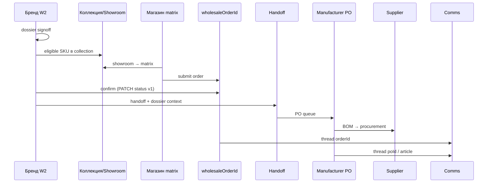
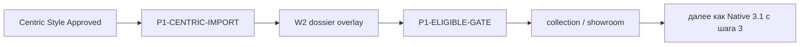
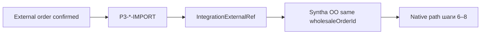
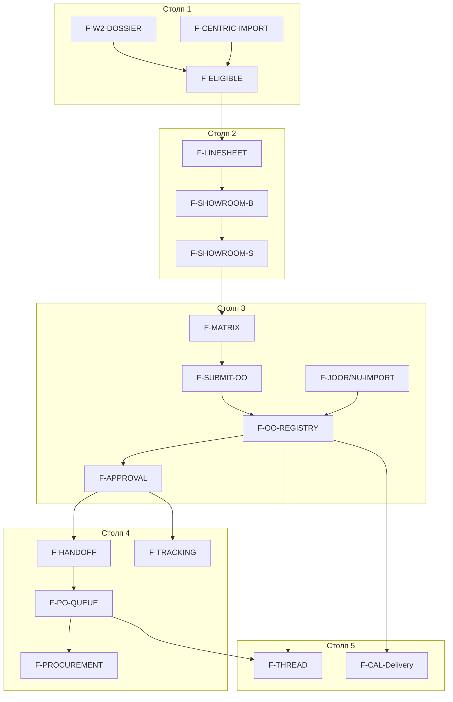

# ADR-002: Integration map — Centric, NuOrder, JOOR, Apparel Magic, Zedonk, AIMS360 и wholesale-платформы

**Статус:** принято (v4.4 Wave A–K spine в коде — import→confirm→handoff→procurement ack→tracking webhook/auto-pull; supplier pillar INT-* wired)
**Review scores (v2):** pillar×role 5.5/10 · logic 6.5/10 · contracts vs code 3/10 · platform map 6.8/10  
**Дата:** 2026-06-12  
**Контекст:** Platform Core · 5 столпов × 4 роли · operational orders v1 · W2/tech pack

---

## 0. Зачем этот ADR (одним абзацем)

Syntha — **execution OS**: один сквозной `wholesaleOrderId` от витрины до PO. Внешние платформы — **upstream SoT** по своей зоне (PLM / wholesale / ERP). ADR фиксирует **что куда**, **что от чего зависит**, **в каком порядке включаются фичи**, **как роли и разделы связаны** — чтобы интеграции не превращались в изолированные демо-кнопки и тупиковые экраны.


### 0.1 Согласование: 3 столба FOCUS vs 5 столпов Platform Core

| FOCUS / B2B spec (3) | Platform Core (5) | Смысл |
|----------------------|-------------------|--------|
| **(A) ТЗ → образец / production** | `development` (+ eligible в `sample_collection`) | W2, tech pack, signoff |
| **(B) Коллекции + B2B заказы** | `sample_collection` + `collection_order` | showroom → matrix → OO |
| **(C) Чат + календарь** | `comms` | overlay, не SoT |
| *(в B2B spec: ТЗ→цех)* | `order_production` | handoff, PO, procurement |

FOCUS и B2B spec — **нарратив инвестора**; ADR §5 — **матрица роль×столп** для интеграций. Не конкурируют.

### 0.2 Baseline vs target (честность к коду)

| Артефакт | Сегодня в коде | Target (ADR) |
|----------|----------------|--------------|
| OO `integration` block | ✅ `operational-order-dto.schema.ts` | Wave A5 done |
| `IntegrationExternalRef` | ✅ `src/lib/integrations/spine/` | Wave B/C partial |
| `POST /api/integrations/v1/*` | ✅ status, import, inventory, centric, sync-jobs, eligible | Wave B–C partial |
| `GET /api/b2b/archive/joor|zedonk/orders` | ✅ read-only | → import merge Wave C |
| `POST /api/b2b/export-order` | ✅ `platform` only | без новых providers |
| Centric PIM UI | ✅ copy only | Wave B1 |
| Collection order pillar INT-* chain | ✅ `CollectionOrderPillarCard` resolves INT from queue/operational | Wave J |
| Sample collection pillar 2 spine | ✅ `BrandSampleCollectionSpineStrip` + `ShopSampleCollectionSpineStrip` in hub cabinet | Wave K |
| Order production pillar INT-* strips | ✅ `OrderProductionPillarCard` handoff resolve + shipment/allocation strips | Wave J |
| Supplier vendor PO ack → chain | ✅ `acknowledgeApparelMagicVendorPo` + `materials_supplied` in INT chain | Wave I |
| Supplier pillar cabinet (INT-*) | ✅ `SupplierProcurementSpineStrip` in `SupplierProcurementPillarCard` | Wave I |
| Shipment inbound (NuOrder/JOOR/Zedonk) | ✅ webhook + auto-pull on WIP shipped | Wave G/H |


**Не входит в scope ADR:** полный каталог `/shop/b2b/*` (100+ витрин). Только **spine-фичи**, без которых цепочка рвётся, плюс connector-точки.

---

## 1. Принципы (без шума и повторов)

| # | Принцип | Следствие |
|---|---------|-----------|
| P1 | **Один канон id на сделку** | `wholesaleOrderId` не меняется при import/export; внешний id — только в `IntegrationExternalRef` |
| P2 | **Один SoT на домен** | PLM master — Centric (если подключён); оптовый заказ в бою — Syntha OO v1; PO/WIP в цехе — Syntha (+ опционально AIMS360 feed) |
| P3 | **Столб = фаза, не меню** | Фича живёт в **одном primary столпе**; в других — только deep-link с тем же entity id |
| P4 | **Comms — надстройка, не источник истины** | Чат/календарь **не создают** заказ/PO; только контекст + сроки (`B2B_AND_PRODUCTION_CORE_SPEC.md`) |
| P5 | **Empty pillar — объяснение, не 404** | Empty cells: shop `development`; manufacturer `sample_collection` + `collection_order`; supplier `sample_collection` + `collection_order` — hub `reason` + CTA (cabinet `?pillar=`) |
| P6 | **Нет orphan UI** | Любая интеграционная кнопка ведёт на экран с **entity banner** (`B2bOrderUrlContextBanner` / W2 context) или на `/brand/integrations` status |
| P7 | **Connector без конфигурации = честный stub** | Badge «не подключено» + link на integrations; **не** mock-as-prod без подписи |
| P8 | **Archive ≠ spine** | `b2b-workspace-matrix` teaser-фичи (gamification, social-feed, …) **не** в волне A–C; не блокируют spine |

---

## 2. Канон сущностей и владение

| Сущность | Syntha id | Владелец процесса | Внешний SoT (если есть) |
|----------|-----------|-------------------|-------------------------|
| Артикул / досье W2 | `articleId` (+ `collectionId`) | Бренд | Centric `Style.Id`, Lectra model |
| Eligibility в сезон | `eligibleForCollection` | Бренд (signoff) | Centric `LifecycleState=Approved` |
| Коллекция | `collectionId` | Бренд | Centric season / AM style season |
| SKU / строка матрицы | `skuId` | Бренд | NuOrder/JOOR line sku |
| Оптовый заказ | `wholesaleOrderId` | Бренд подтверждает; создаёт shop | JOOR/NuOrder/Zedonk order id → ref |
| PO / выпуск | `poId` | Бренд → manufacturer | AIMS360 production order |
| Закупка сырья | procurement job | Supplier | Centric RFQ / AM vendor PO |
| Чат | `threadId` | Система | Centric conversation id (optional ref) |
| Событие срока | `calendarEventId` | Роль-инициатор | JOOR delivery window (mapped) |

Инварианты: `glossary-ids.md`, `cross-role-entity-ids.ts`.

---

## 3. Мастер-процесс (что за чем следует)

### 3.1. Happy path «Native Syntha» (без внешних систем)



**Жёсткий порядок gate:**

1. `signoff` (W2) → 2. `eligibleForCollection=true` → 3. SKU в linesheet/showroom → 4. shop matrix → 5. `wholesaleOrderId` created → 6. brand `confirmed` → **6b. aggregate demand (AGG, опционально multi-OO)** → 7. `handoff` → **8. `poId`** → 9. supplier procurement.

**AGG vs handoff:** `F-P4-OO-PO` (свод спроса по сезону/стилю) **предшествует** созданию PO; `F-HANDOFF` передаёт контекст досье на конкретный OO. PO queue (`F-PO-QUEUE`) создаётся **из AGG или single-OO handoff** — один `poId`, не два параллельных producer без ADR.

**Блокировки (не демо-обход):**

| Шаг | Блок если | UI сообщение |
|-----|-----------|--------------|
| 3 | !eligible | «Артикул не одобрен для сезона» + link W2 |
| 5 | нет partner/contract | «Нет партнёрства с брендом» |
| 7 | status != confirmed | «Сначала подтвердите заказ» + link OO card |
| 8 | нет BOM | «Нет спецификации материалов в досье» + link dossier |

### 3.2. Path «Centric PLM + Syntha execution»



- Centric **не** создаёт OO и **не** заменяет matrix.
- Изменение BOM в Centric после signoff → **conflict badge** (P1-BOM-SYNC); не silent overwrite.

### 3.3. Path «Wholesale import (JOOR / NuOrder / Zedonk)»



- Import **не** создаёт второй заказ при повторе (`payloadHash` / external id).

**Import gate addendum (§3.3):** inbound wholesale **не обходит** шаги 6b–9, но **может** пропустить 1–5 если заказ уже confirmed во внешней системе. Обязательно:
- `IntegrationExternalRef` + разрешение каждой строки SKU → `skuId` или **warning row**;
- **блок handoff/PO** если нет `articleId`/BOM (anti-pattern **A11**);
- eligible gate **не требуется** для import, но showroom/matrix **не** показывают не-eligible SKU для native path (A2/A3).

- Shop и brand видят **один** OO read-model (`useShopB2BOperationalOrdersList` / brand list).

### 3.4. Path «AIMS360 / Apparel Magic ERP feed»

- **Inbound:** WIP stage, ATP, allocation → обогащают **существующие** OO/PO (P3-AIMS-ALLOC, P4-AIMS-WIP).
- **Не создают** OO с нуля без ref (unless full ERP migration project — out of spine).

---

## 4. Каталог spine-фич (интеграционный контур)

Только фичи, участвующие в цепочке или в connector UX. Остальное — archive sidebar, не spine.

| Feature id | Название | Primary столп | Primary роли | Зависит от | Даёт на выходе |
|------------|----------|---------------|--------------|------------|----------------|
| F-W2-DOSSIER | W2 досье + signoff | 1 development | brand | — | eligible gate input |
| F-CENTRIC-IMPORT | Import style/BOM | 1 | brand | connector config | article + BOM |
| F-ELIGIBLE | Eligible gate | 2 sample_collection | brand | F-W2-DOSSIER or Centric Approved | SKU in collection |
| F-LINESHEET | Linesheets | 2 | brand | F-ELIGIBLE | showroom feed |
| F-SHOWROOM-B | Brand showroom | 2 | brand | F-LINESHEET | shop discover |
| F-SHOWROOM-S | Shop showroom | 2 | shop | partnership + F-SHOWROOM-B | matrix entry |
| F-MATRIX | Order matrix | 3 collection_order | shop | F-SHOWROOM-S, ATS optional | draft OO lines |
| F-ORDER-MODES | buy_now/reorder/pre_order | 3 | shop | F-MATRIX | `orderMode` on DTO |
| F-MARGIN | Margin calculator | 3 | shop | F-MATRIX lines + price | display only |
| F-DRAFTS | Order drafts | 3 | shop | F-MATRIX | resume matrix session |
| F-SUBMIT-OO | Submit wholesale order | 3 | shop | F-MATRIX | `wholesaleOrderId` |
| F-OO-REGISTRY | OO list/detail v1 | 3 | brand, shop | F-SUBMIT-OO | status, notes |
| F-JOOR-IMPORT | JOOR inbound | 3 | brand | connector | OO + ref |
| F-NU-IMPORT | NuOrder inbound | 3 | brand | connector | OO + ref |
| F-NU-ATS | ATS in matrix | 3 | shop | F-NU-IMPORT or inventory API | cell cap |
| F-APPROVAL | Multi-step approval | 3 | brand | F-OO-REGISTRY | confirmed status |
| F-WORKING-ORDER | Excel/working order versions | 3 | brand, shop | F-OO-REGISTRY | doc version |
| F-COLLECTION-TERMS | MOQ/MOV/deadlines | 3 | shop | collection metadata | validation on submit |
| F-HANDOFF | Brand handoff | 4 order_production | brand | F-APPROVAL | handoff queue item |
| F-PO-QUEUE | Manufacturer PO | 4 | manufacturer | F-HANDOFF | `poId` |
| F-WIP | PO stages | 4 | manufacturer | F-PO-QUEUE | stage badges |
| F-PROCUREMENT | Supplier procurement | 4 | supplier | F-PO-QUEUE + BOM | material PO |
| F-TRACKING | Shop tracking | 4 | shop | F-APPROVAL | mirrored status |
| F-THREAD | Entity threads | 5 comms | all active roles | entity ids | contextual chat |
| F-CAL-Delivery | Delivery calendar | 5 | shop, brand | F-OO-REGISTRY | calendarEvent |

**Explicitly OUT of integration spine (no ADR sprint until spine green):** gamification, social-feed, store-locator, agent consolidated (unless agent role product phase), academy, AI smart order.

---


## 5.0. Матрица покрытия Platform Core (5×4)

Источник UI: `PLATFORM_CORE_HUB_ROWS`, workspace: `getRolePillarWorkspaceHref`.

| Столп | Brand | Shop | Manufacturer | Supplier |
|-------|-------|------|--------------|----------|
| development | active → W2 | **empty** → showroom CTA | active → **dossier** (primary), sample queue secondary | active → materials dev |
| sample_collection | active → **/brand/linesheets?collection=** (PC workspace); alt `/brand/b2b/linesheets` | active → showroom | **empty** | **empty** |
| collection_order | active → OO card | active → matrix | **empty** | **empty** |
| order_production | active → handoff on OO | active → **tracking ?order=** | active → handoff queue | active → procurement |
| comms | messages+calendar+article | messages+b2b calendar | factory messages+calendar | supplier messages (article: **/factory/supplier/messages**) |

**Empty pillars:** не строить интеграционные фичи; только `PlatformCoreEmptyCellPanels` reason + cross-link.

---

## 5. Platform Core × роли × разделы × интеграции

Легенда: **Route** — primary workspace; **Ext** — внешняя платформа; **Feat** — spine feature id из §4.

### Столп 1 · `development` (ТЗ → образец)

#### Бренд · `/brand/production/workshop2`

| Feat | Route / раздел | Ext input | Ext output | Внутри роли | Наружу (другие роли) |
|------|----------------|-----------|------------|-------------|----------------------|
| F-W2-DOSSIER | W2 hub → article dossier | — | — | signoff → triggers F-ELIGIBLE | manufacturer read dossier; supplier read BOM |
| F-CENTRIC-IMPORT | PIM dialog + W2 | Centric style/BOM | — | creates/updates article | — |
| Lectra stub | W2 TZ section | Lectra CSV | — | `lectraModelId` | — |

**Зависимости:** F-CENTRIC-IMPORT до F-ELIGIBLE (если Centric — source of approved state).

**Не делаем:** редактирование Centric master в W2 без conflict UX.

#### Производство · dossier read + sample queue

| Feat | Route | Ext | Зависит от | Связь |
|------|-------|-----|------------|-------|
| Sample queue | `/factory/production` | AIMS sample status (pattern) | brand signoff event | Opens **read-only** dossier; comms F-THREAD article context |
| — | factory dossier | Centric ref display only | F-W2-DOSSIER | No W2 editor |

#### Поставщик · `/factory/production/materials` (development view)

| Feat | Ext | Зависит от | Связь |
|------|-----|------------|-------|
| BOM preview | Centric material ids | article BOM from brand | F-THREAD `contextType=workshop2_article`; **не** B2B order |

#### Магазин · empty pillar

- Panel reason + CTA → **F-SHOWROOM-S** (не W2).

---

### Столп 2 · `sample_collection` (Образец → коллекция)

#### Бренд · linesheets + `/brand/showroom`

| Feat | Route | Ext | Зависит от | Out |
|------|-------|-----|------------|-----|
| F-ELIGIBLE | filter on collection SKUs | Centric Approved | F-W2-DOSSIER / import | SKU list |
| F-LINESHEET | `/brand/b2b/linesheets` | Zedonk auto-gen (pattern) | F-ELIGIBLE | PDF/XLS |
| F-SHOWROOM-B | `/brand/showroom` | NuOrder board UX (pattern) | F-ELIGIBLE | published assortment |
| F-P2-MEDIA | media on SKU | Centric PXM | import | linesheet/showroom |

**Cross-role:** shop **only** sees SKUs passing F-ELIGIBLE filter.

#### Shop · `/shop/b2b/showroom`

| Feat | Ext | Зависит от | Out |
|------|-----|------------|-----|
| F-SHOWROOM-S | NuOrder showroom / JOOR discover | partnership, brand publish | link to F-MATRIX `?collection=` |
| F-P2-JOOR-SHARE | lookbook share | — | optional entry to showroom |

**Anti-dead-end:** matrix без `collection` query → banner «выберите коллекцию в showroom».

---

### Столп 3 · `collection_order` (Коллекция → заказ)

#### Shop · matrix, create-order, orders

| Feat | Route | Ext | Зависит от | Out |
|------|-------|-----|------------|-----|
| F-MATRIX | `/shop/b2b/matrix` | NuOrder ATS | F-SHOWROOM-S | line qty |
| F-ORDER-MODES | create-order | NuOrder pattern | F-MATRIX | orderMode field |
| F-MARGIN | matrix inline | NuOrder | prices on lines | no persist |
| F-DRAFTS | `/shop/b2b/order-drafts` | JOOR | F-MATRIX session | resume matrix |
| F-COLLECTION-TERMS | terms panel | NuOrder | collection | validate F-SUBMIT |
| F-SUBMIT-OO | create-order submit | — | terms + matrix | wholesaleOrderId |
| F-CAL-Delivery | `/shop/b2b/delivery-calendar` | JOOR windows | OO optional | calendar events |

#### Brand · `/brand/b2b-orders`

| Feat | Route | Ext | Зависит от | Out |
|------|-------|-----|------------|-----|
| F-OO-REGISTRY | list/detail | integration meta | F-SUBMIT or IMPORT | brand actions |
| F-JOOR-IMPORT | integrations job | JOOR API | connector | OO + ref |
| F-NU-IMPORT | integrations job | NuOrder OAuth | connector | OO + ref |
| F-NU-ATS | feeds matrix | NuOrder inventory | connector | — |
| F-APPROVAL | order-approval-workflow | JOOR pattern | F-OO-REGISTRY | PATCH status v1 |
| F-WORKING-ORDER | working-order | NuOrder | F-OO-REGISTRY | version doc |

**Cross-role:** PATCH status (brand) → shop list/detail read-model (already v1); **must** share wholesaleOrderId.

**Import vs native merge rule:** if `IntegrationExternalRef` exists, inbound status updates merge; never duplicate OO row.

---

### Столп 4 · `order_production` (Заказ → производство)

#### Brand · handoff registry

| Feat | Route | Ext | Зависит от | Out |
|------|-------|-----|------------|-----|
| F-HANDOFF | order card handoff | Centric milestone (opt) | F-APPROVAL | queue item |
| F-P4-OO-PO | aggregate demand | AIMS360 pattern | F-HANDOFF | poId candidate |

#### Shop · tracking

| Feat | Route | Ext | Зависит от |
|------|-------|-----|------------|
| F-TRACKING | `/shop/b2b/tracking?order={wholesaleOrderId}` | Zedonk 360 pattern | brand status + PO stage feed |

#### Manufacturer · handoff queue + PO

| Feat | Route | Ext | Зависит от | Out |
|------|-------|-----|------------|-----|
| F-PO-QUEUE | factory production orders | — | F-HANDOFF | poId |
| F-WIP | PO card stages | AIMS360 | F-PO-QUEUE | stage updates |

#### Supplier · procurement

| Feat | Route | Ext | Зависит от |
|------|-------|-----|------------|
| F-PROCUREMENT | materials procurement view | Centric RFQ / AM vendor PO | F-PO-QUEUE + BOM |

**Cross-role chain:** brand handoff → manufacturer queue (same demo orderId) → supplier sees BOM lines for same articleIds.

---

### Столб 5 · `comms` (Связь)

| Feat | Route | Ext | Entity keys | Depends |
|------|-------|-----|-------------|---------|
| F-THREAD | messages | Centric conv (opt) | orderId, articleId, poId | entity must exist |
| F-CAL-Delivery | calendar | JOOR/NuOrder windows | orderId + deliveryDate | F-OO-REGISTRY |

**Rule:** production shell tabs (brand factory floor) = **same thread ids** as `/brand/messages` when orderId present (GAP §8); не второй backend без ADR.

**Anti-dead-end:** message screen without context → default inbox, not fake order thread.

---

## 6. Матрица cross-role handoff (события)

| Событие | Publisher | Subscriber read-model | Id carried | API/event |
|---------|-----------|-------------------------|------------|-----------|
| Style imported | brand integration | W2 dossier | articleId, centricStyleId | `integration.style.inbound` |
| Eligible set | brand W2/signoff | showroom filter, shop matrix | collectionId, skuId | domain or dossier persist |
| Order submitted | shop | brand OO registry | wholesaleOrderId | operational orders v1 POST/create |
| Order confirmed | brand | shop OO list/detail | wholesaleOrderId | PATCH status v1 |
| Handoff queued | brand | manufacturer queue | wholesaleOrderId, poId?, articleIds | handoff API / domain event |
| PO stage change | manufacturer | shop tracking, brand OO | poId | PATCH / feed AIMS |
| Procurement req | manufacturer/supplier | supplier queue | poId, material lines | procurement module |
| Delivery window | integration/comms | both calendars | calendarEventId, orderId | calendar API |

---

## 7. Граф зависимостей фич (DAG)



**Parallel allowed after REG:** F-TRACKING, F-WORKING-ORDER, F-MARGIN (display-only) — не блокируют PO.

**Critical path для demo spine:** `W2 → ELIG → SHS → MX → SUB → REG → APR → HO → PO`.

---

## 8. Внешние платформы → фичи (без дублирования SoT)

| Platform | Подключается к Feat | Направление | Не подменяет |
|----------|---------------------|-------------|--------------|
| Centric | F-CENTRIC-IMPORT, F-ELIGIBLE, F-P2-MEDIA, F-PROCUREMENT (RFQ) | Inbound + optional outbound status | F-SUBMIT-OO, F-PO-QUEUE |
| Lectra | W2 lectra stub | Inbound CSV | Centric BOM if both configured — **conflict rule §9** |
| NuOrder | F-NU-IMPORT, F-NU-ATS, F-MARGIN (pattern), F-WORKING-ORDER | Bi-dir orders; inbound inventory | W2 editor |
| JOOR | F-JOOR-IMPORT, F-DRAFTS, F-APPROVAL, F-CAL-Delivery | Inbound orders; pattern UX | PLM |
| Zedonk | F-JOOR-IMPORT path (source tag), F-TRACKING, F-LINESHEET gen | Inbound orders | Unified comms backend |
| Apparel Magic | F-NU-ATS-like ATP, F-P4-OO-PO, vendor PO | HYBRID phase D | Enterprise PLM depth |
| AIMS360 | F-WIP, F-NU-ATS-like OTS, allocation | Inbound WIP/ATP | Creative W2 |
| Colect/FashionCloud | F-JOOR-IMPORT generic envelope | Inbound only | — |

---

## 9. Контракты полей (сжатый канон)

### IntegrationExternalRef

```typescript
interface IntegrationExternalRef {
  platform: 'centric' | 'lectra' | 'nuorder' | 'joor' | 'apparel_magic' | 'zedonk' | 'aims360' | 'shopify' | 'colect' | 'fashion_cloud';
  externalId: string;
  externalRevision?: string;
  synthaEntityType: 'article' | 'collection' | 'sku' | 'wholesale_order' | 'po' | 'supplier' | 'material' | 'thread';
  synthaEntityId: string;
  lastSyncedAt: string;
  syncDirection: 'inbound' | 'outbound' | 'bidirectional';
  payloadHash?: string;
}
```

### Centric → Syntha (inbound)

| Ext | Syntha field | Gate |
|-----|--------------|------|
| Style.Id | IntegrationExternalRef + `centricStyleId` | — |
| LifecycleState Approved | `eligibleForCollection` | blocks showroom if false |
| BOM.Lines | W2 BOM panel | revision conflict if newer |
| PXM Asset | SKU media | — |

### NuOrder / JOOR → OO v1

| Ext | Syntha | Rule |
|-----|--------|------|
| order id | `integration.externalOrderId` | 1:1 ref |
| lines[].sku | OO items | sku must exist or import warning row |
| status | operational status | map tables below |


**Статусы OO (interim → target):** demo сейчас — `z.string()` + RU labels в mock data; aggregate enum `pending_approval` в order-schemas. **Target map:** JOOR `pending/review` → `pending_approval`; `approved/confirmed` → `confirmed`; ADR текст `awaiting_brand` = alias `pending_approval`.

**JOOR status map:** draft→draft; pending/review→awaiting_brand; approved/confirmed→confirmed; cancelled→cancelled.

**NuOrder:** map provider status → same Syntha enum as JOOR where possible.

### OO DTO extension

```typescript
integration?: {
  sourcePlatform?: 'syntha' | 'centric' | 'nuorder' | 'joor' | 'apparel_magic' | 'zedonk' | 'aims360';
  externalOrderId?: string;
  externalStatus?: string;
  lastSyncedAt?: string;
  syncHealth?: 'ok' | 'degraded' | 'error';
};
```

### AIMS360 poStage

cutting→cutting; sewing→sewing; finishing→finishing; inspection→qc; packed→ready_to_ship.

---

## 10. API v1 (единая поверхность)

| Method | Path | Feat consumer |
|--------|------|---------------|
| GET | `/api/integrations/v1/status` | `/brand/integrations` cards |
| POST | `/api/integrations/v1/centric/styles/import` | F-CENTRIC-IMPORT |
| POST | `/api/integrations/v1/{platform}/orders/import` | F-JOOR-IMPORT, F-NU-IMPORT, Zedonk |
| POST | `/api/integrations/v1/{platform}/orders/export` | post-confirm outbound |
| GET | `/api/integrations/v1/{platform}/inventory` | F-NU-ATS |
| POST/GET | `/api/integrations/v1/sync-jobs` | admin retry |

Events: `integration.style.inbound`, `integration.order.inbound`, `integration.sync.completed`.

**Не расширять** `POST /api/b2b/export-order` новыми providers (P7 legacy = platform only).

---

## 11. Конфликты sync и приоритеты

1. **eligibleForCollection:** Syntha signoff **OR** Centric Approved — either sufficient; both must not disagree without conflict UI.
2. **BOM:** higher `externalRevision` wins on **draft** dossier; frozen after signoff → manual resolve.
3. **OO status:** max(precedence): cancelled > confirmed > awaiting > draft; inbound never downgrades confirmed without brand actor.
4. **Delete in external:** soft-delete + banner «источник снят»; Syntha OO/PO остаются для audit.
5. **Centric + Lectra both on:** Lectra enriches TZ/pattern only; BOM SoT = Centric unless configured per tenant.

---

## 12. Anti-patterns (запрещённые demo-тупики)

| # | Запрет | Правильно |
|---|--------|-----------|
| A1 | Кнопка «Sync Centric» без job status | Job id + last sync + error in integrations |
| A2 | Showroom SKU без eligible | Filter + empty state with W2 link |
| A3 | Matrix order on ineligible SKU | Validate on submit + row error |
| A4 | Handoff без confirmed OO | Disable CTA + link approval |
| A5 | PO без dossier/BOM link | Warning + link factory dossier |
| A6 | Shop tracking без wholesaleOrderId in URL | `B2bOrderUrlContextBanner` required |
| A7 | Orphan chat «по заказу» без orderId query | Fall back to inbox |
| A8 | NuOrder/JOOR teaser in workspace matrix без connector | Badge «вне spine» or hide in investor mode |
| A9 | Second wholesaleOrderId on re-import | Idempotent ref lookup |
| A10 | Manufacturer B2B orders sidebar as primary | PO queue only (CORE_OPERATING_CHAIN) |
| A11 | Import OO без resolvable SKU/article | Warning row; **block handoff** |
| A12 | Centric + Lectra без conflict badge | §11.5 enforcement |
| A13 | Pre-order при ATS=0 (если ATS включён) | Row validation on submit |
| A14 | Delivery calendar event без orderId | No orphan events |


---

## 13. UI навигация (одна логика deep-link)

| From | To | Query keys |
|------|-----|------------|
| OO card brand/shop | matrix | `order`, `orderId`, `collection` |
| OO card | messages | `B2B_WHOLESALE_ORDER_CONTEXT_QUERY` |
| OO card | calendar | `order`, `orderId`, `layers=tasks` |
| W2 article | messages | `contextType=workshop2_article`, `contextId=col:art` |
| Handoff | factory dossier | `article`, `collection`, `orderId` |
| Showroom shop | matrix | `collection` |
| Integrations error | failed entity | link to OO or article admin |

Platform Core: **workspace** uses pillar strip; **cabinet** uses aside — не дублировать CTA (`platform-core-ui-dedup.mdc`).

---

## 14. Очередь спринтов (зависимости строго)

### Wave A — native spine (обязателен до connector prod)

| Sprint | Feat | Blocker for |
|--------|------|-------------|
| A0 | F-W2-DOSSIER persist + signoff | eligible, handoff dossier |
| A1 P1-ELIGIBLE-GATE | F-ELIGIBLE | pillar 2–3 publish |
| A2 | F-LINESHEET + F-SHOWROOM-B/S | matrix entry |
| A3 | F-MATRIX + F-SUBMIT-OO + F-OO-REGISTRY | wholesaleOrderId |
| A4 | F-APPROVAL + PATCH status mirror | handoff, tracking |
| A5 P3-OO-INTEG-META | integration DTO field | import badges |
| A6 | F-P4-OO-PO (AGG) + F-HANDOFF→F-PO-QUEUE | manufacturer spine |
| A7 P5-THREAD-ENTITY | F-THREAD | comms demo honesty |

### Wave B — PLM connector

| Sprint | Feat | Requires |
|--------|------|----------|
| B1 P1-CENTRIC-IMPORT | F-CENTRIC-IMPORT | A1 |
| B2 P1-BOM-SYNC | conflict UX | B1 |
| B3 P2-MEDIA-SYNC | PXM | B1 |

### Wave C — wholesale inbound

| Sprint | Feat | Requires |
|--------|------|----------|
| C1 P3-JOOR-IMPORT | F-JOOR-IMPORT | A2, operational orders v1 |
| C2 P3-NU-IMPORT + ATS | F-NU-IMPORT, F-NU-ATS, F-JOOR-INV | A2, C1 patterns |
| C3 P3-JOOR-APPROVAL | F-APPROVAL wired | C1 |
| C4 P2-SHOWROOM-NU patterns | F-SHOWROOM-* polish | A1 |
| C5 | F-DRAFTS + F-P2-JOOR-SHARE | A3 |
| C6 | F-ORDER-MODES + F-MARGIN + F-COLLECTION-TERMS | A3 |
| C7 | ZEDONK-AGENT consolidated | C1 |

### Wave D — production ERP feeds

| Sprint | Feat | Requires |
|--------|------|----------|
| D1 P4-AIMS-WIP | F-WIP | A4 |
| D2 P4-ZEDONK-TRACK | F-TRACKING | A5 |
| D3 P4-SUPPLIER-RFQ | F-PROCUREMENT | B2, A4 |
| D4 P3-ZEDONK-IN / AIMS alloc | ERP enrich | C1 |

### Wave E — comms + calendar enrichment

| Sprint | Feat | Requires |
|--------|------|----------|
| E1 P5-CENTRIC-CONVO | BOM thread | A3, B2 |
| E2 P5-CAL-Delivery | delivery windows | C1 |

**Definition of Done (integration spine):** один проход Wave A + mock B1 + mock C1 на **одном** `wholesaleOrderId` и **одном** `collectionId` (SS27 demo); e2e: import/eligible→showroom→matrix→OO→confirm→handoff→PO visible manufacturer; no A1–A10 violations.

---

## 15. Альтернативы (кратко)

| Альтернатива | Отказ |
|--------------|-------|
| Каждая b2b-workspace-matrix карточка = интеграция | Шум; только Feat из §4 |
| Centric replaces W2 | Теряем moat и РФ handoff |
| Single mega webhook bus day 1 | Sync jobs + explicit events достаточно для v1 |

---

## 16. Последствия и артефакты для обновления

**Код (по волнам):** `src/lib/integrations/*`, `operational-order-dto.schema.ts`, W2 persist, `/brand/integrations`, archive clients promotion → v1 routes.

**Доки:** `glossary-ids.md` (integration fields), `INTEGRATION_MAP.md` §0, `CORE_OPERATING_CHAIN.md` §6.1 demo path, `GAP` §7.6–7.8.

**Тесты:** e2e `integrations-spine.spec.ts` (one wholesaleOrderId path); contract tests Zod schemas.

---

## 17. Связанные файлы

- `src/lib/platform-core-hub-matrix.ts`
- `src/lib/domain/cross-role-entity-ids.ts`
- `src/lib/b2b/integrations/archive/*`
- `docs/phase-0/glossary-ids.md`
- `docs/B2B_AND_PRODUCTION_CORE_SPEC.md` (корень monorepo)
- `.cursor/rules/platform-core-ui-dedup.mdc`
- `ProductInformationManager.tsx`


---

## 19. Полный каталог: что интегрировать из каждой платформы

**Легенда:** **IN** = inbound connector · **OUT** = export/webhook · **PAT** = UX/workflow без live API · **—** = роль/столп empty или не applicable · **Wave** = спринт из §14.

**Единое правило:** каждая строка — **одна** интеграционная обязанность; без дублирования SoT (см. §8).

---

### 19.1 Centric PLM (+ Lectra pattern)

**SoT:** style master, BOM, size chart, PXM media, supplier RFQ, lifecycle. **Не SoT:** OO, matrix, PO execution.

| Столп | Роль | Раздел / Route | Действие | Поля / API | Feat | Wave |
|-------|------|----------------|----------|------------|------|------|
| **1 development** | brand | `/brand/production/workshop2` · PIM import | **IN** style→article | `Style.Id`, `Style.Code`, `BOM.Lines[]`, `SizeChart`, `Revision` | F-CENTRIC-IMPORT | B1 |
| 1 | brand | W2 dossier BOM panel | **IN** sync + conflict | `externalRevision`, materialId, qty, uom | P1-BOM-SYNC | B2 |
| 1 | brand | W2 signoff / eligible | **IN** or **PAT** gate | `LifecycleState=Approved` → `eligibleForCollection` | F-ELIGIBLE | A1/B1 |
| 1 | brand | W2 TZ (Lectra) | **IN** CSV | `lectraModelId`, grading file | P1-LECTRA-STUB | B1 |
| 1 | manufacturer | `/factory/production/dossier/{article}` | **IN** read-only | centricStyleId badge, BOM read | — | B2 |
| 1 | manufacturer | sample queue `/factory/production` | **PAT** | Centric sample milestone label | P1-AIMS-SAMPLE | A0 |
| 1 | supplier | `/factory/production/materials?view=development` | **IN** material refs | Centric `MaterialId`, lab dip status | F-PROCUREMENT (prep) | B2 |
| 1 | shop | empty | — | CTA showroom only | — | — |
| **2 sample_collection** | brand | `/brand/linesheets?collection=` | **IN** media/spec | PXM `Asset.Url`, specs | F-P2-MEDIA | B3 |
| 2 | brand | `/brand/showroom` | **PAT** filter | only `eligibleForCollection` SKUs | F-ELIGIBLE | A1 |
| 2 | brand | `/brand/b2b/linesheets` | **OUT** optional | publish assortment snapshot | F-LINESHEET | A2 |
| 2 | shop | `/shop/b2b/showroom` | — | consumes brand publish; no Centric direct | F-SHOWROOM-S | A2 |
| 2 | manufacturer | empty | — | reason panel | — | — |
| 2 | supplier | empty | — | reason panel | — | — |
| **3 collection_order** | brand | `/brand/b2b-orders` | — | Centric **не** создаёт OO | — | — |
| 3 | shop | matrix / create-order | — | SKU must resolve to Centric style ref | A11 | C |
| **4 order_production** | brand | OO handoff `#production-handoff` | **IN** milestone | Centric dev milestone → handoff payload | P4-CENTRIC-MILESTONE | B2 |
| 4 | manufacturer | PO queue | **PAT** | display centricStyleId on PO card | F-PO-QUEUE | A6 |
| 4 | supplier | procurement | **IN** RFQ | `SupplierRequest.Id` → thread + PO line | P4-SUPPLIER-RFQ | D3 |
| 4 | shop | tracking | — | indirect via Syntha PO | F-TRACKING | D2 |
| **5 comms** | brand | `/brand/messages` | **IN** optional | Centric conversation id → `threadId` ref | P5-CENTRIC-CONVO | E1 |
| 5 | brand | article thread | **IN** | BOM line → contextual thread | P5-CENTRIC-CONVO | E1 |
| 5 | manufacturer | `/factory/messages` | **PAT** | read Centric supplier request notifications | F-THREAD | E1 |
| 5 | supplier | `/factory/supplier/messages` | **IN** | RFQ replies | F-THREAD | E1 |
| 5 | shop | messages | — | no Centric direct | F-THREAD | A7 |

**Centric API (target):** `POST /api/integrations/v1/centric/styles/import` · webhook `centric.style.approved` · `GET status`.

---

### 19.2 NuOrder

**SoT:** wholesale order (optional co-SoT with Syntha after import), ATS/prebook inventory, working order versions, shipment status. **Не SoT:** PLM, factory WIP.

| Столп | Роль | Раздел / Route | Действие | Поля / API (archive types) | Feat | Wave |
|-------|------|----------------|----------|----------------------------|------|------|
| **1 development** | all | — | — | NuOrder не ведёт PLM | — | — |
| **2 sample_collection** | brand | `/brand/showroom` | **PAT** | collection boards, drop grouping UX | P2-SHOWROOM-NU | C4 |
| 2 | shop | `/shop/b2b/showroom` | **PAT** | digital showroom navigation | F-SHOWROOM-S | C4 |
| **3 collection_order** | shop | `/shop/b2b/matrix` | **IN** ATS/prebook | `NuOrderInventoryItem.ats_qty`, `pre_book_qty` | **F-NU-ATS** | C2 |
| 3 | shop | `/shop/b2b/create-order` | **PAT** | `orderMode`: buy_now/reorder/pre_order | F-ORDER-MODES | C6 |
| 3 | shop | matrix inline | **PAT** | margin display | F-MARGIN | C6 |
| 3 | shop | `/shop/b2b/collection-terms` | **PAT** | MOQ/MOV/deadlines | F-COLLECTION-TERMS | C6 |
| 3 | shop | submit order | **OUT** optional | `NuOrderOrderPayload` after Syntha confirm | F-NU-EXPORT | C2 |
| 3 | brand | `/brand/b2b-orders` | **IN** orders | `order._id`, lines sku/qty/price, `company_code` | F-NU-IMPORT | C2 |
| 3 | brand | `/brand/b2b/order-approval-workflow` | **PAT** | approval before OUT export | F-APPROVAL | A4 |
| 3 | brand | `/shop/b2b/working-order` mirror | **IN/OUT** | order edit versions (`NuOrderOrderEditPayload`) | F-WORKING-ORDER | C2 |
| 3 | brand | integrations | **IN** inventory push to NuOrder | `NuOrderInventoryPayload.overwrite` | F-NU-ATS | C2 |
| **4 order_production** | shop | `/shop/b2b/tracking?order=` | **IN** shipments | `NuOrderShipmentPayload` tracking, lines | F-TRACKING | C2 |
| 4 | brand | handoff | — | NuOrder не PO | — | — |
| 4 | manufacturer | — | — | — | — | — |
| **5 comms** | shop | `/shop/b2b/delivery-calendar` | **PAT** | ship windows from order | F-CAL-Delivery | E2 |
| 5 | brand/shop | calendar | **PAT** | delivery dates on OO | F-CAL-Delivery | E2 |

**NuOrder status map (target):** map provider status → `pending_approval` / `confirmed` / `cancelled` (см. §9 JOOR alias).

**NuOrder API (target):** OAuth (`nuorder-server.ts`) · `POST .../nuorder/orders/import` · `GET .../inventory` · `POST .../orders/export`.

**Не интегрировать в spine:** NuOrder collaborative order UI (`integration-modules.ts`) — OUT §4.

---

### 19.3 JOOR

**SoT:** wholesale orders (import), delivery windows, customer/style sync for linesheets, inventory (v2). **Не SoT:** W2 editor, PO.

| Столп | Роль | Раздел / Route | Действие | Поля / API | Feat | Wave |
|-------|------|----------------|----------|------------|------|------|
| **1 development** | — | — | — | — | — | — |
| **2 sample_collection** | brand | linesheets | **OUT** styles | `JoorStyleItem`, `JoorSyncStylesPayload` | F-LINESHEET | C4 |
| 2 | brand | `/brand/retailers` | **OUT** customers | `JoorCustomerItem`, discounts | — | C4 |
| 2 | shop | `/shop/b2b/showroom` | **PAT** | discover / partnership assortments | F-SHOWROOM-S | C4 |
| 2 | shop | `/shop/b2b/lookbooks` share | **PAT** | password/expiry link | F-P2-JOOR-SHARE | C4 |
| **3 collection_order** | brand | `/brand/b2b-orders` | **IN** orders | `JoorOrderRaw` → OO + ref | F-JOOR-IMPORT | C1 |
| 3 | shop | `/shop/b2b/order-drafts` | **PAT** | resume matrix session | F-DRAFTS | C5 |
| 3 | shop | matrix | **IN** inventory optional | `JoorInventoryItem.quantity`, `availableDate` | **F-JOOR-INV** | C2 |
| 3 | brand | order-approval-workflow | **PAT** | multi-step → PATCH status | F-APPROVAL | C3 |
| 3 | brand | price lists (archive) | **IN** | `joor-prices.ts` → matrix wholesale price | — | C4 |
| 3 | shop | `/shop/b2b/multi-currency` | **PAT** deferred | 135+ currencies — **вне spine v1** | OUT | — |
| **4 order_production** | shop | tracking | **PAT** | status from imported OO + brand PATCH | F-TRACKING | A4 |
| **5 comms** | shop/brand | delivery-calendar + calendar | **IN** windows | `joorGetDeliveryWindows()` → events | F-CAL-Delivery | E2 |
| 5 | all | messages on OO | **PAT** | thread by orderId only | F-THREAD | A7 |

**JOOR API today:** `GET /api/b2b/archive/joor/orders` → target `POST .../joor/orders/import`.

**Status map:** draft→draft; pending/review→`pending_approval`; approved/confirmed→confirmed; cancelled→cancelled.

---

### 19.4 Apparel Magic (AM)

**SoT (HYBRID phase D):** style-color-size tree, ATP, vendor PO, production order id, B2B portal orders for mid-market. **Не SoT:** enterprise PLM depth, 4-role comms.

| Столп | Роль | Раздел / Route | Действие | Поля / API | Feat | Wave |
|-------|------|----------------|----------|------------|------|------|
| **1 development** | brand | W2 / PIM | **IN** optional | `style.id`, `bom_id` → article/sku | AM-IMPORT | D5 |
| 1 | brand | W2 costing hint | **PAT** | cost sheet read-only | — | D5 |
| **2 sample_collection** | brand | linesheet/showroom | **IN** ATP | `inventory.qty_on_hand` per sku | **F-AM-ATP** | D5 |
| 2 | shop | showroom | **IN** display ATP | same read-model | F-AM-ATP | D5 |
| **3 collection_order** | brand | b2b-orders | **IN** B2B orders | `amOrderId`, lines sku/qty/price | AM-IMPORT | D5 |
| 3 | shop | matrix | **PAT** | order from AM portal mirror | F-MATRIX | D5 |
| **4 order_production** | brand | AGG / handoff | **IN** production order | `production_order.id` → `poId` | F-P4-OO-PO | D5 |
| 4 | manufacturer | PO card | **IN** WIP feed optional | stage from AM if configured | F-WIP | D5 |
| 4 | supplier | procurement | **IN** vendor PO | vendor PO ack qty/date → `materials_supplied` | P4-AM-VENDOR-PO | D6 · I |
| **5 comms** | — | — | — | use Syntha threads | — | — |

**Tenant rule (§11.6):** if Centric + AM both on → **Centric** owns BOM/style; AM owns ATP/PO/finance.

---

### 19.5 Zedonk (Z.Studio + Z.Hub + B2B)

**SoT:** unified UK/EU stack — styles, orders (incl. JOOR/NuOrder source tag), costing, allocation, agent multi-brand. **Не SoT:** Syntha cross-role comms canonical.

| Столп | Роль | Раздел / Route | Действие | Поля / API | Feat | Wave |
|-------|------|----------------|----------|------------|------|------|
| **1 development** | brand | W2 | **IN** style | `styleId` from Z.Studio | ZEDONK-STYLE | D4 |
| 1 | brand | dossier costing | **PAT** | make+freight+duty hint | — | D4 |
| **2 sample_collection** | brand | linesheets | **OUT/IN** | auto line sheet + price lists | P2-LINESHEET-GEN | D4 |
| 2 | shop | showroom | **IN** ATS | stock on-hand in showroom | F-SHOWROOM-S | D4 |
| **3 collection_order** | brand | b2b-orders | **IN** orders | `ZedonkOrder`, `source`: zedonk\|joor\|nuorder | P3-ZEDONK-IN | D4 |
| 3 | shop | `/shop/b2b/agent/*` | **IN** agent | `ZedonkConsolidatedOrder`, multi-brand | ZEDONK-AGENT | C7 |
| 3 | shop | matrix | **PAT** | offline sales app sync (future PWA) | — | backlog |
| **4 order_production** | brand/shop | tracking + allocation | **IN** | allocation status, 360 order tracking | P4-ZEDONK-TRACK | D2 |
| 4 | manufacturer | — | — | PO still Syntha | — | — |
| **5 comms** | — | — | — | Syntha canonical | — | — |

**API today:** `GET /api/b2b/archive/zedonk/orders` · target import merge Wave D4.

---

### 19.6 AIMS360

**SoT (inbound enrich):** style-color-size matrix, prepacks, WIP by stage, OTS (ATP+WIP), vendor PO, allocation. **Не SoT:** W2 UX, showroom narrative.

| Столп | Роль | Раздел / Route | Действие | Поля / API | Feat | Wave |
|-------|------|----------------|----------|------------|------|------|
| **1 development** | manufacturer | sample queue | **IN** sample status | sample tracking milestone | P1-AIMS-SAMPLE | A0 |
| **2 sample_collection** | — | — | — | — | — | — |
| **3 collection_order** | shop | matrix | **IN** OTS column | `openToSell` = on-hand + WIP promise | **F-AIMS-OTS** | D6 |
| 3 | shop | matrix prepack | **PAT** | ratio pack / prepack lines | F-AIMS-OTS | D6 |
| 3 | brand | post-confirm | **IN** allocation | intelligent allocation queue | P3-AIMS-ALLOC | D6 |
| **4 order_production** | brand | AGG → PO | **IN** demand tie | production orders tied to OO demand | F-P4-OO-PO | A6/D1 |
| 4 | manufacturer | PO workspace | **IN** WIP stages | `poStage`: cutting→sewing→qc→ready_to_ship | F-WIP (P4-AIMS-WIP) | D1 |
| 4 | supplier | procurement | **IN** vendor PO | `vendorPo.id` | F-PROCUREMENT | D3 |
| 4 | shop | tracking | **IN** stage mirror | PO stage → tracking UI | F-TRACKING | D1 |
| **5 comms** | — | — | — | — | — | — |

**AIMS360 API:** tenant-specific; ADR assumes adapter `POST .../aims360/wip/sync`, `GET .../aims360/ots`.

---

### 19.7 Сводная heatmap: платформа × столп (что интегрировать)

| Столп → | Centric | NuOrder | JOOR | Apparel Magic | Zedonk | AIMS360 |
|---------|---------|---------|------|---------------|--------|---------|
| **1 development** | style,BOM,size,RFQ | — | — | style,BOM | style,cost | sample status |
| **2 sample_collection** | PXM,eligible | showroom PAT | styles OUT,share | ATP | linesheet,ATS | — |
| **3 collection_order** | SKU resolve | ATS,import,ship,WO | import,drafts,inv | order,ATP | import,agent | OTS,alloc |
| **4 order_production** | milestone,RFQ | shipment | status PAT | PO,vendor PO | tracking,alloc | WIP,PO,vendor |
| **5 comms** | RFQ thread | delivery PAT | delivery IN | — | — | — |

---

### 19.8 Reverse index: Feat → Platform[] (§8.1)

| Feat | Platforms | Primary столп |
|------|-----------|---------------|
| F-CENTRIC-IMPORT | Centric | 1 |
| F-ELIGIBLE | Centric, Syntha signoff | 1→2 |
| F-P2-MEDIA | Centric | 2 |
| F-SHOWROOM-B/S | NuOrder PAT, JOOR PAT, Zedonk | 2 |
| F-NU-ATS | NuOrder | 3 |
| F-JOOR-INV | JOOR | 3 |
| F-AM-ATP | Apparel Magic | 2–3 |
| F-AIMS-OTS | AIMS360 | 3 |
| F-JOOR-IMPORT | JOOR, Zedonk (source tag) | 3 |
| F-NU-IMPORT | NuOrder | 3 |
| F-ORDER-MODES, F-MARGIN, F-COLLECTION-TERMS | NuOrder PAT | 3 |
| F-DRAFTS, F-P2-JOOR-SHARE | JOOR PAT | 2–3 |
| F-APPROVAL | JOOR PAT | 3 |
| F-WORKING-ORDER | NuOrder | 3 |
| F-TRACKING | NuOrder ship, Zedonk, AIMS WIP | 4 |
| F-P4-OO-PO | AIMS360, AM | 4 |
| F-WIP | AIMS360, AM | 4 |
| F-PROCUREMENT | Centric RFQ, AM vendor, AIMS vendor | 4 |
| F-CAL-Delivery | JOOR, NuOrder PAT | 5 |
| F-CENTRIC-CONVO | Centric | 5 |
| ZEDONK-AGENT | Zedonk | 3 |

**Inventory adapters (не смешивать):** `F-NU-ATS` · `F-JOOR-INV` · `F-AM-ATP` · `F-AIMS-OTS` — разные API, одна колонка matrix с `sourcePlatform` badge.

---

## 5.1 Comms по ролям (deep-link canon)

| Роль | Order thread (primary) | Article / W2 thread | Calendar |
|------|------------------------|----------------------|----------|
| **brand** | `/brand/messages?order=&orderId=` | `contextType=workshop2_article&contextId={collectionId}:{articleId}` | `/brand/calendar?order=&orderId=&layers=tasks` |
| **shop** | `/shop/messages?order=&orderId=` | — (no W2) | `/shop/b2b/calendar?order=&layers=tasks` |
| **manufacturer** | `/factory/messages?order=&orderId=&role=manufacturer` | `/factory/messages?contextType=workshop2_article&...` | `/factory/production/calendar?role=manufacturer&layers=tasks,orders,production` |
| **supplier** | `/factory/messages?order=&orderId=&role=supplier` | **`/factory/supplier/messages?`** same article context | `/factory/calendar?role=supplier&layers=tasks,orders,logistics` |

**Интеграции в comms:** JOOR/NuOrder delivery windows → calendar events (F-CAL-Delivery); Centric RFQ → supplier/brand threads (F-CENTRIC-CONVO). Platform messages **не** replace Syntha `threadId`.

---

## 9.1–9.6 Platform field contracts (расширение)

### 9.1 NuOrder (implementer)

| Ext field | Syntha | Notes |
|-----------|--------|-------|
| `order._id` | `integration.externalOrderId` | 1:1 ref |
| `company_code` | shop/account mapping | partner registry |
| `lines[].sku`, `qty`, `price` | OO items | |
| `inventory[].ats_qty` | matrix cell ATS | F-NU-ATS |
| `inventory[].pre_book_qty` | pre_order cap | with F-ORDER-MODES |
| `shipment.tracking_number` | tracking UI | F-TRACKING |

### 9.2 JOOR

| Ext | Syntha |
|-----|--------|
| `id` | externalOrderId |
| `lines[].style_id`, `sku` | order lines |
| `JoorInventoryItem.quantity` | ATS |
| delivery window API | calendarEvent + deliveryDate |

### 9.3 Apparel Magic

| Ext | Syntha |
|-----|--------|
| `style.id` | article + sku explosion |
| `b2b_order.id` | wholesaleOrderId ref |
| `production_order.id` | poId |
| `inventory.qty_on_hand` | F-AM-ATP |

### 9.4 Zedonk

| Ext | Syntha |
|-----|--------|
| `ZedonkOrder.id` | externalOrderId |
| `source` | integration.sourcePlatform hint |
| `ZedonkConsolidatedOrder` | agent multi-brand draft |
| allocation/tracking fields | F-TRACKING |

### 9.5 AIMS360

| Ext | Syntha |
|-----|--------|
| styleColorSize key | skuId |
| `productionOrder.stage` | poStage map §9 |
| `openToSell` | F-AIMS-OTS |
| `vendorPo.id` | procurement job |

### 9.6 Centric (full)

| Ext | Syntha |
|-----|--------|
| Style.Id | centricStyleId + IntegrationExternalRef |
| LifecycleState | eligibleForCollection |
| BOM.Lines | W2 BOM |
| SupplierRequest | thread + RFQ |
| PXM Asset | PIM media |

**§11.6 Tenant precedence:** Centric > Lectra (pattern); Centric > AM (style/BOM); Syntha > all (OO/poId/threadId).


---

## 18. Peer review log (2026-06-12)

| Agent focus | Score v2 | Top gaps closed in v3 |
|-------------|----------|------------------------|
| Pillar×role coverage | 5.5/10 | §5.0 matrix, empty pillars P5, routes (linesheets, tracking), comms paths |
| Process logic | 6.5/10 | AGG step, import gates, Wave A rewrite, 3↔5 pillar map |
| Contracts vs code | 3/10 | §0.2 baseline/target, status interim note, API path honesty |
| Platform mapping | 6.8/10 | F-CAL-Delivery naming; §9 AM/AIMS/Zedonk still **Wave D** detail (TODO §9.1–9.5) |

**Closed in v4:** §19 полный каталог Centric/NuOrder/JOOR/AM/Zedonk/AIMS360; §5.1 comms по ролям; §8.1 reverse index; split inventory adapters.

**Closed v4.1:** `src/lib/integrations/spine/*`, `/api/integrations/v1/*`, OO `integration` DTO, eligible API, JOOR import merge, glossary-ids, e2e `integrations-spine-v1-api.spec.ts`.

**Remaining v5:** Centric live API spec; UI badges on `/brand/b2b-orders`; promote archive GET → import UI.

---

## Appendix A · ShopProductionVisibility (buyer disclosure)

**Scope:** столп `collection_order` · раздел `shop-co-buyer-tracking` · shop read-only после `shop_sent`.

| Уровень | Видимые chain steps | PO id / factory | Materials | Inventory / WIP / shipment |
|---------|---------------------|-----------------|-----------|----------------------------|
| `none` | shop_sent, brand_confirmed | скрыто | скрыто | скрыто |
| `milestones` (default) | + production_po | скрыто | скрыто | скрыто |
| `logistics` | + inventory_reserved | скрыто | скрыто | strips ON |
| `full` | + materials_supplied | ON | ON | ON |

**Resolution order:** per-order metadata (`b2bDisclosure.shopProductionVisibility`) → collection PG policy → `NEXT_PUBLIC_SHOP_PRODUCTION_VISIBILITY` → default `milestones`.

**BFF / UI:** `chain-status-batch?buyerView=1`, `platform-core-pillar-snapshot` (shop), `PlatformCoreShopB2bTrackingPanel`, brand settings `BrandShopProductionVisibilitySettings`, per-order `BrandOrderShopProductionVisibilityOverride`.

**API:** `GET/PATCH /api/workshop2/collections/[collectionId]/shop-production-visibility`, `GET/PATCH /api/workshop2/b2b/orders/[orderId]/shop-production-visibility`.

**E2E:** `core-16-shop-production-visibility.spec.ts` (collection + per-order override).

**Invariant:** shop×`order_production` не в nav; единственный buyer path — `shop-co-buyer-tracking` (redirect с legacy `?pillar=order_production`).

---

## Appendix B · Comms pillar ownership (Связь)

**Scope:** столп `comms` у всех 4 ролей Platform Core — **единственное** место audit-разделов чата, календаря и групп.

| Правило | Следствие |
|---------|-----------|
| Разделы audit | id `{role}-cm-*` только в `SECTION_AUDIT[role].comms` |
| Другие столпы | context-link → `/…/messages` / calendar с `?order=` / `?article=` / `section=` — **не** отдельный раздел |
| Empty cells | peer CTA `*-comms-peer` → href на `?pillar=comms`, не workspace чата в чужом столпе |
| Группы | `*-cm-section-groups` — обсуждения по sectionId столпа; cross-role в одном order/article context |
| Календарь | задачи, встречи, logistics/production layers — полная работа в comms workspace |
| Вне столпов | свободные треды/события ok; target — auto из PG registry + chain |

**Code:** `platform-core-comms-canon.ts`, `findCommsSectionAuditViolations`, jest `platform-core-comms-canon.test.ts`.

**Nav:** sidebar group `comms` (Связь) — единая точка входа; см. `CROSS_ROLE_FLOWS.md` §1.
