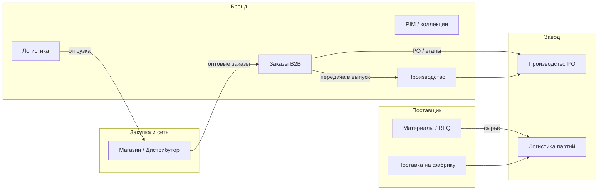

# Операционная цепочка ядра: профили, этапы, связи и пробелы

Документ **сводит в одном месте** то, что в коде разнесено по `syntha-nav-clusters.ts`, файлам навигации, `role-hub-matrix.ts` и `CROSS_ROLE_FLOWS.md`. Его задача — **навигация по смыслу** (что есть у кого в основном контуре), **сквозные сценарии** и **где нет полной интеграции** в рантайме.

**Роль документа (канон план↔исполнение):** помимо теории, ниже **§7 (журнал)** и **§8 (детальный реестр)** — живой **статус**, **инструменты/API/тесты** и **честная маркировка** заглушек vs рабочего функционала. При каждом существенном изменении ядра обновляйте **§7–8** и при смене якорей кода — **§9**; продуктовые приоритеты P0/P1/P2 — в **`CORE_PRODUCT_DEEP_PLAN.md`**.

**Условные обозначения статуса:** ✅ сделано и проверяется в репозитории · 🟡 частично / демо / один инстанс · ❌ нет / только док · 📋 запланировано, не начато.

См. также: **`CABINET-INTERACTION-ARCHITECTURE.md`** (контур/архив), **`CROSS_ROLE_FLOWS.md`** (матрица потоков и пирамида тестов). **План развития ядра с позиции владельца продукта и enterprise-заказчика (P0/P1/P2, по профилям):** **`CORE_PRODUCT_DEEP_PLAN.md`**. **Продуктовый контракт до Этапа 2 (scope, роли, статусы заказа, ADR, глоссарий id):** **`docs/phase-0/README.md`**. **Закрытие этапа 0 перед этапом 1:** **`docs/phase-0/PHASE-0-CLOSURE-CHECKLIST.md`**. **Этап 1 (навигация/UI, P0-ENTITY, демо-политика, выбор E2E):** **`docs/phase-1/README.md`**, план волнами — **`docs/phase-1/PHASE-1-PLAN.md`**, **следующие шаги** — **`docs/phase-1/PHASE-1-NEXT-ACTIONS.md`**.

---

## 1. Фазовая цепочка ценности (сквозной процесс)

Порядок фаз из `COVERAGE_PHASE_ORDER` в `role-hub-matrix.ts` — **логическая последовательность**, не экранный мастер.

| Фаза | Смысл | Кто типично «ведёт» в ядре |
|------|--------|----------------------------|
| **Вход и обзор** (`entry`) | Дашборд, точка входа | Архивные группы `overview` у shop/distributor/factory |
| **Организация** (`org`) | Команда, доступы, настройки | `team`, архив `management*` |
| **Продукт, материалы, B2B** (`product_supply`) | Ассортимент, опт, заказы | `pim`, `b2b`, материалы (архив/бренд) |
| **Производство и качество** (`production_quality`) | Цех, PO, ОТК | `production` (бренд, manufacturer), `qc` (архив) |
| **Логистика и исполнение** (`fulfillment`) | Склад, отгрузки, трекинг | `logistics` |
| **Партнёры и маркетинг** (`partners_market`) | Каналы, кампании, CRM | `partners`, архив маркетинга |
| **Аналитика и ИИ** (`analytics_ai`) | Отчёты, финансы, ИИ | архив `analytics`, `finance` |
| **Коммуникации** (`comms`) | Сквозной слой | группа `comms`: календарь + сообщения |
| **РФ-контур** (`rf_russia`) | ЭДО, маркировка, касса, ВЭД | см. строки матрицы `rf_*` в `ROLE_HUB_MATRIX` |

---

## 2. Ядро `syntha-cores` по профилям (канон кода)

Источник порядка: `*_CORE_GROUP_ORDER` в `syntha-nav-clusters.ts`. Подписи групп — поле `label` в соответствующем файле навигации.

| Группа (`id`) | Бренд | Магазин | Дистрибутор | Производство | Поставщик |
|----------------|-------|---------|-------------|--------------|-----------|
| `team` | ● | ● | ● | ● | ● |
| `comms` | ● | ● | ● | ● | ● |
| `partners` | ● | ● | ● | ● | ● |
| `development` | ● | — | — | — | — |
| `pim` | ● | ● | — | — | ● |
| `b2b` | ● | ● | ● | — | — |
| `production` | ● | — | — | ● | — |
| `logistics` | ● | ● | ● | ● | ● |

**Смысловые отличия:**

- **Бренд** — полный хребет: разработка коллекции, PIM, B2B, собственное производство, логистика.
- **Магазин / дистрибутор** — закупка и опт **без** цеха и **без** `development`; у дистрибутора нет столбца `pim` (товар бренда не ведётся как у ритейла).
- **Производство (manufacturer)** — исполнение **PO и цех** (`production`), не дублирует группу «Заказы B2B» в сайдбаре: заказ приходит от бренда, работа — в производстве и логистике.
- **Поставщик** — `pim` = материалы/RFQ/VMI, не B2B-витрина магазина.

**Календарь (`comms`):** слои query в навигации согласованы с ролью — см. `CROSS_ROLE_FLOWS.md` §1 (бренд/магазин/производство/поставщик).

---

## 3. Матрица «темы покрытия» vs живой сайдбар

В `role-hub-matrix.ts` справочник **`CABINET_SIDEBAR_CLUSTERS_FULL`** — **тематические имена кластеров** для таблицы на `/project-info/roles-matrix` (например «Управление», «Заказы B2B»). Они **не обязаны дословно совпадать** с подписью каждой группы в `brand-navigation.ts` / `HubSidebar`: для отображения чипов используется **`role-hub-matrix-table-unification.ts`** (`MATRIX_CLUSTER_LABEL_RU`, `ROLE_HUB_TABLE_UNIFICATION`).

**Важно:** у **производства** в старом списке кластеров фигурирует имя **«Заказы»** — в контексте матрицы это **связано с исполнением заказа/PO**, а в UI завода основной вход — группа **`production`**, не отдельный B2B-реестр.

При правках: не ломать `validate:role-hub-matrix` — любое новое имя кластера должно быть в `CABINET_SIDEBAR_CLUSTERS_FULL` и использоваться согласованно в `ROLE_HUB_MATRIX`.

---

## 4. Межролевые потоки (кратко)

Полная таблица **● / ◐ / —** — в **`CROSS_ROLE_FLOWS.md` §2**. Здесь — склейка с интеграциями:

| Функция | Интеграционный след в репозитории (ориентиры) |
|---------|-----------------------------------------------|
| B2B заказ | UI магазина/бренда; экспорт `POST /api/b2b/export-order`; события/outbox — см. `CROSS_ROLE_FLOWS.md` §5.3 |
| Доменные события | `GET /api/ops/domain-events/health`, outbox-тесты |
| Процессы (workflow) | `src/app/api/processes/*` + `src/lib/server/process-workflow-store.ts` — **файл** `.data/workflow-store.json` (определения и runtime); `WORKFLOW_STORE_DISABLED=1` — без записи / только встроенные схемы. **P1:** БД при нескольких репликах (см. §6) |

Чаты и календарь: **единый контекст сущности** (`orderId`, `collectionId`, …) — контракт §3 в `CROSS_ROLE_FLOWS.md`.

---

## 5. Реестр расхождений, заглушек и технического долга

| Область | Состояние | Риск | Что делать |
|---------|-----------|------|------------|
| **Процессы `/api/processes`** | Файловый store на диске (single-instance) | Нет общей БД между репликами; нет полноценного audit trail | **P1:** миграция в БД или явная политика деплоя; при необходимости — event log / бэкапы файла |
| **Матрица ролей vs подписи сайдбара** | Два слоя имён (см. §3) | Путаница у авторов контента | Менять только по чеклисту в `role-hub-matrix.ts`; подписи в UI — через unification |
| **E2E между кабинетами** | Частично (см. §5.6 `CROSS_ROLE_FLOWS.md`) | Регрессии сквозных сценариев | Наращивать тесты по строкам матрицы §2 |
| **Демо-данные** | `placeholder-data`, статичные метрики на отдельных экранах | Не продакшен-источник истины | Помечать в UI как демо или подключать API |
| **Круговой хаб поставщика** | Упрощённая диаграмма (анимация столбцов) | Воспринимается как финансовый отчёт | **На странице:** дисклеймер «Демо» + `data-testid="supplier-circular-demo-disclaimer"` (`/factory/supplier/circular-hub`). Полноценный API — 📋 |
| **Каталог брендов `/brands`** | Контракт `useUIState`: избранное и заявки партнёрства | Ранее поля отсутствовали в контексте | **Сделано:** `favoriteBrands`, `toggleFavoriteBrand`, `partnershipRequests` (= `partnershipStatusByBrand`), `sendPartnershipRequest`; типизация `fetch` JSON на странице |

---

## 6. Рекомендуемая последовательность «довести до рабочей формы»

1. **Контракт данных:** сохранить инварианты `npm run validate:cabinet-nav` и `validate:role-hub-matrix` при любых правках навигации.
2. **Сквозной B2B:** опираться на уже существующие тесты экспорта/outbox; расширять покрытие по таблице пробелов в `CROSS_ROLE_FLOWS.md` §5.6.
3. **Процессы:** на одном инстансе схемы и runtime **сохраняются** в `.data/workflow-store.json`; для кластера — спланировать БД или отказ от записи workflow (`WORKFLOW_STORE_DISABLED`).
4. **UI с моками:** явные бейджи «Демо» или привязка к API — по приоритету продукта.

### 6.1. Эпик «заглушки и сквозные потоки» (масштаб и выбор сценария)

**Устранить все заглушки и пробелы из §5 за один проход нереалистично** — это **отдельный эпик**: БД для workflow, вынос демо-метрик в API, расширение E2E, инвентаризация экранов с бейджами «Демо» (см. §8.5–8.6). Порядок и P0/P1/P2 по продукту — в **`CORE_PRODUCT_DEEP_PLAN.md`**; живой статус инструментов — §8 ниже.

Если **следующий шаг** — пройти **один** end-to-end поток по файлам с чеклистом экранов/кнопок (например «B2B заказ → PO → производство → отгрузка»), выбор сценария зависит от цели:

| Цель | Что приоритизировать | Типичный фокус первого прохода |
|------|----------------------|--------------------------------|
| **Демо, презентация, онбординг** | Непрерывный **рассказ** и экраны, которые уже собраны | Цепочка с опорой на существующие тесты (`test:e2e:api`, operational orders, export, health): ритейл/магазин → B2B → видимость у бренда / экспорт — даже если участок «PO → цех» пока с демо-данными |
| **Продукт, платный контракт, enterprise** | Доказуемая **связность данных** и событий между ролями | Один сквозной `orderId` / outbox / доменные события по пути заказа; сценарий вроде **B2B заказ → PO → производство → отгрузка** — как целевой контур, даже если UI местами сырой: важнее **трассировка и тест**, чем визуальный polish |

Конкретную ветку сценария (одну строку из `CROSS_ROLE_FLOWS.md` §2 / §5.6) фиксируйте в задаче или PR; при появлении нового `test('…')` — обновляйте §5.4–5.6 там же.

---

## 7. Журнал исполнения (план ↔ код)

| Период | Изменение по ядру | Артефакты / проверка |
|--------|-------------------|----------------------|
| 2026-Q2 | **Workflow LIVE** — персистентность схем и runtime не in-memory: файл **`.data/workflow-store.json`**, `process-workflow-store.ts`; UI `/brand/process/.../live` грузит определение с **`GET /api/processes/:id`**, редактор с **`initialDefinition`**, сохранение **`PUT`**; **`WORKFLOW_STORE_DISABLED`**, **`WORKFLOW_STORE_PATH`**. | Код: `src/app/api/processes/*`, `src/lib/server/process-workflow-store.ts`. Мульти-реплика — 📋 БД (§8.2). |
| 2026-Q2 | **Таблица ролей ↔ сайдбар:** для кластера **«Логистика»** в матрице отображается как **«Логистика и остатки»** (как у групп навигации бренд/дистрибутор/завод). | `role-hub-matrix-table-unification.ts` (`MATRIX_CLUSTER_LABEL_RU`). |
| 2026-Q2 | **E2E:** smoke хабов кабинетов включает `/factory/production`, `/factory/supplier`; страница **`/brand/production`** — якорь **`data-testid="brand-production-page"`** для Playwright. | `e2e/cabinet-hubs-smoke.spec.ts`, `e2e/production.spec.ts`. |
| 2026-Q2 | **Визуальный регресс сайдбара завода (manufacturer):** `data-testid="factory-mfr-sidebar"` на `<aside>` в `factory/production/layout.tsx`; Playwright **`toHaveScreenshot`** — артефакты **`e2e/factory-sidebar-snapshot.spec.ts-snapshots/*.png`** (имя зависит от ОС/браузера, напр. `*-chromium-darwin.png`). Запуск: **`npm run test:e2e:factory-sidebar-snapshot`**; обновление эталона: `--update-snapshots`. | `e2e/README.md`; при PR с `factory-navigation` / `HubSidebar` — прогонять или обновлять снимок. |
| 2026-Q2 | **Круговой хаб поставщика** (`/factory/supplier/circular-hub`): явный текст **«Демо»** и отсылка к этому документу; **`data-testid="supplier-circular-demo-disclaimer"`**. | Снижает риск восприятия мок-графики как финотчётности. |
| 2026-Q2 | **E2E workflow API:** Playwright **`e2e/processes-workflow-api.spec.ts`** — `GET /api/processes` (непустой merged list), **`POST` → `GET` → `PUT` → `GET`** для custom-процесса; входит в **`npm run test:e2e:api`**. | `CROSS_ROLE_FLOWS.md` §5.4; кластер/мульти-реплика workflow — по-прежнему 📋 (§8.2). |
| 2026-Q2 | **Канон:** эпик «устранить все заглушки §5» вынесен из ожиданий «одним проходом»; добавлена **§6.1** — критерии выбора первого сквозного E2E (**демо** vs **продукт**). | См. §6.1; детализация P0/P1 — `CORE_PRODUCT_DEEP_PLAN.md`. |
| 2026-Q2 | **B2B platform export:** UI-карточка на **`/shop/b2b/create-order`** (`ShopB2bPlatformExportCard`); **`POST /api/b2b/export-order`** прокидывает **`Idempotency-Key`**, **`simulateReject`**, ответ с **`exportJobId`**; идемпотентный replay возвращает **`orderId` первого запроса**. | `e2e/b2b-export-order-api.spec.ts`, `e2e/b2b-create-order-platform-export-ui.spec.ts`; чеклист пути — **§8.7**. |
| 2026-Q2 | **Дедупликация:** браузерные вызовы **`POST /api/b2b/export-order`** сведены в **`post-b2b-export-order-client.ts`** (`postB2bExportOrder`) — использует **`ShopB2bPlatformExportCard`** (единственный рабочий provider в API — `platform`). | §8.7, §9. |
| 2026-Q2 | **Нет действий «в никуда»:** с `/shop/b2b/create-order` убрана карточка NuOrder (API её не поддерживает); в **настройках пользователя** — рабочий экспорт JSON и сброс локальных UI-настроек; в **BrandMessagesPro** — вложение файла добавляет строку в черновик + toast. | См. `useSettingsForm`, `BrandMessagesPro`. |
| 2026-Q2 | **P0-ENTITY (шаг):** список **`/shop/b2b/orders`** переведён на **`useShopB2BOperationalOrdersList`** (тот же v1→legacy→read-model, что у бренда); канон **`getWholesaleOrderIdFromB2BOrder`** в **`cross-role-entity-ids.ts`**. | Jest `cross-role-entity-ids.test.ts`; §8.6 P0-ENTITY. |
| 2026-Q2 | **P0-ENTITY (шаг):** карточка **`/shop/b2b/orders/[orderId]`** — оверлей оплат (**`applyOrderPaymentsOverlay`**) на том же списке, что и реестр (**`useShopB2BOperationalOrdersList`**), вместо только **`mockB2BOrders`**; в **`cross-role-entity-ids.ts`** зафиксированы **`B2B_WHOLESALE_ORDER_CONTEXT_QUERY`** и **`SHOP_B2B_COLLECTION_QUERY_PARAM`**. | Согласованность ссылок чата/календаря (`routes.ts`) и shop vs `collectionId` на полу бренда. |
| — | **`tsc`:** `npx tsc --noEmit` в корне `synth-1-full` — ✅; в CI полный `typecheck` может быть с **`continue-on-error`** (см. `SOURCE_OF_TRUTH.md`) — строгость горячих путей отдельно (`typecheck:order-subset` и т.д.). | Локально держать зелёным полный `tsc` перед релизом ядра. |
| — | **Валидаторы навигации:** `npm run validate:cabinet-nav` — ✅ при зелёном дереве nav/matrix. | См. §8.1. |
| 2026-Q2 | **Этап 1 — решение §6.1:** зафиксирован **двойной контур** в `docs/phase-1/PHASE-1-DECISION-6.1.md`: **(1) демо** — базис export + operational orders и существующие E2E без регрессий; **(2) продукт** — волна B закрывает пробел `CROSS_ROLE_FLOWS` **§5.7** по потоку **B2B заказ** (подтверждение брендом ↔ видимость статуса у магазина). Инвентаризация демо-экранов: `docs/phase-1/PHASE-1-DEMO-INVENTORY.md`. | Связь §2 «B2B заказ» и §5.7; при появлении нового теста — обновить §5.4–5.6 в `CROSS_ROLE_FLOWS.md`. |

---

## 8. Детальный реестр ядра: команды, API, UX, пробелы

### 8.1. Команды и инварианты (что гонять при изменениях)

| Команда | Что проверяет | Статус |
|---------|----------------|--------|
| `npm run validate:cabinet-nav` | Композит: матрица ролей, `comms`, `syntha-core-groups`, href кабинетов | ✅ |
| `npm run validate:role-hub-matrix` | `ROLE_HUB_MATRIX` ⊆ `CABINET_SIDEBAR_CLUSTERS_FULL` | ✅ |
| `npm run validate:comms-group-ids` | Ровно один `comms` на профиль | ✅ |
| `npm run validate:syntha-core-groups` | Все id из `*_CORE_GROUP_ORDER` есть в данных групп | ✅ |
| `npm run validate:cabinet-nav-hrefs` | Относительные href, непустые ссылки | ✅ |
| `npm run validate:cabinet-nav-routes` | (отдельно) маршруты — при необходимости | 📋 по регламенту PR |
| `npm run validate:category-handbook` | Снимок категорий производства | ✅ для PLM-контура |
| `npm run check:contracts` / `check:contracts:ci` | Границы модулей, health-контракты | 🟡 зависит от env URL |

### 8.2. API и хранилища (сквозное ядро)

| Компонент | Поведение | Статус | Пробел / следующий шаг |
|-----------|-----------|--------|-------------------------|
| **`GET /api/ops/domain-events/health`** | Снимок шины и outbox для ops | ✅ | Playwright + Jest; не замена полного наблюдения в проде |
| **`POST /api/b2b/export-order`** + идемпотентность | Экспорт заказа, доменные события | ✅ | Сквозной «второй актор видит» — 📋 (см. `CROSS_ROLE_FLOWS` §5.6) |
| **Operational orders** `GET/PATCH` v1 | Мутации + чтение в e2e:api | ✅ | — |
| **`/api/processes`**, **`/api/processes/[id]`**, **`/api/processes/[id]/runtime`** | CRUD определений и runtime LIVE-процессов | 🟡 | Файл на диске; **❌** общая БД между инстансами; **📋** audit trail, миграции |
| **Переменные** | `WORKFLOW_STORE_DISABLED`, `WORKFLOW_STORE_PATH` | ✅ док | Serverless без общего диска — только read-only / встроенные схемы |

### 8.3. UI ядра: навигация, матрица, производство

| Область | Описание | Статус |
|---------|----------|--------|
| **Сайдбар пяти кабинетов** | `syntha-cores` / архив; порядок `*_CORE_GROUP_ORDER` | ✅ консистентен с валидаторами |
| **`/project-info/roles-matrix`** | Темы × роли × кластеры; чипы через unification | ✅; слой имён ≠ дословно сайдбар — задокументировано §3 |
| **`/brand/production`** | Крупный клиентский контур цеха + вкладка LIVE | 🟡 много демо/local state; **✅** e2e якорь `brand-production-page` |
| **LIVE процесс** | Схема с сервера, localStorage прогресс | 🟡 см. §8.2 |

### 8.4. Автотесты (пирамида; кратко)

| Уровень | Покрытие | Статус |
|---------|----------|--------|
| **`test:e2e:api`** | HTTP-контракты B2B, export, health, production page load, ERP strip и др. | ✅ узкий набор |
| **`test:e2e:cabinet-hubs`** | Все хабы включая factory production/supplier — не 5xx, есть `main` | ✅ |
| **`test:e2e:verification`** | Сквозняк инвентаря brand↔shop и др. | ✅ тяжёлый serial |
| **`test:e2e:factory-sidebar-snapshot`** | PNG-снимок сайдбара **`factory-mfr-sidebar`** на `/factory/production` | ✅ baseline в репо (по платформе; Linux CI может потребовать отдельного `-linux.png`) |
| **Сквозной чат/календарь/PO/RFQ** между двумя сессиями | — | ❌ строки с **—** в `CROSS_ROLE_FLOWS.md` §5.6–5.7 |
| **Workflow `POST`/`PUT` схемы → `GET`** в Playwright | `e2e/processes-workflow-api.spec.ts` в `test:e2e:api` | ✅ |

### 8.5. Заглушки, демо и политика честности

| Элемент | Реальность | Действие |
|---------|------------|----------|
| **Много экранов** | Данные из `placeholder-data`, JSON, локальные сторы | **📋** инвентаризация экранов + бейдж «Демо» / API; не выдавать за OMS без дисклеймера. Частичный **сквозной** ориентир — §8.7 |
| **Круговой/ESG-блоки поставщика** | Упрощённая визуализация | 🟡 дисклеймер на `/factory/supplier/circular-hub`; остальные экраны — 📋 по мере обхода |
| **KPI бренд-центра** | Часть с API, часть статика | 🟡 режим «спокойный» / источник — см. `CORE_PRODUCT_DEEP_PLAN` §3.1 |
| **Единые entity ID** в чатах/календаре/заказах | Контракт в доке; везде в UI не проверено | ❌ P0 — сквозная дисциплина |

### 8.6. Очередь P0/P1 по ядру (сводка исполнения)

| ID | Задача | Статус |
|----|--------|--------|
| P0-TS | Полный `tsc` зелёный в `synth-1-full` | ✅ удерживать |
| P0-NAV | `validate:cabinet-nav` при изменениях nav/matrix | ✅ |
| P0-ENTITY | Один контракт `orderId` / `collectionId` / `poId` / `threadId` в UI ядра | 🟡 **частично:** `WholesaleOrderId` / `B2BOrder.order` — `getWholesaleOrderIdFromB2BOrder`; shop список + **карточка** `/shop/b2b/orders/[orderId]` на **`useShopB2BOperationalOrdersList`** + оплаты; query-ключи чата/коллекции — **`cross-role-entity-ids.ts`**; `poId` / серверный `threadId` — по экранам |
| P0-WORKFLOW | Персистентность workflow single-instance | 🟡 файл |
| P0-WORKFLOW-HA | Workflow при нескольких репликах | 📋 БД или политика |
| P0-DEMO | Политика бейджей демо vs прод | 🟡 точечно |
| P1-E2E-X | Один сквозной E2E заказ ↔ производство/логистика | 📋 |
| P1-CAL | Единый payload событий календаря между ролями | 📋 |

### 8.7. Чеклист сквозного пути «демо-первый» (B2B → платформа → бренд)

Один **проход по файлам** для сценария с наибольшей готовностью тестов (см. §6.1): **не** PO/цех, а опт + экспорт + реестр у бренда. Пробелы матрицы — `CROSS_ROLE_FLOWS.md` §5.7 (подтверждение у «второй стороны» в UI без отдельного E2E).

| Шаг | Где в коде | Что проверить |
|-----|------------|----------------|
| 1 | `src/app/shop/b2b/create-order/page.tsx` | Страница: `data-testid` **`page-shop-b2b-create-order`** |
| 2 | `src/components/shop/ShopB2bPlatformExportCard.tsx` | Карточка: **`shop-b2b-create-order-platform-export`**; поле **`shop-b2b-platform-export-order-id`**; кнопка **`shop-b2b-platform-export-submit`**; после ответа — **`shop-b2b-platform-export-result`** (`exportJobId`, `Готово.`) |
| 3 | `src/app/api/b2b/export-order/route.ts` + `b2b-integration-service.ts`; из UI — один клиент **`post-b2b-export-order-client.ts`** (`postB2bExportOrder`) | `POST` с `provider: platform`, `payload.orderId`; опционально заголовок **`Idempotency-Key`**, тело **`simulateReject`** (тесты); JSON ответа содержит **`exportJobId`**; при повторе idempotency — тот же job и **`orderId` первого запроса** |
| 4 | `src/components/brand/b2b-orders/page.tsx` | Реестр заказов бренда (хук списка operational orders) |
| 5 | `e2e/b2b-create-order-platform-export-ui.spec.ts`, `e2e/b2b-export-order-api.spec.ts`, `e2e/b2b-operational-orders-api.spec.ts` | Входят в **`npm run test:e2e:api`** |

---

## 9. Связанные файлы (якоря)

| Файл | Назначение |
|------|------------|
| `syntha-nav-clusters.ts` | Порядок групп `syntha-cores` / `archive` |
| `brand-navigation.ts`, `shop-navigation-normalized.ts`, `distributor-navigation.ts`, `factory-navigation.ts` | Пункты меню и href |
| `role-hub-matrix.ts` | Таблица тем × роли × кластеры |
| `role-hub-matrix-nav-details.ts` | Подразделы под темами |
| `role-hub-matrix-table-unification.ts` | Отображаемые подписи чипов матрицы |
| `process-workflow-store.ts` | Файловое хранилище workflow |
| `ShopB2bPlatformExportCard.tsx` | UI экспорта platform на `/shop/b2b/create-order` |
| `post-b2b-export-order-client.ts` | Единый браузерный `fetch` на `POST /api/b2b/export-order` (в продуктовом контуре — **`provider: platform`**) |
| `cross-role-entity-ids.ts` | Канон **`WholesaleOrderId`**, query-ключи чата/коллекции, `getWholesaleOrderIdFromB2BOrder`; **`routes.ts`** использует **`B2B_WHOLESALE_ORDER_CONTEXT_QUERY`** для deep links |
| `CROSS_ROLE_FLOWS.md` | Межролевые потоки и реестр тестов §5 |
| `CORE_PRODUCT_DEEP_PLAN.md` | P0/P1/P2 продуктовые приоритеты |
| `docs/phase-0/PHASE-0-MAIN-CONTOUR.md` | Этап 0: продуктовый контракт основного контура (инвестор/команда) |
| `docs/phase-0/glossary-ids.md` | Глоссарий сквозных id (согласование с entity-контрактом) |
| `docs/phase-0/ADR/README.md` | Индекс ADR этапа 0 (COGS, отгрузки, ЭДО) |
| `docs/phase-0/PHASE-0-CLOSURE-CHECKLIST.md` | Чеклист закрытия этапа 0 перед этапом 1 |
| `docs/phase-1/README.md` | Этап 1: навигация/UI, P0-ENTITY, политика демо, выбор первого E2E |
| `docs/phase-1/PHASE-1-PLAN.md` | Этап 1: волны A–D, задачи с якорями, DoD, вход в этап 2 |
| `docs/phase-1/PHASE-1-NEXT-ACTIONS.md` | Этап 1: операционный чеклист, P0-ENTITY-кандидаты, команды проверки |
| `docs/phase-1/PHASE-1-DECISION-6.1.md` | Этап 1: принятое решение §6.1 (демо + продукт, волна B) |
| `docs/phase-1/PHASE-1-DEMO-INVENTORY.md` | Этап 1: инвентаризация экранов с `placeholder-data` (DEMO1) |
| `docs/phase-0/PHASE-0-RF-FIELDS-MINIMUM.md` | Минимум полей заказа/отгрузки под РФ (v1) |
